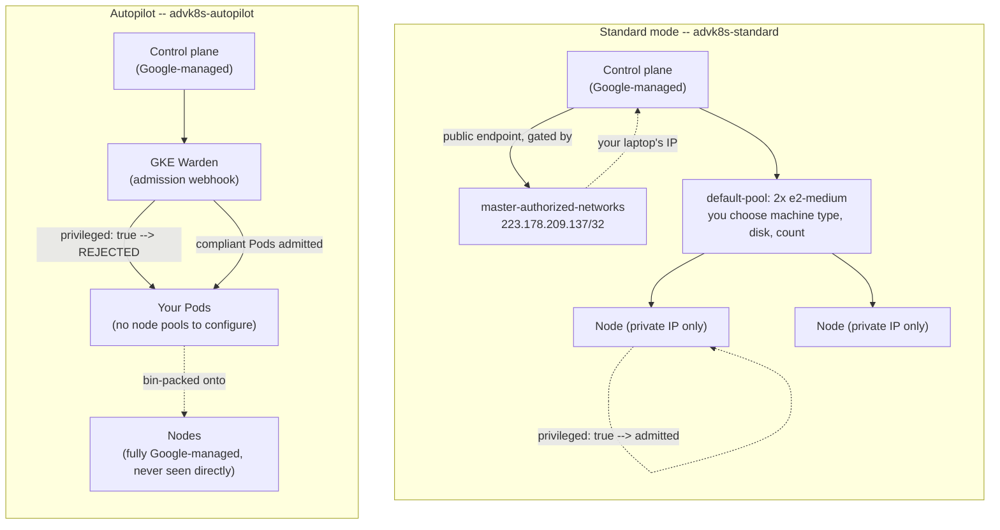

# Lab 1 — GKE Cluster Architecture: Autopilot vs Standard, Private Clusters, and Release Channels 

**Day 1 · Multi-Cluster & Service Mesh**

> Every command below was actually run end to end against two real GKE clusters, and every screenshot is a real `screencapture` of that run — including a deliberate lockout-and-recovery of the control plane's public endpoint.

## What you'll learn

- The real difference between GKE's two operating modes — **Standard** (you manage node pools and their machine shapes) and **Autopilot** (Google manages nodes entirely; you only think in Pods) — and how to choose between them for a real workload.
- What a **private cluster** actually restricts (node IPs, not necessarily the control plane), and how **master authorized networks** gates who can reach the control plane's public endpoint.
- **Release channels** (`rapid` / `regular` / `stable` / `None`) as GKE's mechanism for opting into a managed upgrade cadence instead of pinning a version yourself.
- Concretely, hands-on, what Autopilot's built-in Pod-level restrictions block that Standard mode allows — not as a bullet list, but as an actual admission-time rejection you trigger yourself.

## Time & cost

- **Time:** ~60 minutes.
- **Cost:** real. Verified during testing: two small GKE clusters (one Standard zonal, one Autopilot regional), up for under 20 minutes total, then deleted — comparable to the other GKE-dependent labs in this set (a few dollars if you tear down promptly, per §1.7).

## Prerequisites

Complete the [Setup Environment Guide](00-setup-environment-guide.md). You need `gcloud` authenticated against a real GCP project with billing enabled. This is the first lab in the course, so if you've done nothing else yet: this is the one to start with — its own two clusters are separate from, and torn down before, the two-cluster platform Lab 2 onward builds and shares for the rest of the day.

---

## 1.1 Concepts, briefly

**Standard mode** is what "a GKE cluster" has meant historically: you choose machine types, node counts, and autoscaling bounds for one or more **node pools**, and you're billed for those VM instances whether or not they're fully utilized. You can SSH to nodes, run privileged/host-networked Pods, install node-level DaemonSets freely, and generally treat the nodes as yours to configure.

**Autopilot** inverts this: there are no node pools for you to configure at all. You submit Pod specs with resource requests, and GKE provisions and bills for exactly the compute those Pods need, per-Pod, automatically bin-packed onto nodes you never see or manage directly. In exchange for giving up node-level control, Autopilot enforces a hardened Pod security baseline by default via a component called **GKE Warden** — no privileged containers, among other restrictions — because Google is the one operating the underlying nodes and won't let a workload reach out of its Pod boundary into node-level access it doesn't control.

**Private clusters** are a networking property, not a Standard-vs-Autopilot property — both modes support them. A private cluster gives nodes IP addresses only in your VPC (no public IP on any node), which is the default posture you want for anything beyond a disposable demo. The control plane, separately, can have a private endpoint, a public endpoint, or both; when a public endpoint exists, **master authorized networks** is the allow-list of CIDR ranges permitted to reach it. Get this list wrong and you lock yourself out of your own cluster's API server — a mistake worth deliberately reproducing once so you recognize it instantly in the future (§1.3 below).

**Release channels** decouple "which Kubernetes version" from a version number you have to track yourself. `rapid` gets new minor versions first (shortest support window, closest to upstream Kubernetes releases); `stable` gets them last (longest soak time in production fleets before reaching you); `regular` is the default middle ground. Choosing `None` means you pin and manage version upgrades entirely yourself — rarely the right default for a team, but sometimes required for strict compatibility windows.



---

## 1.2 Create a private Standard-mode cluster, on a release channel

```bash
export PROJECT_ID=YOUR_GCP_PROJECT_ID

gcloud services enable container.googleapis.com --project=$PROJECT_ID

# Find your current public IP -- you'll authorize it below.
# Use -4 explicitly: on a dual-stack network, plain "curl ifconfig.me" can hand back
# an IPv6 address, which silently breaks --master-authorized-networks (it needs IPv4 CIDR).
MY_IP=$(curl -4 -s ifconfig.me)
echo "Your current public IPv4: $MY_IP"

gcloud container clusters create advk8s-standard \
  --project=$PROJECT_ID \
  --zone=us-central1-a \
  --release-channel=regular \
  --enable-private-nodes \
  --enable-master-authorized-networks \
  --master-authorized-networks="${MY_IP}/32" \
  --enable-ip-alias \
  --num-nodes=2 \
  --machine-type=e2-medium \
  --disk-size=30
```

> **Tested gotcha:** `--master-authorized-networks` is rejected outright — `Cannot use --master-authorized-networks if --enable-master-authorized-networks is not specified` — unless you also pass `--enable-master-authorized-networks`. This is easy to miss: several older docs and blog posts show only the CIDR-list flag on its own, which no longer works. Both flags are required together, on `create` **and** on any later `update` that changes the list (§1.3 hits this exact error again).

`--enable-private-nodes` (without `--enable-private-endpoint`) gives you the common real-world shape: nodes have no public IP, but the control plane keeps a public endpoint, gated by `--master-authorized-networks`. `--enable-ip-alias` turns on VPC-native networking (Pods get real routable VPC IPs via alias IP ranges) — the modern default, and a prerequisite for several GKE features including Autopilot itself.

```bash
gcloud container clusters get-credentials advk8s-standard --zone us-central1-a --project=$PROJECT_ID
kubectl config rename-context gke_${PROJECT_ID}_us-central1-a_advk8s-standard advk8s-standard
kubectl --context advk8s-standard get nodes -o wide
```


Confirm the node IPs are private-only (no `EXTERNAL-IP`, visible above), the release channel, and the authorized network list:

```bash
gcloud container clusters describe advk8s-standard --zone us-central1-a --project=$PROJECT_ID \
  --format="yaml(releaseChannel, privateClusterConfig, masterAuthorizedNetworksConfig)"
```


**Verified result:**

```
masterAuthorizedNetworksConfig:
  cidrBlocks:
  - cidrBlock: 223.178.209.137/32
  enabled: true
  privateEndpointEnforcementEnabled: true
privateClusterConfig:
  enablePrivateNodes: true
  privateEndpoint: 10.128.0.28
  publicEndpoint: 35.255.8.141
releaseChannel:
  channel: REGULAR
```

---

## 1.3 Tested gotcha, deliberately reproduced: locking yourself out via authorized networks

This is worth breaking on purpose once, because the failure mode is confusing the first time it happens for real. Update the authorized network list to something that does **not** include your own IP:

```bash
gcloud container clusters update advk8s-standard \
  --zone us-central1-a --project=$PROJECT_ID \
  --enable-master-authorized-networks \
  --master-authorized-networks="203.0.113.0/32"

kubectl --context advk8s-standard --request-timeout=15s get nodes
```


**Verified result:**

```
Unable to connect to the server: context deadline exceeded (Client.Timeout exceeded while awaiting headers)
```

Exactly as expected: a connection-level timeout, not a Kubernetes-level `Forbidden`, because the request never reaches the API server at all. The control plane's load balancer drops the connection before authentication is even attempted — this is a network-layer block, not an RBAC decision, which is the detail that trips people up when they go looking for an RBAC fix to a networking problem.

Put your own IP back and confirm recovery:

```bash
gcloud container clusters update advk8s-standard \
  --zone us-central1-a --project=$PROJECT_ID \
  --enable-master-authorized-networks \
  --master-authorized-networks="${MY_IP}/32"

kubectl --context advk8s-standard get nodes
```


**Verified result:** both nodes `Ready` again, within about a minute of the fix.

---

## 1.4 Create an Autopilot cluster

```bash
gcloud container clusters create-auto advk8s-autopilot \
  --project=$PROJECT_ID \
  --region=us-central1 \
  --release-channel=regular

gcloud container clusters get-credentials advk8s-autopilot --region us-central1 --project=$PROJECT_ID
kubectl config rename-context gke_${PROJECT_ID}_us-central1_advk8s-autopilot advk8s-autopilot
kubectl --context advk8s-autopilot get nodes
```


**Verified result:** one node already `Ready`, before a single Pod of ours was deployed. This is `create-auto`, not `create --enable-autopilot` (both exist in current `gcloud`; `create-auto` is the more direct form) — and Autopilot clusters are **regional** by default, not zonal, which is part of why they're priced and scheduled differently under the hood. Autopilot pre-provisions a small amount of system capacity for its own managed components before you ask for anything.

---

## 1.5 The actual restriction, triggered for real: privileged containers

Deploy the identical manifest to both clusters:

```bash
cat > /tmp/privileged-test.yaml <<'EOF'
apiVersion: v1
kind: Pod
metadata:
  name: privileged-test
spec:
  containers:
  - name: test
    image: busybox
    command: ["sleep", "3600"]
    securityContext:
      privileged: true
EOF

echo "--- Standard ---"
kubectl --context advk8s-standard apply -f /tmp/privileged-test.yaml
kubectl --context advk8s-standard get pod privileged-test

echo "--- Autopilot ---"
kubectl --context advk8s-autopilot apply -f /tmp/privileged-test.yaml
```


**Verified result:**

```
--- Standard ---
pod/privileged-test created
NAME              READY   STATUS    RESTARTS   AGE
privileged-test   1/1     Running   0          17s

--- Autopilot ---
Warning: autopilot-default-resources-mutator:Autopilot updated Pod default/privileged-test: defaulted unspecified 'cpu' resource for containers [test] (see http://g.co/gke/autopilot-defaults).
Error from server (GKE Warden constraints violations): error when creating "/tmp/privileged-test.yaml": admission webhook "warden-validating.common-webhooks.networking.gke.io" denied the request: GKE Warden rejected the request because it violates one or more constraints.
Violations details: {"[denied by autogke-disallow-privilege]":["container test is privileged; not allowed in Autopilot"]}
```

Standard admits the Pod and it reaches `Running` — a privileged container is a perfectly normal thing to ask a Standard node pool to run. Autopilot's built-in admission control (**GKE Warden**, its policy enforcement webhook) rejects the same manifest outright, by name (`autogke-disallow-privilege`) — a hard constraint, not a configurable policy you opted into. This is Autopilot's whole value proposition made concrete: Google can make this guarantee because you never had node-level access to begin with.

Clean up the Standard-side Pod:

```bash
kubectl --context advk8s-standard delete pod privileged-test
```

---

## 1.6 Node pools, briefly (Standard only — Autopilot has none to inspect)

```bash
gcloud container node-pools list --cluster advk8s-standard --zone us-central1-a --project=$PROJECT_ID
gcloud container node-pools describe default-pool --cluster advk8s-standard --zone us-central1-a --project=$PROJECT_ID \
  --format="yaml(config.machineType, config.diskSizeGb, config.spot, management)"
```


**Verified result:**

```
config:
  diskSizeGb: 30
  machineType: e2-medium
management:
  autoRepair: true
  autoUpgrade: true
```

(`config.spot` doesn't appear in the output at all when it's `false` — that's normal YAML omission for an unset boolean, not a missing field.)

A Standard node pool is where machine type, disk size, spot/preemptible pricing (`config.spot`), and auto-repair/auto-upgrade (`management`) all live — every one of these is a decision Autopilot makes for you instead. This is also the object [Lab 11](lab-11-cluster-autoscaler-gpu-nodepools.md)'s Cluster Autoscaler and Node Auto-Provisioning sections operate on directly; if this lab is your first exposure to node pools, that's the concept to carry forward.

---

## 1.7 Clean up — both clusters

```bash
kubectl --context advk8s-standard delete pod privileged-test --ignore-not-found
kubectl --context advk8s-autopilot delete pod privileged-test --ignore-not-found

gcloud container clusters delete advk8s-standard --zone us-central1-a --project=$PROJECT_ID --quiet
gcloud container clusters delete advk8s-autopilot --region us-central1 --project=$PROJECT_ID --quiet
```

Verify both are actually gone:

```bash
gcloud container clusters list --project=$PROJECT_ID
```


**Verified result:** empty. Autopilot cluster deletion has no separate node pools to clean up first — one `delete` call is the entire teardown, which is itself a small illustration of the operational trade-off this lab is about.

---

## Lab summary

| | Standard | Autopilot |
|---|---|---|
| Node pools you manage | ✅ | None — fully managed |
| Privileged containers | ✅ Allowed | ❌ Blocked by GKE Warden (`autogke-disallow-privilege`) |
| Billing granularity | Per-node | Per-Pod resource request |
| Cluster scope | Zonal (as created here) | Regional by default |
| Private nodes + authorized networks | ✅ tested, including a real lockout/recovery | Same mechanism, not exercised here |
| Release channel | ✅ `regular` | ✅ `regular` |

## Evidence

- Screenshots: [`screenshots/lab01/`](screenshots/lab01/) (8 images)

**Next:** [Lab 2 — Standing up the fleet](lab-02-stand-up-the-fleet.md)
