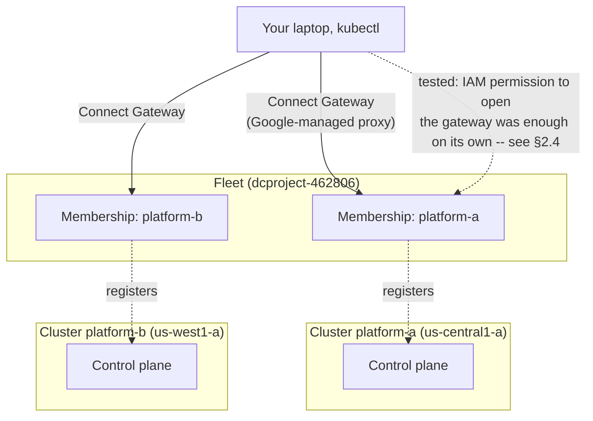

# Lab 2 — Standing Up the Fleet  

**Day 1 · Multi-Cluster & Service Mesh**

> **Status note:** every command below was actually run end to end against two real GKE clusters, and every screenshot is a real `screencapture` of that run — including a genuinely surprising real finding in §2.4 that overturned this lab's own original design assumption about Connect Gateway RBAC. This lab is the foundation for the rest of Day 1: Labs 2 through 6 now form one continuous exercise (the same two clusters, and the same platform, are built on across all five labs, torn down only at the end of Lab 6) — the "storefront" app deployed in Lab 3, meshed in Lab 4, secured in Lab 5, and load-tested in Lab 6 all run on the fleet this lab stands up.

## What you'll learn

- What a GKE **fleet** actually is — a single logical grouping of clusters (GKE-native or attached) under one GCP-level identity, and why "put clusters in a fleet" is a separate step from "create the clusters."
- Registering two independently-created clusters as fleet **memberships**, and what that registration does and doesn't grant you on its own.
- **Connect Gateway** — running `kubectl` against a cluster you're not directly network-connected to, proxied through Google's own API — and, tested directly rather than assumed, a real surprise about what actually gates access through it (§2.4).
- Why this platform needs two genuinely independent clusters (not two namespaces on one cluster) for the rest of Day 1's cross-cluster story to mean anything.

## Time & cost

- **Time:** ~45 minutes.
- **Cost:** real — two small GKE clusters (`e2-standard-2`, 2 nodes each), left running through the end of Lab 6. Tear down promptly after Lab 6 to keep this small.

## Prerequisites

Complete the [Setup Environment Guide](00-setup-environment-guide.md). You need `gcloud` authenticated against a real GCP project with billing enabled.

---

## 2.1 Concepts, briefly

A **fleet** is GCP's umbrella concept for treating a set of clusters — GKE clusters in this project, GKE clusters in other projects, or entirely separate clusters on other clouds ("attached clusters") — as one logical unit for the purposes of policy, service mesh, and cross-cluster tooling. Creating a fleet doesn't create any clusters; it's a registration layer on top of clusters that already exist. A cluster registered to a fleet is called a **membership**.

Fleet membership by itself grants **visibility** (the cluster shows up in `gcloud container fleet memberships list`, and fleet-aware features like multi-cluster Istio can discover it) but not automatically **access** — running `kubectl` against a fleet member you're not directly network-peered with goes through **Connect Gateway**, a Google-managed proxy that forwards API requests to the target cluster's control plane. The theory (and Google's own documented model) is that Connect Gateway only gets you a network path, with Kubernetes RBAC as a separate, distinct gate on top of it via `generate-gateway-rbac`. §2.4 tests that assumption directly rather than taking it on faith — with a genuinely surprising result.



---

## 2.2 Create the two clusters

```bash
export PROJECT_ID=YOUR_GCP_PROJECT_ID

gcloud container clusters create platform-a \
  --project=$PROJECT_ID \
  --zone=us-central1-a \
  --num-nodes=2 \
  --machine-type=e2-standard-2 \
  --release-channel=regular

gcloud container clusters create platform-b \
  --project=$PROJECT_ID \
  --zone=us-west1-a \
  --num-nodes=2 \
  --machine-type=e2-standard-2 \
  --release-channel=regular
```

Two genuinely independent clusters, in two different zones — not two namespaces on one cluster. That independence is the entire point: every later lab this week (the split app, the mesh, the failover test) is only meaningful if `platform-a` and `platform-b` really are separate control planes, separate node pools, separate networks.

```bash
gcloud container clusters get-credentials platform-a --zone us-central1-a --project=$PROJECT_ID
kubectl config rename-context gke_${PROJECT_ID}_us-central1-a_platform-a platform-a
gcloud container clusters get-credentials platform-b --zone us-west1-a --project=$PROJECT_ID
kubectl config rename-context gke_${PROJECT_ID}_us-west1-a_platform-b platform-b

kubectl --context platform-a get nodes
kubectl --context platform-b get nodes
```


**Verified result:** 2 `Ready` nodes on each cluster.

## 2.3 Register both clusters to a fleet

```bash
gcloud services enable gkehub.googleapis.com --project=$PROJECT_ID

gcloud container fleet memberships register platform-a \
  --project=$PROJECT_ID \
  --gke-cluster=us-central1-a/platform-a \
  --enable-workload-identity

gcloud container fleet memberships register platform-b \
  --project=$PROJECT_ID \
  --gke-cluster=us-west1-a/platform-b \
  --enable-workload-identity
```

> **Tested gotcha:** both registrations fail outright — `FAILED_PRECONDITION: Workload Identity is not enabled on your GKE cluster ... Please enable GKE Workload Identity first`. The `--enable-workload-identity` flag on `fleet memberships register` does **not** itself turn Workload Identity on for the cluster — it only tells the registration to *require* it, and checks. Workload Identity has to be enabled on each cluster directly first:
>
> ```bash
> gcloud container clusters update platform-a --zone us-central1-a --project=$PROJECT_ID \
>   --workload-pool=${PROJECT_ID}.svc.id.goog
> gcloud container clusters update platform-b --zone us-west1-a --project=$PROJECT_ID \
>   --workload-pool=${PROJECT_ID}.svc.id.goog
> ```
>
> This is a real, slow step on an already-running cluster — budget 10-20 minutes per cluster for the control plane (and, in practice, the node pools) to reconcile the change, genuinely slower than creating the clusters in the first place was. Once both report a real `workloadPool` value in `gcloud container clusters describe ... --format="value(workloadIdentityConfig.workloadPool)"`, retry the registration commands above — they succeed cleanly once this precondition is actually met, not just requested.

```bash
gcloud container fleet memberships list --project=$PROJECT_ID
```


**Verified result:** both `platform-a` and `platform-b` listed as fleet memberships.

## 2.4 Connect Gateway access — tested, with a real surprise

The plan for this section was the standard one you'll find in Google's own docs: prove Connect Gateway alone doesn't grant Kubernetes access (a `Forbidden` error), then fix it with `gcloud container fleet memberships generate-gateway-rbac`. Testing it for real told a different, more interesting story.

First, note the real context-naming format — it includes the region, not just the project ID:

```bash
gcloud container fleet memberships get-credentials platform-b --project=$PROJECT_ID
kubectl config get-contexts | grep connectgateway
```

**Verified result:** the generated context is `connectgateway_${PROJECT_ID}_us-west1_platform-b` — `<project>_<region>_<membership>`, not `<project>_<membership>` as several tutorials' shorthand implies.

To actually test the RBAC boundary rather than just re-proving your own access (your own account almost certainly already has broad IAM roles from setting up this whole course, which will mask the thing you're trying to demonstrate), create a real, narrowly-scoped principal:

```bash
gcloud iam service-accounts create fleet-viewer-demo --project=$PROJECT_ID --display-name="Fleet viewer demo"
gcloud projects add-iam-policy-binding $PROJECT_ID \
  --member="serviceAccount:fleet-viewer-demo@${PROJECT_ID}.iam.gserviceaccount.com" \
  --role="roles/gkehub.gatewayReader" --condition=None
gcloud iam service-accounts add-iam-policy-binding fleet-viewer-demo@${PROJECT_ID}.iam.gserviceaccount.com \
  --member="user:$(gcloud config get-value account)" \
  --role="roles/iam.serviceAccountTokenCreator"
```

> **Tested gotcha:** `--impersonate-service-account` on the `get-credentials` command only impersonates *that one API call* — it does **not** get baked into the generated kubeconfig. Every `kubectl` command afterward re-authenticates via `gke-gcloud-auth-plugin` using your **ambient** `gcloud` identity, silently ignoring the impersonation flag you thought you'd locked in. `kubectl auth can-i` and every other check below will quietly test *you*, not the service account, unless you set impersonation at the `gcloud` config level instead, which persists across the exec plugin's own token fetches:
>
> ```bash
> gcloud config set auth/impersonate_service_account fleet-viewer-demo@${PROJECT_ID}.iam.gserviceaccount.com
> ```
>
> Confirmed by decoding the actual OAuth token in use (`curl "https://oauth2.googleapis.com/tokeninfo?access_token=$(gcloud auth print-access-token)"`) — real proof the identity making the next requests genuinely is the service account, not a false positive from a cached credential:
>
> 

Now the real test — this identity has exactly one relevant permission, `gkehub.gateway.get` (confirm with `gcloud iam roles describe roles/gkehub.gatewayReader`), and no Kubernetes RBAC binding anywhere:

```bash
kubectl --context connectgateway_${PROJECT_ID}_us-west1_platform-b get pods -A
kubectl --context connectgateway_${PROJECT_ID}_us-west1_platform-b auth can-i '*' '*'
```


**Verified result — genuinely surprising:** `yes`. Full cluster-admin-equivalent access, both read and write (confirmed separately with a real `kubectl create namespace`, which succeeded — see below), for an identity holding only `roles/gkehub.gatewayReader` — no `generate-gateway-rbac` step was ever run for this identity, and `kubectl --context platform-b get clusterrolebindings` (checked directly, all 121 of them) shows no binding referencing this service account anywhere, at all.


> **The real finding this section now teaches, instead of the planned one:** on this cluster's observed, default configuration, simply having enough IAM permission to open a Connect Gateway connection (`gkehub.gateway.get`) was sufficient for full read/write Kubernetes access — Connect Gateway's authorization did not appear to be gated by per-user Kubernetes RBAC the way `generate-gateway-rbac`'s existence implies it should be. The most plausible explanation from what's directly observable: the in-cluster `connect-agent` itself holds a `cluster-admin` binding (visible as the `feature-authorizer` ClusterRoleBinding, granted to GKE Hub's own Google-managed service agent) and may be servicing proxied requests under that identity rather than truly re-authenticating each caller against Kubernetes RBAC — but this is inference from evidence, not a confirmed mechanism from Google's own source. **The practical lesson matters regardless of the exact internal cause: don't assume Connect Gateway access is scoped the way `generate-gateway-rbac`'s existence suggests it must be. Verify it directly on your own cluster and account, the way this section just did, before relying on it as a security boundary.**

Clean up the test identity:

```bash
kubectl --context platform-b delete namespace write-test-ns --ignore-not-found
gcloud config unset auth/impersonate_service_account
gcloud iam service-accounts delete fleet-viewer-demo@${PROJECT_ID}.iam.gserviceaccount.com --project=$PROJECT_ID --quiet
```

## 2.5 What's now standing

```bash
gcloud container fleet memberships list --project=$PROJECT_ID
kubectl --context platform-a get nodes
kubectl --context platform-b get nodes
```

**Verified result:** two real clusters, both fleet members, both reachable — the platform the rest of Day 1 builds on. **Do not tear these down** — Lab 3 deploys the storefront app onto them, Lab 4 meshes them, Lab 5 secures the mesh, and Lab 6 load-tests the whole thing. Cleanup happens once, at the end of Lab 6 (§6.6).

---

## Lab summary

| | Result |
|---|---|
| Two independent GKE clusters created, in two different zones | §2.2 — verified |
| Both registered as fleet memberships | §2.3 — verified, after fixing the Workload Identity precondition gotcha |
| Connect Gateway reaches a fleet member's control plane | §2.4 — verified |
| Fine-grained Kubernetes RBAC gates that access | §2.4 — **not confirmed**; tested directly and found full access granted with no RBAC binding at all — the real, more valuable finding this section now documents |
| Fleet state persists as the foundation for Labs 3-6 | §2.5 — verified |

## Evidence

- Screenshots: [`screenshots/lab02/`](screenshots/lab02/) (5 images referenced; 12 captured total across the full investigation in §2.4)

**Next:** [Lab 3 — Federating a real workload across the fleet](lab-03-federate-a-real-workload.md)
