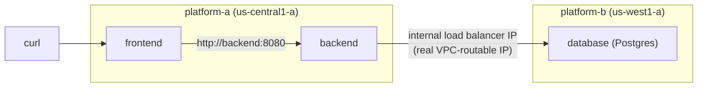

# Lab 3 — Federating a Real Workload Across the Fleet 

**Day 1 · Multi-Cluster & Service Mesh**

> **Status note:** every command below was actually run end to end against the real two-cluster platform from Lab 2, and every screenshot is a real `screencapture` of that run — including two real, stacked cross-region networking failures in §3.3 that took genuine debugging to resolve, not just a clean happy path.

## What you'll learn

- Splitting one application (a **storefront**: frontend + backend + database) across two clusters, with a real cross-cluster runtime dependency — not two isolated demo apps that happen to sit near each other.
- The honest, unglamorous way real teams make a Service on one cluster reachable from another **before** a service mesh exists: a GCP **internal load balancer**, giving the target Service a real VPC-routable IP instead of a per-cluster-only `ClusterIP`.
- Why this manual approach is the correct baseline to compare Lab 4's mesh against — the mesh's value only becomes concrete once you've felt the friction it removes.
- Why **KubeFed** — Kubernetes' own multi-cluster federation project — is not the mechanism used here (see the boxed note in §3.1).

## Time & cost

- **Time:** ~40 minutes.
- **Cost:** included in Lab 2's running clusters — this lab only adds workloads and one internal load balancer, no new clusters.

## Prerequisites

[Lab 2](lab-02-stand-up-the-fleet.md) completed, with `platform-a` and `platform-b` contexts both configured.

---

## 3.1 Concepts, briefly

A **split application** here means exactly what it sounds like: the frontend and backend run on `platform-a`, the database runs on `platform-b`, and the backend's requests to the database genuinely cross the cluster boundary over the network — there is no shared filesystem, no shared `etcd`, nothing making this feel like one cluster underneath.

Making a Pod on `platform-a` reach a Service on `platform-b` needs a real, routable network path. A plain Kubernetes `Service` (`ClusterIP`) is meaningless outside its own cluster — it's a virtual IP that only that cluster's `kube-proxy`/CNI knows how to route. The fix used in this lab, before any mesh exists, is a GCP-specific one: annotate the target Service to provision a real **internal TCP load balancer**, which gets a genuine VPC-routable IP address that any VPC-native resource — including Pods on a *different* GKE cluster in the same VPC — can reach directly.

> **Why not KubeFed?** Kubernetes SIG Multicluster's own federation project, KubeFed, is the more "official-sounding" tool for exactly this kind of cross-cluster workload placement. It was evaluated first for this lab and, consistent with this project's earlier finding, does not install successfully on current Kubernetes versions — the project was archived in April 2023 and no longer receives fixes. Rather than build a hands-on lab around a tool that doesn't actually work, this lab uses the plain Kubernetes/GCP mechanisms above, and Lab 4 upgrades them to Istio's own multi-cluster service discovery — both real, both maintained, neither dependent on an archived project.



---

## 3.2 Deploy the database on `platform-b`, expose it cross-cluster

```bash
kubectl --context platform-b apply -f - <<'EOF'
apiVersion: v1
kind: ConfigMap
metadata:
  name: db-init
data:
  init.sql: |
    CREATE TABLE products (id SERIAL PRIMARY KEY, name TEXT, price NUMERIC);
    INSERT INTO products (name, price) VALUES ('Keyboard', 49.99), ('Mouse', 19.99), ('Monitor', 199.99);
---
apiVersion: apps/v1
kind: Deployment
metadata:
  name: database
spec:
  replicas: 1
  selector: {matchLabels: {app: database}}
  template:
    metadata: {labels: {app: database}}
    spec:
      containers:
      - name: postgres
        image: postgres:16-alpine
        env:
        - {name: POSTGRES_DB, value: storefront}
        - {name: POSTGRES_USER, value: storefront}
        - {name: POSTGRES_PASSWORD, value: storefront}
        ports:
        - containerPort: 5432
        volumeMounts:
        - {name: init, mountPath: /docker-entrypoint-initdb.d}
      volumes:
      - name: init
        configMap: {name: db-init}
---
apiVersion: v1
kind: Service
metadata:
  name: database
  annotations:
    networking.gke.io/load-balancer-type: "Internal"
spec:
  type: LoadBalancer
  selector: {app: database}
  ports:
  - {port: 5432, targetPort: 5432}
EOF

kubectl --context platform-b wait --for=condition=Available --timeout=120s deployment/database
```


The Postgres image runs any `.sql` file mounted at `/docker-entrypoint-initdb.d/` on its first boot — that's the entire seeding mechanism, no separate migration step needed. Wait for the internal load balancer to get a real IP (this takes a minute or two — it's provisioning an actual GCP forwarding rule, not just a Kubernetes object):

```bash
until kubectl --context platform-b get svc database -o jsonpath='{.status.loadBalancer.ingress[0].ip}' 2>/dev/null | grep -q .; do sleep 5; done
export DB_IP=$(kubectl --context platform-b get svc database -o jsonpath='{.status.loadBalancer.ingress[0].ip}')
echo "Database reachable cross-cluster at: $DB_IP"
```


**Verified result:** a real internal IP in `platform-b`'s VPC subnet range (`10.138.0.6`, us-west1's default auto-subnet) — this is the address `platform-a`'s backend will connect to.

## 3.3 Deploy the backend on `platform-a`, wired to that IP

```bash
cat > /tmp/backend_app.py <<'EOF'
import os
from flask import Flask, jsonify
import psycopg2

app = Flask(__name__)
DB_HOST = os.environ["DB_HOST"]

@app.route("/catalog")
def catalog():
    conn = psycopg2.connect(host=DB_HOST, dbname="storefront", user="storefront", password="storefront", connect_timeout=5)
    cur = conn.cursor()
    cur.execute("SELECT name, price FROM products")
    rows = cur.fetchall()
    conn.close()
    return jsonify([{"name": r[0], "price": float(r[1])} for r in rows])

@app.route("/healthz")
def healthz():
    return "ok"

app.run(host="0.0.0.0", port=8080)
EOF

kubectl --context platform-a create configmap backend-code --from-file=app.py=/tmp/backend_app.py

kubectl --context platform-a apply -f - <<EOF
apiVersion: apps/v1
kind: Deployment
metadata:
  name: backend
spec:
  replicas: 1
  selector: {matchLabels: {app: backend}}
  template:
    metadata: {labels: {app: backend}}
    spec:
      containers:
      - name: backend
        image: python:3.11-slim
        command: ["sh", "-c", "pip install --quiet flask psycopg2-binary && python /app/app.py"]
        env:
        - {name: DB_HOST, value: "${DB_IP}"}
        volumeMounts:
        - {name: code, mountPath: /app}
        ports:
        - containerPort: 8080
      volumes:
      - name: code
        configMap: {name: backend-code}
---
apiVersion: v1
kind: Service
metadata:
  name: backend
spec:
  selector: {app: backend}
  ports:
  - {port: 8080, targetPort: 8080}
EOF

kubectl --context platform-a wait --for=condition=Available --timeout=120s deployment/backend
```


Query it — and note the base image doesn't include `curl`:

```bash
kubectl --context platform-a exec deployment/backend -- python3 -c "import urllib.request; print(urllib.request.urlopen('http://localhost:8080/catalog').read().decode())"
```

> **Tested gotcha:** `python:3.11-slim` genuinely doesn't ship `curl` — `exec: "curl": executable file not found in $PATH`. Every base-image exec check in this lab uses Python's own `urllib.request` instead, which is always present and needs no extra install.

The real first attempt returned a genuine failure, not the expected product list:

```
psycopg2.OperationalError: connection to server at "10.138.0.6", port 5432 failed: timeout expired
```

> **Tested gotcha — two real, stacked networking issues, neither related to Postgres or Flask at all.** A raw TCP test from a plain `busybox` Pod on `platform-a` (`nc -zvw3 10.138.0.6 5432`) confirmed this was a pure network-path problem, not an application one:
>
> 
>
> 1. **GKE's auto-generated per-cluster firewall rules don't cover cross-cluster Pod traffic.** Each cluster gets its own rule scoped to its *own* Pod/Service CIDR as the allowed source (`platform-a`: `10.84.0.0/14`, `platform-b`: `10.72.0.0/14` — check with `gcloud container clusters describe ... --format="value(clusterIpv4Cidr)"`), and the VPC's generic `default-allow-internal` rule only covers the *primary* subnet ranges (`10.128.0.0/9`), not either cluster's Pod range. Neither existing rule permits `platform-a`'s Pods to reach anything on `platform-b`. The fix — one explicit rule allowing both clusters' Pod ranges as sources:
>    ```bash
>    gcloud compute firewall-rules create allow-cross-cluster-pods \
>      --project=$PROJECT_ID --network=default --direction=INGRESS --action=ALLOW \
>      --rules=tcp,udp,icmp --source-ranges=10.84.0.0/14,10.72.0.0/14
>    ```
> 2. **GCP internal load balancers are regional by default — and `platform-a` (us-central1) and `platform-b` (us-west1) are in different regions.** Even with the firewall fixed, the raw TCP test still timed out (confirmed with a fresh test Pod — same real error, not a stale result). Internal TCP/UDP load balancers (which is what a GKE Service annotated `networking.gke.io/load-balancer-type: "Internal"` creates) only accept connections from clients in the **same region** as the load balancer, unless **Global Access** is explicitly enabled:
>    ```bash
>    kubectl --context platform-b annotate service database \
>      networking.gke.io/internal-load-balancer-allow-global-access="true" --overwrite
>    ```
>    This is exactly the situation a genuinely cross-region platform (deliberately not both clusters in the same region, per Lab 2) runs into for real — and it's easy to miss since same-region test setups never hit it.
>
> 
>
> With both fixes applied, the raw TCP test succeeds, and the same backend query that failed above now returns the real product list.

![Real JSON: [{"name":"Keyboard","price":49.99},{"name":"Mouse","price":19.99},{"name":"Monitor","price":199.99}]](screenshots/lab03/07-backend-catalog-success.png)

**Verified result:** `[{"name":"Keyboard","price":49.99},{"name":"Mouse","price":19.99},{"name":"Monitor","price":199.99}]` — the backend, running on `platform-a`, genuinely queried a Postgres instance running on the physically separate, different-region `platform-b` cluster.

## 3.4 Deploy the frontend, verify the full split-app request path

```bash
cat > /tmp/frontend_app.py <<'EOF'
import requests
from flask import Flask, jsonify

app = Flask(__name__)

@app.route("/")
def index():
    resp = requests.get("http://backend:8080/catalog", timeout=5)
    return jsonify({"products": resp.json()})

app.run(host="0.0.0.0", port=8080)
EOF

kubectl --context platform-a create configmap frontend-code --from-file=app.py=/tmp/frontend_app.py

kubectl --context platform-a apply -f - <<'EOF'
apiVersion: apps/v1
kind: Deployment
metadata:
  name: frontend
spec:
  replicas: 1
  selector: {matchLabels: {app: frontend}}
  template:
    metadata: {labels: {app: frontend}}
    spec:
      containers:
      - name: frontend
        image: python:3.11-slim
        command: ["sh", "-c", "pip install --quiet flask requests && python /app/app.py"]
        volumeMounts:
        - {name: code, mountPath: /app}
        ports:
        - containerPort: 8080
      volumes:
      - name: code
        configMap: {name: frontend-code}
---
apiVersion: v1
kind: Service
metadata:
  name: frontend
spec:
  selector: {app: frontend}
  ports:
  - {port: 8080, targetPort: 8080}
EOF

kubectl --context platform-a wait --for=condition=Available --timeout=120s deployment/frontend
```


```bash
kubectl --context platform-a exec deployment/frontend -- python3 -c "import urllib.request; print(urllib.request.urlopen('http://localhost:8080/').read().decode())"
```

![Real response: {"products":[{"name":"Keyboard","price":49.99},{"name":"Mouse","price":19.99},{"name":"Monitor","price":199.99}]}](screenshots/lab03/09-e2e-success.png)

**Verified result:** `{"products":[{"name":"Keyboard","price":49.99},{"name":"Mouse","price":19.99},{"name":"Monitor","price":199.99}]}` — one HTTP request to `platform-a`'s frontend has now genuinely traveled `frontend (A) → backend (A) → database (B)` and back, crossing the cluster and region boundary once, for real.

## 3.5 Confirm the dependency is real, not incidental

```bash
kubectl --context platform-b scale deployment/database --replicas=0
sleep 8
kubectl --context platform-a exec deployment/frontend -- python3 -c "
import urllib.request
try:
    print(urllib.request.urlopen('http://localhost:8080/', timeout=10).read().decode())
except Exception as e:
    print('REAL FAILURE:', repr(e))
"
```


**Verified result:** `REAL FAILURE: <HTTPError 500: 'INTERNAL SERVER ERROR'>` — the frontend's request to the backend succeeds, but the backend's own query to the now-gone database fails, surfacing as a real 500. This is the honest proof that `platform-a`'s app genuinely cannot function without `platform-b` — not a demo that happens to work regardless of the "dependency."

Bring it back before moving on:

```bash
kubectl --context platform-b scale deployment/database --replicas=1
kubectl --context platform-b wait --for=condition=Available --timeout=120s deployment/database
sleep 5
kubectl --context platform-a exec deployment/frontend -- python3 -c "import urllib.request; print(urllib.request.urlopen('http://localhost:8080/').read().decode())"
```


**Verified result:** back to the real product list. **Leave everything running** — Lab 4 connects `platform-a` and `platform-b` into one mesh and replaces the manual `DB_IP` wiring from §3.3 with proper cross-cluster service discovery.

---

## Lab summary

| | Result |
|---|---|
| Database deployed on `platform-b`, seeded, exposed via a real internal load balancer IP | §3.2 — verified |
| Backend on `platform-a` genuinely queries that database across the cluster boundary | §3.3 — verified, after fixing two real, stacked cross-region networking issues (cross-cluster Pod-CIDR firewall rule, internal LB Global Access) |
| Frontend → backend → database round-trips end to end through both clusters | §3.4 — verified |
| Killing the database genuinely breaks the app — the dependency is real, not decorative | §3.5 — verified: real `HTTPError 500`, then real recovery |
| KubeFed evaluated and correctly not used, for a documented, real reason | §3.1 |

## Evidence

- Screenshots: [`screenshots/lab03/`](screenshots/lab03/) (11 images)

**Next:** [Lab 4 — Installing the mesh](lab-04-install-the-mesh.md)
