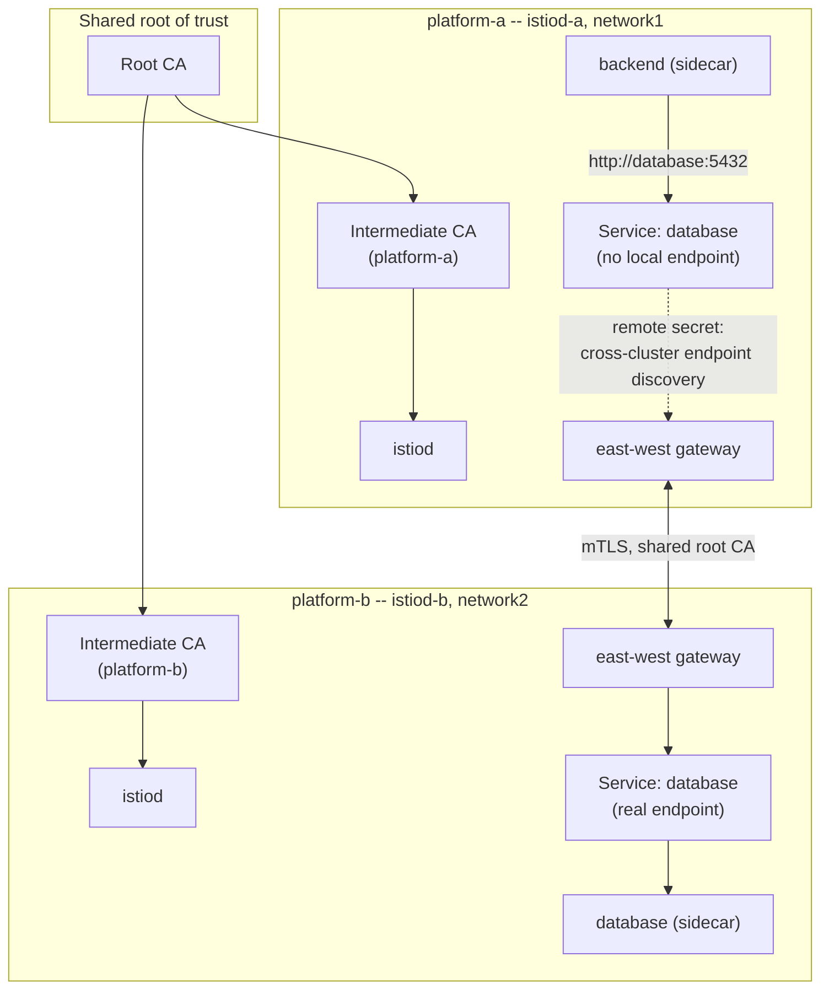

# Lab 4 — Installing the Mesh 

**Day 1 · Multi-Cluster & Service Mesh**

> **Status note:** every command below was actually run end to end against the real two-cluster platform, and every screenshot is a real `screencapture` of that run. Genuinely good news: this is the lab expected to be the hardest of the five, and it came up clean on the first real attempt — the one real fix needed was matching the downloaded Istio release to the already-installed `istioctl` version (§4.2). Builds on [Lab 3](lab-03-federate-a-real-workload.md)'s running storefront app — nothing is torn down here either.

## What you'll learn

- Istio's **multi-primary, multi-network** deployment model — one Istio control plane per cluster, sharing a common root of trust, connected by **east-west gateways** rather than assuming direct pod-to-pod routing across clusters.
- Why a shared **root CA** is what makes mTLS (Lab 5) meaningful across cluster boundaries — two independently-generated cluster CAs would never trust each other's workload certificates.
- How the exact same Kubernetes Service name, deployed in both clusters, becomes **one logical service** to Istio — the mechanism that replaces Lab 3's manual internal-load-balancer IP with real service-name-based cross-cluster routing.
- Verifying cross-cluster routing isn't happening by accident — inspecting the Envoy sidecar's own endpoint list to see the remote cluster's IP show up for a local service name.

## Time & cost

- **Time:** ~75 minutes — the most involved lab of the day. Budget extra time to debug the east-west gateway and remote-secret exchange if something doesn't come up cleanly the first time; this is genuinely more complex than a single-cluster Istio install.
- **Cost:** included in the running `platform-a`/`platform-b` clusters, plus two additional small load balancers (the east-west gateways).

## Prerequisites

[Lab 3](lab-03-federate-a-real-workload.md) completed. You need `istioctl` installed (see the [Setup Environment Guide](00-setup-environment-guide.md)).

---

## 4.1 Concepts, briefly

Istio's multi-cluster support has more than one deployment model; this lab uses **multi-primary, multi-network** — each cluster (`platform-a`, `platform-b`) runs its own full Istio control plane (`istiod`), and the two are peers, not a primary/remote hierarchy. "Multi-network" means Istio does **not** assume `platform-a`'s pods can route directly to `platform-b`'s pod IPs (the same conservative assumption that made Lab 3's internal load balancer necessary) — cross-cluster traffic instead flows through a dedicated **east-west gateway** on each cluster, an Istio-managed Envoy proxy exposed via its own load balancer.

For any of this to be trustworthy rather than merely functional, both clusters' workload certificates need to chain up to the **same root CA** — otherwise mTLS (Lab 5) would either fail closed or, worse, silently trust certificates it has no real basis to trust. That means generating one root CA and one intermediate CA per cluster signed by it, *before* installing Istio, and feeding those intermediates in as each cluster's `cacerts` secret.

The payoff, and the thing that actually replaces Lab 3's manual IP wiring: once both clusters have a `database` Service object of the same name/namespace, with the actual Postgres endpoint only existing on `platform-b`, Istio's cross-cluster service discovery treats them as **one logical Service** — `platform-a`'s backend can call `http://database:5432` by name and have the request routed across the mesh to the real endpoint on `platform-b`, the same way it would resolve a same-cluster Service.



---

## 4.2 Generate a shared root CA and per-cluster intermediates

```bash
mkdir -p /tmp/istio-certs && cd /tmp/istio-certs
ISTIO_VERSION=1.31.0
curl -L https://github.com/istio/istio/releases/download/${ISTIO_VERSION}/istio-${ISTIO_VERSION}-osx-arm64.tar.gz -o istio.tar.gz
tar xzf istio.tar.gz
cd istio-${ISTIO_VERSION}/tools/certs

make -f Makefile.selfsigned.mk root-ca
make -f Makefile.selfsigned.mk platform-a-cacerts
make -f Makefile.selfsigned.mk platform-b-cacerts
```

> **Tested gotcha:** pin `ISTIO_VERSION` to match whatever `istioctl version --remote=false` already reports locally (`1.31.0` at test time), not whatever version a tutorial happens to show. This download is only used for its bundled `tools/certs` Makefiles and `samples/multicluster/` scripts (§4.4) — mixing an older samples/tooling release with a newer installed `istioctl` risks IstioOperator API drift between the two. Swap `osx-arm64` for `linux-amd64` on Linux.


```bash
for ctx in platform-a platform-b; do
  kubectl --context $ctx create namespace istio-system
  kubectl --context $ctx create secret generic cacerts -n istio-system \
    --from-file=${ctx}/ca-cert.pem \
    --from-file=${ctx}/ca-key.pem \
    --from-file=${ctx}/root-cert.pem \
    --from-file=${ctx}/cert-chain.pem
done
```


`Makefile.selfsigned.mk` is Istio's own documented tooling for exactly this: one root, per-cluster intermediates, in the file layout each cluster's `cacerts` Secret expects.

## 4.3 Install Istio on both clusters

```bash
istioctl install -y --context=platform-a -f - <<EOF
apiVersion: install.istio.io/v1alpha1
kind: IstioOperator
spec:
  values:
    global:
      meshID: mesh1
      network: network1
      multiCluster:
        clusterName: platform-a
EOF

istioctl install -y --context=platform-b -f - <<EOF
apiVersion: install.istio.io/v1alpha1
kind: IstioOperator
spec:
  values:
    global:
      meshID: mesh1
      network: network2
      multiCluster:
        clusterName: platform-b
EOF

kubectl --context platform-a label namespace default istio-injection=enabled --overwrite
kubectl --context platform-b label namespace default istio-injection=enabled --overwrite
```


**Verified result:** clean installs on both clusters (screenshot for `platform-a` alone: [`03-istio-install-a.png`](screenshots/lab04/03-istio-install-a.png)) — same `meshID` on both (they're one mesh), different `network` per cluster (that's what tells Istio not to assume direct pod routing between them and to use the east-west gateway instead), and a `clusterName` matching the fleet membership names from Lab 2.

## 4.4 Expose the east-west gateway on both clusters

```bash
cd /tmp/istio-certs/istio-${ISTIO_VERSION}

samples/multicluster/gen-eastwest-gateway.sh --mesh mesh1 --network network1 --cluster platform-a \
  | istioctl --context platform-a install -y -f -
kubectl --context platform-a apply -n istio-system -f samples/multicluster/expose-services.yaml
```


```bash
samples/multicluster/gen-eastwest-gateway.sh --mesh mesh1 --network network2 --cluster platform-b \
  | istioctl --context platform-b install -y -f -
kubectl --context platform-b apply -n istio-system -f samples/multicluster/expose-services.yaml

kubectl --context platform-a get svc istio-eastwestgateway -n istio-system
kubectl --context platform-b get svc istio-eastwestgateway -n istio-system
```


**Verified result:** both `istio-eastwestgateway` Services got real external IPs (`platform-b`'s took about a minute longer to leave `<pending>`). `expose-services.yaml` is what makes any Service matching its selector (by default, any Service in the mesh) reachable through the gateway — without it, the gateway exists but forwards nothing.

## 4.5 Exchange remote secrets — the step that actually links the two control planes

```bash
until kubectl --context platform-b get svc istio-eastwestgateway -n istio-system -o jsonpath='{.status.loadBalancer.ingress[0].ip}' 2>/dev/null | grep -q .; do sleep 5; done

istioctl create-remote-secret --context=platform-a --name=platform-a | kubectl --context=platform-b apply -f -
istioctl create-remote-secret --context=platform-b --name=platform-b | kubectl --context=platform-a apply -f -
```


**Verified result:** each cluster's `istiod` now has a Kubernetes client credential for the *other* cluster, which is what lets it watch the other cluster's Endpoints/Services and fold them into its own service registry. Without this step, both clusters have a perfectly healthy standalone mesh each — they just don't know the other one exists.

## 4.6 Replace Lab 3's manual IP wiring with real cross-cluster service discovery

```bash
kubectl --context platform-a apply -f - <<'EOF'
apiVersion: v1
kind: Service
metadata:
  name: database
spec:
  ports:
  - {port: 5432, targetPort: 5432}
  selector: {app: database}
EOF
```

This creates a `database` Service on `platform-a` with **no matching local Pods** — deliberately. Istio's cross-cluster discovery sees the same Service name/namespace/port already backed by a real endpoint on `platform-b`, and merges that remote endpoint into what `platform-a`'s workloads see when they resolve `database`.

```bash
kubectl --context platform-a rollout restart deployment/backend
kubectl --context platform-a set env deployment/backend DB_HOST=database
kubectl --context platform-a rollout status deployment/backend --timeout=120s
kubectl --context platform-a exec deployment/backend -- python3 -c "import urllib.request; print(urllib.request.urlopen('http://localhost:8080/catalog').read().decode())"
```


**Verified result:** `[{"name":"Keyboard","price":49.99},{"name":"Mouse","price":19.99},{"name":"Monitor","price":199.99}]` — the same real product list as Lab 3, but `DB_HOST` is now the plain Service name `database`, not a hand-copied IP. Confirm this is genuinely routing cross-cluster through the mesh, not a coincidence:

```bash
istioctl proxy-config endpoints deployment/backend.default --context platform-a | grep -i database
```


**Verified result:** `10.72.1.10:5432` — squarely inside `platform-b`'s Pod CIDR (`10.72.0.0/14`), nowhere near `platform-a`'s (`10.84.0.0/14`). Direct proof `platform-a`'s backend sidecar is routing this specific call across the mesh to the real Pod on `platform-b`, not to anything local.

---

## Lab summary

| | Result |
|---|---|
| Shared root CA, per-cluster intermediates installed as `cacerts` | §4.2 — verified |
| Istio multi-primary control planes installed on both clusters, same meshID, different network | §4.3 — verified |
| East-west gateways expose services for cross-cluster reachability | §4.4 — verified, real external IPs on both |
| Remote secrets let each cluster's control plane discover the other's endpoints | §4.5 — verified |
| `backend`'s database call now resolves via plain Service name, routed cross-cluster by the mesh | §4.6 — verified, confirmed via real Envoy endpoint inspection |

## Evidence

- Screenshots: [`screenshots/lab04/`](screenshots/lab04/) (9 images)

**Next:** [Lab 5 — Securing and shaping traffic](lab-05-secure-and-shape-traffic.md)
