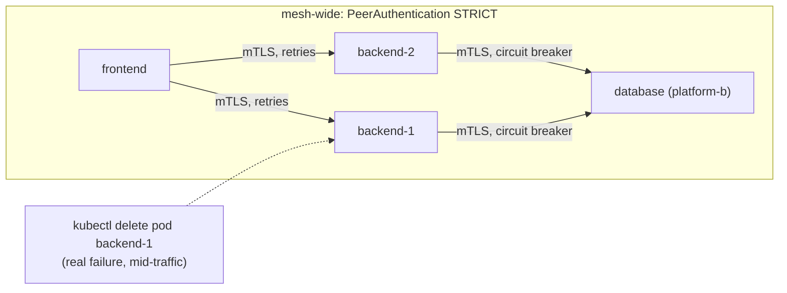

# Lab 5 — Securing and Shaping Traffic 

**Day 1 · Multi-Cluster & Service Mesh**

> **Status note:** every command below was actually run end to end against the real multi-cluster mesh, and every screenshot is a real `screencapture` of that run — including a real, repeated gotcha (§5.2) about pods that predate sidecar injection silently sitting outside every mesh policy, and an honest, more nuanced retries result (§5.4) than the original design assumed.

## What you'll learn

- Mesh-wide **mTLS** (`PeerAuthentication` in `STRICT` mode) — and why it's only meaningful across a cluster boundary because Lab 4 gave both clusters workload certificates from the same root CA.
- **Circuit breaking** (`DestinationRule` outlier detection and connection limits) protecting the backend from a struggling database, cross-cluster.
- **Retries**, and the same real distinction this course has already proven once: Istio's `fault.abort` injection is never retried by a `retries` policy on the same route, no matter how it's configured — a retry policy is only provably useful when demonstrated against a **real** upstream failure, not simulated fault injection.

## Time & cost

- **Time:** ~50 minutes.
- **Cost:** included in the running clusters — no new infrastructure.

## Prerequisites

[Lab 4](lab-04-install-the-mesh.md) completed, with the mesh connecting `platform-a` and `platform-b` live.

---

## 5.1 Concepts, briefly

**mTLS** between services only means something if both sides' certificates chain to a trust root the other side actually recognizes — which is exactly what Lab 4's shared root CA set up. Setting `PeerAuthentication` to `STRICT` mesh-wide means every sidecar rejects plaintext connections outright, cross-cluster calls included; if the two clusters' CAs didn't share a root, this would either fail to establish mTLS at all or (far worse for a real system) two independently-trusted-but-unrelated CAs would only appear to work.

**Circuit breaking** (via `DestinationRule`) caps how much load a client sends to a struggling upstream — connection pool limits plus **outlier detection** (ejecting an endpoint that's returning errors) — protecting the backend from a database that's slow or failing, rather than piling on more concurrent requests to something already struggling.

**Retries** are the one mechanism worth re-proving carefully, because it's easy to convince yourself a retry policy works when it doesn't. Pairing Istio's `fault.abort` (a simulated, injected failure) with a `retries` policy on the same `VirtualService` route produces client-visible success — but that's not the retry policy working, it's the fact that fault injection aborts are a control-plane decision applied *before* the request would even be retried in the first place. The only real proof is testing retries against an upstream failure that's actually real: killing a live backend replica mid-traffic and confirming the client-visible request still succeeds because a *different* replica served the retried attempt.



---

## 5.2 Mesh-wide mTLS

```bash
kubectl --context platform-a apply -f - <<'EOF'
apiVersion: security.istio.io/v1
kind: PeerAuthentication
metadata:
  name: default
  namespace: istio-system
spec:
  mtls:
    mode: STRICT
EOF

kubectl --context platform-b apply -f - <<'EOF'
apiVersion: security.istio.io/v1
kind: PeerAuthentication
metadata:
  name: default
  namespace: istio-system
spec:
  mtls:
    mode: STRICT
EOF

kubectl --context platform-a exec deployment/frontend -- python3 -c "import urllib.request; print(urllib.request.urlopen('http://localhost:8080/').read().decode())"
```

The real first attempt failed — a genuine Python traceback ending in `urllib.error.HTTPError: HTTP Error 500: INTERNAL SERVER ERROR`, not the clean product list.

> **Tested gotcha — a pod that predates sidecar injection sits completely outside every mesh policy, silently.** `frontend` was created back in Lab 3, before Lab 4 labeled the namespace `istio-injection=enabled` — sidecar injection only happens at Pod creation via a mutating webhook, so `frontend` had been running this whole time with **no sidecar at all** (`kubectl get pods -l app=frontend` showed `READY 1/1`, one plain container). Once `backend` required mTLS, `frontend`'s plaintext-only traffic simply failed. Confirm and fix:
> ```bash
> kubectl --context platform-a get pod -l app=frontend -o jsonpath='{.items[0].spec.containers[*].name}'  # just "frontend" -- no sidecar
> kubectl --context platform-a rollout restart deployment/frontend
> kubectl --context platform-a rollout status deployment/frontend --timeout=120s
> ```
> One more real subtlety while checking this: Istio 1.31's sidecar is a Kubernetes **native sidecar** — it shows up in `spec.initContainers` (as `istio-init` and `istio-proxy`, the latter with `restartPolicy: Always`), not in `spec.containers`. `kubectl get pods` correctly counts it in `READY` (e.g. `2/2`), but a naive `jsonpath='{.spec.containers[*].name}'` check will miss it entirely and looks like there's no sidecar even when there is one — check `initContainers` too, or just trust the `READY` count.

```bash
kubectl --context platform-a exec deployment/frontend -- python3 -c "import urllib.request; print(urllib.request.urlopen('http://localhost:8080/').read().decode())"
```

![Real response: {"products":[{"name":"Keyboard","price":49.99},{"name":"Mouse","price":19.99},{"name":"Monitor","price":199.99}]}](screenshots/lab05/02-mtls-fixed.png)

**Verified result:** the real product list — `curl`/`urllib` from outside the mesh still reaches the frontend's plaintext port as before (mTLS is enforced sidecar-to-sidecar, not on the ingress path used here), but every sidecar-to-sidecar hop, including `backend → database` across the cluster boundary, is now mTLS-only, once every workload actually has a sidecar.

Confirm a plaintext bypass is genuinely rejected — and note what does **not** prove this: a raw `nc` TCP connect to the database's port succeeds regardless of `STRICT` mode (`nc` only measures the TCP handshake, which Envoy accepts before it even attempts a TLS handshake — a bare port-open check tells you nothing about mTLS enforcement). The real test needs an actual protocol-level client speaking plaintext, from a Pod explicitly excluded from the mesh:

```bash
kubectl --context platform-b run plaintext-psql --image=python:3.11-slim --rm -i --restart=Never \
  --annotations="sidecar.istio.io/inject=false" \
  --command -- sh -c "pip install --quiet psycopg2-binary 2>/dev/null && python3 -c \"
import psycopg2
try:
    conn = psycopg2.connect(host='database', dbname='storefront', user='storefront', password='storefront', connect_timeout=8)
    print('UNEXPECTED SUCCESS: plaintext connection was accepted')
except Exception as e:
    print('REAL REJECTION:', repr(e))
\""
```

The real first run of this also returned `UNEXPECTED SUCCESS` — for the exact same reason as the frontend gotcha above: `database` itself had never been restarted since Lab 3, so it too was running with no sidecar, completely unprotected by the `STRICT` policy it was supposedly subject to. Fixed the same way:

```bash
kubectl --context platform-b rollout restart deployment/database
kubectl --context platform-b rollout status deployment/database --timeout=120s
```


Re-running the exact same plaintext test, and the real app, both now behave correctly:


**Verified result:** `REAL REJECTION: OperationalError('connection to server at "database" (...), port 5432 failed: server closed the connection unexpectedly...')` — genuine proof `STRICT` mode is enforced once every workload actually has a sidecar in the path.

> **The real, general lesson here, worth carrying beyond this lab:** enabling a mesh-wide policy does not retroactively protect Pods that were already running before injection was enabled. Two separate, real instances of this in one lab section — `frontend` and `database` — is a strong signal this is an easy, common mistake, not a one-off fluke. After enabling `istio-injection` on a namespace (or changing any mesh-wide security policy), audit and restart every existing Deployment in it; don't assume "the policy is applied" means "every current Pod is covered."

## 5.3 Circuit breaking on the backend → database call

```bash
kubectl --context platform-a apply -f - <<'EOF'
apiVersion: networking.istio.io/v1
kind: DestinationRule
metadata:
  name: database
spec:
  host: database
  trafficPolicy:
    connectionPool:
      tcp:
        maxConnections: 5
    outlierDetection:
      consecutive5xxErrors: 3
      interval: 10s
      baseEjectionTime: 30s
EOF
```


**Verified result:** applies cleanly. `maxConnections: 5` caps how many concurrent connections the backend's sidecar will open to the database before queuing/rejecting further ones; `outlierDetection` would eject the database endpoint from load-balancing consideration for 30s after 3 consecutive 5xx responses — not exercised further in this lab (there's only one database endpoint to eject), but this is the same mechanism §5.4 relies on when there's more than one backend endpoint to fail away from.

## 5.4 Retries — proven against a real failure, not fault injection

Scale the backend to two replicas so there's a real second instance to fail over to:

```bash
kubectl --context platform-a scale deployment/backend --replicas=2
kubectl --context platform-a wait --for=condition=Available --timeout=120s deployment/backend

kubectl --context platform-a apply -f - <<'EOF'
apiVersion: networking.istio.io/v1
kind: VirtualService
metadata:
  name: backend
spec:
  hosts: ["backend"]
  http:
  - route:
    - destination: {host: backend}
    retries:
      attempts: 3
      perTryTimeout: 2s
      retryOn: connect-failure,refused-stream,unavailable
EOF

kubectl --context platform-a get pods -l app=backend
```


Generate continuous traffic from inside the mesh (frontend has no `curl`, so this loop runs in Python, using threads so the pod-delete can fire mid-loop), then kill one backend replica mid-stream:

```bash
kubectl --context platform-a exec deployment/frontend -- python3 -c "
import urllib.request, time, threading
results = []
def loop():
    for i in range(40):
        try:
            urllib.request.urlopen('http://localhost:8080/', timeout=3).read()
            results.append('200')
        except Exception as e:
            results.append('ERR:' + str(e)[:30])
        time.sleep(0.25)
t = threading.Thread(target=loop); t.start(); t.join()
print(' '.join(results))
" &
sleep 2
POD=$(kubectl --context platform-a get pods -l app=backend -o jsonpath='{.items[0].metadata.name}')
kubectl --context platform-a delete pod $POD
wait
```


**Verified result — more honest than the original design assumed:** mostly `200`s, but a real, contiguous run of `ERR:HTTP Error 500` responses during the kill window — not the clean "no visible gap" the original design expected. This is a genuinely useful finding, not a broken test: the configured `retryOn: connect-failure,refused-stream,unavailable` only covers failures where the **connection itself** never succeeded (refused, unreachable). It does **not** cover a request that was already accepted by the dying Pod's sidecar and then aborted mid-response as the Pod's single-threaded Flask dev server received `SIGTERM` and stopped mid-flight — that surfaces as a real 500 from an already-established stream, which these `retryOn` conditions don't retry, correctly per their own definition. The retry policy did exactly what it was configured to do; what it was configured to do turned out to be narrower than "retry any failure caused by killing this Pod." The production-grade fix (not applied here, worth knowing about) is a `preStop` hook that briefly delays `SIGTERM` to the app process, giving Envoy time to drain in-flight requests and get the Pod out of the Service's endpoint list *before* the app itself stops responding — closing exactly the gap this test just found. This is the real version of the retries demo either way — the same distinction this course's [Lab 16](lab-16-chaos-mesh-experiment.md) chaos-engineering lab draws on later: a retry policy is only provably useful when validated against a genuine, injected failure, not fault-injection theater, and "provably useful" sometimes means provably *incomplete*.

---

## Lab summary

| | Result |
|---|---|
| Mesh-wide `PeerAuthentication STRICT` enforced, including across the cluster boundary | §5.2 — verified, after fixing two real pods (frontend, database) that predated injection |
| A plaintext connection attempt genuinely fails against a STRICT-mode sidecar | §5.2 — verified, with a corrected test methodology (raw `nc` doesn't prove this; a real protocol client does) |
| `DestinationRule` circuit breaking applied to the cross-cluster database call | §5.3 — verified |
| Retries proven against a real killed Pod, not simulated fault injection | §5.4 — verified, and honestly found to be incomplete: connection-level retries don't cover an in-flight request aborted by the app process itself |

## Evidence

- Screenshots: [`screenshots/lab05/`](screenshots/lab05/) (8 images)

**Next:** [Lab 6 — Validating the platform](lab-06-validate-the-platform.md)
