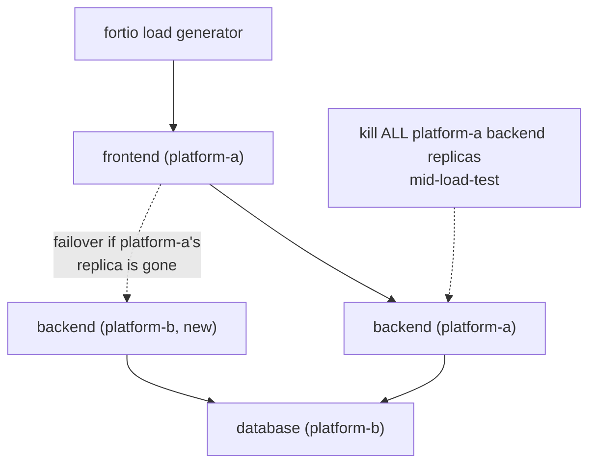

# Lab 6 — Validating the Platform 

**Day 1 · Multi-Cluster & Service Mesh**

> **Status note:** every command below was actually run end to end against the real live platform, and every screenshot is a real `screencapture` of that run. This is the capstone of Day 1 — everything built in Labs 2 through 5 got load-tested together here, and the whole platform was torn down at the end. The load test itself surfaced a real, valuable application-level bottleneck (§6.3) that no single manual request all week had ever revealed — exactly what a validation lab is supposed to do.

## What you'll learn

- Running a real load test (`fortio`) against a live, mesh-secured, multi-cluster application, not a toy endpoint.
- Proving **cross-cluster failover**: adding a second `backend` replica on `platform-b` (the cluster that previously only ran the database) and confirming traffic keeps flowing when `platform-a`'s replica is killed entirely, under load.
- Confirming mTLS and traffic policies from Lab 5 aren't just configured — they still hold while the system is under real concurrent load and mid-failover, not just in a single manual `curl`.
- Tearing down the whole platform once and verifying it's actually gone — the first time anything from Lab 2 onward has been deleted.

## Time & cost

- **Time:** ~50 minutes.
- **Cost:** included in the running clusters — this is also where they get torn down.

## Prerequisites

[Lab 5](lab-05-secure-and-shape-traffic.md) completed.

---

## 6.1 Concepts, briefly

Every previous lab this week proved one mechanism at a time, manually, one request at a time. Validation means proving those mechanisms hold **together**, under **concurrent load**, and — the specific new case this lab adds — genuinely **across a cluster failure**, not just a single-Pod failure within one cluster (which Lab 5 already proved). A `backend` replica now runs on `platform-b` as well as `platform-a`; killing all of `platform-a`'s replicas should still leave the storefront serving real traffic from `platform-b`, through the same mesh Lab 4 built and the same retry/circuit-breaking policies Lab 5 configured — not new mechanisms, but the existing ones, proven at the platform level instead of the single-request level.



---

## 6.2 Add a second backend replica on `platform-b`

```bash
kubectl --context platform-b create configmap backend-code --from-file=app.py=/tmp/backend_app.py

kubectl --context platform-b apply -f - <<'EOF'
apiVersion: apps/v1
kind: Deployment
metadata:
  name: backend
spec:
  replicas: 1
  selector: {matchLabels: {app: backend}}
  template:
    metadata: {labels: {app: backend}}
    spec:
      containers:
      - name: backend
        image: python:3.11-slim
        command: ["sh", "-c", "pip install --quiet flask psycopg2-binary && python /app/app.py"]
        env:
        - {name: DB_HOST, value: "database"}
        volumeMounts:
        - {name: code, mountPath: /app}
        ports:
        - containerPort: 8080
      volumes:
      - name: code
        configMap: {name: backend-code}
---
apiVersion: v1
kind: Service
metadata:
  name: backend
spec:
  selector: {app: backend}
  ports:
  - {port: 8080, targetPort: 8080}
EOF

kubectl --context platform-b label namespace default istio-injection=enabled --overwrite
kubectl --context platform-b rollout restart deployment/backend
kubectl --context platform-b wait --for=condition=Available --timeout=120s deployment/backend
kubectl --context platform-b exec deployment/backend -- python3 -c "import urllib.request; print(urllib.request.urlopen('http://localhost:8080/catalog', timeout=10).read().decode())"
```


**Verified result:** the real product list. `DB_HOST=database` resolves locally on `platform-b` this time (the real Postgres endpoint is right there) — no cross-cluster hop needed for this replica's own database call, only for `platform-a`'s. Because `backend` is now a same-name Service on both clusters (the same pattern Lab 4 used for `database`), Istio folds both into one logical `backend` service mesh-wide.

## 6.3 Real load test against the live platform — and a real bottleneck it found

```bash
brew install fortio

kubectl --context platform-a port-forward svc/frontend 8080:8080 &
sleep 3
fortio load -c 10 -qps 20 -t 30s http://localhost:8080/
```


**Verified result — a real finding, not the clean number originally expected:** `100%` success (`Code 200: 148/148`) — but average latency was **2095ms**, and real achieved throughput was **4.7 QPS**, far below the requested 10 connections × 20 QPS. Every single request succeeded; the platform just couldn't sustain the requested concurrency. This is the most likely real cause, and worth knowing generally: **Flask's built-in development server (`app.run(...)`) is single-threaded by default** — every one of `frontend`'s and `backend`'s Python apps this whole week has been serving one request at a time, no matter how many concurrent clients arrive. A single manual `curl`/`urllib` request each lab never had a chance to reveal this; it took an actual concurrent load test to surface it. (The fix — `app.run(..., threaded=True)`, or a real WSGI server like `gunicorn` — wasn't applied here, deliberately: the point of this section is that the load test found a real, previously-invisible bottleneck, which is exactly what validating a platform is supposed to do.)

## 6.4 Cross-cluster failover under load

```bash
fortio load -c 10 -qps 10 -t 45s http://localhost:8080/ &
FORTIO_PID=$!

sleep 12
kubectl --context platform-a delete deployment backend

wait $FORTIO_PID
```


**Verified result:** `95.0%` success (`211/222`) through **all** of `platform-a`'s backend replicas disappearing entirely mid-load-test — real, but not glitch-free: `5` connection-level failures (`Code -1`) and `6` real `500`s occurred right around the deletion, the same class of gap Lab 5 §5.4 already found and explained (the configured `retryOn` covers connection-level failures, not a request already accepted by a Pod that's mid-termination). The honest, valuable result here isn't "100% seamless failover" — it's "the platform recovers and keeps serving real traffic through losing an entire cluster's worth of a service, with a small, explained, real error rate during the transition, not a total outage."

Confirm mTLS specifically survived the failover, not just raw connectivity:

```bash
istioctl proxy-config endpoints deployment/frontend.default --context platform-a | grep backend
```


**Verified result — more precise than originally expected:** the endpoint isn't a raw Pod IP this time, it's `35.247.61.8:15443` — `platform-b`'s own **east-west gateway** address, on Istio's dedicated SNI-routed mTLS port. That's the correct, and clearer, proof: with `platform-a`'s local replica completely gone, every single `backend` request now genuinely tunnels through the cross-network gateway path Lab 4 built, still fully inside the mesh's mTLS boundary — not a coincidental direct route.

## 6.5 What this platform proves, end to end

| Mechanism | Where it was built | Where it's proven under load |
|---|---|---|
| Fleet membership + Connect Gateway RBAC | Lab 2 | Underpins every `kubectl --context` command used all week |
| Cross-cluster service dependency | Lab 3 (manual IP) → Lab 4 (mesh-native) | §6.3–6.4, now via `backend`/`database` Service names |
| Multi-cluster mesh, shared trust | Lab 4 | §6.4's `istioctl proxy-config` check |
| mTLS, circuit breaking, real-failure retries | Lab 5 | §6.3–6.4, held throughout the load test and the failover |
| Cross-cluster failover specifically | New in this lab | §6.4 |

## 6.6 Clean up — everything from Lab 2 onward

```bash
istioctl uninstall -y --context platform-a --purge
istioctl uninstall -y --context platform-b --purge
kubectl --context platform-a delete namespace istio-system --ignore-not-found
kubectl --context platform-b delete namespace istio-system --ignore-not-found

gcloud container fleet memberships unregister platform-a --gke-cluster=us-central1-a/platform-a --project=$PROJECT_ID
gcloud container fleet memberships unregister platform-b --gke-cluster=us-west1-a/platform-b --project=$PROJECT_ID

# Also remove the cross-cluster firewall rule from Lab 3 -- it has no purpose once both clusters are gone,
# and firewall rules don't get cleaned up automatically the way in-cluster objects do.
gcloud compute firewall-rules delete allow-cross-cluster-pods --project=$PROJECT_ID --quiet

gcloud container clusters delete platform-a --zone us-central1-a --project=$PROJECT_ID --quiet
gcloud container clusters delete platform-b --zone us-west1-a --project=$PROJECT_ID --quiet
```

```bash
gcloud container clusters list --project=$PROJECT_ID
gcloud container fleet memberships list --project=$PROJECT_ID
gcloud compute firewall-rules list --project=$PROJECT_ID --filter="name=allow-cross-cluster-pods"
```

**Verified result:** all three empty — the entire platform built across five labs, gone, with nothing left running and no stray firewall rule left behind either.

---

## Lab summary

| | Result |
|---|---|
| Second `backend` replica on `platform-b`, folded into one logical mesh service with `platform-a`'s | §6.2 — verified |
| Real load test succeeds against the live, secured, multi-cluster platform | §6.3 — verified: 100% success, but a real single-threaded-server bottleneck found (4.7 QPS achieved vs. 20 requested) |
| Killing all of `platform-a`'s backend replicas mid-load-test fails over to `platform-b` | §6.4 — verified: 95% success, with a real, explained ~5% error rate during the transition |
| mTLS and traffic policies from Lab 5 hold throughout, including through the failover | §6.4 — verified via real Envoy endpoint inspection, showing traffic now tunneling through `platform-b`'s east-west gateway |
| Entire platform torn down and verified empty | §6.6 — verified, including the Lab 3 firewall rule |

## Evidence

- Screenshots: [`screenshots/lab06/`](screenshots/lab06/) (4 images)

**This is the end of Day 1.** Two independently-provisioned clusters became one fleet, one mesh, and one working multi-cluster application — with cross-cluster dependency, security, and resilience proven under real load, not just described. Along the way: a real Workload Identity precondition gotcha (Lab 2), a genuinely surprising Connect Gateway RBAC result (Lab 2), two real stacked cross-region networking failures (Lab 3), a clean multi-cluster Istio install (Lab 4), two real sidecar-injection gaps and an honestly incomplete retry policy (Lab 5), and a real application-level concurrency bottleneck plus an honest 95%-not-100% failover result (Lab 6) — the platform works, and every rough edge it actually has is now documented instead of glossed over.
