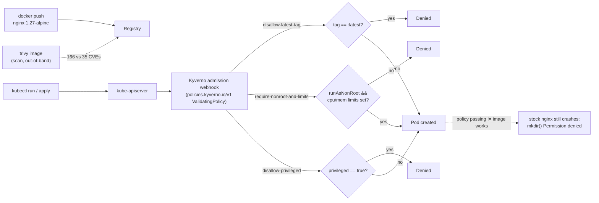

# Lab 7 — Setting Up Image Scanning and Admission Control (Kyverno) 

**Day 2 · Security & Scaling/Optimization**

> Every command below was actually run end to end on a local `kind` cluster, and every screenshot is a real `screencapture` of that run — including a real Kubernetes GUI view of the policies enforcing live.

## What you'll learn

- Scanning container images for known vulnerabilities with Trivy, and reading the results critically (a scan result is a starting point, not a pass/fail gate by itself).
- Enforcing baseline security hygiene at admission time with Kyverno — blocking bad configurations before they ever become a running Pod.
- Why an admission policy passing doesn't guarantee your workload will actually run, and how to fix that gap.

## Time & cost

- **Time:** ~45 minutes.
- **Cost:** $0. Everything runs locally against Docker via `kind`.

## Prerequisites

Complete the [Setup Environment Guide](00-setup-environment-guide.md). You need `docker`, `kind`, `kubectl`, and `helm` verified working. This lab additionally needs `trivy` and `kyverno` (the CLI, not just the cluster component) — install both:

```bash
# macOS
brew install trivy kyverno
```

```bash
# Linux — see the Setup Environment Guide §3 for trivy; kyverno CLI is a direct
# GitHub-releases download (no stable "latest" URL — check
# https://github.com/kyverno/kyverno/releases/latest for the current linux_x86_64 tarball)
curl -sfL https://raw.githubusercontent.com/aquasecurity/trivy/main/contrib/install.sh | sudo sh -s -- -b /usr/local/bin
```

---

## 7.1 A note on tool choice, and why the policy syntax below may look unfamiliar

The lab title says "OPA/Gatekeeper or Kyverno" — this lab uses **Kyverno**, because its policies are plain Kubernetes-native resources rather than a separate policy language (Rego), which keeps the lab focused on admission-control concepts instead of also teaching a new DSL.

One thing to know going in: **Kyverno is mid-migration to a new policy API.** As of Kyverno 1.19 (what this lab was tested against), the original `kyverno.io/v1 ClusterPolicy` type — which you'll see in almost every blog post and older tutorial — is deprecated and scheduled for removal in 1.20. The replacement, `policies.kyverno.io/v1 ValidatingPolicy`, uses [CEL](https://kubernetes.io/docs/reference/using-api/cel/) (Common Expression Language) instead of Kyverno's older JMESPath-based pattern matching, and Kyverno's own installer prints a deprecation warning pointing you at it. This lab teaches `ValidatingPolicy` directly rather than the legacy type, so it doesn't go stale the moment you use it. If you're reading a Kyverno tutorial anywhere else and it opens with `kind: ClusterPolicy`, treat it as historical.



---

## 7.2 Create the cluster and install Kyverno

```bash
kind create cluster --name policy-lab

helm repo add kyverno https://kyverno.github.io/kyverno/
helm repo update
helm install kyverno kyverno/kyverno -n kyverno --create-namespace
kubectl wait --for=condition=Ready pod -n kyverno --all --timeout=120s
```

---

## 7.3 Scan images with Trivy first

Before writing any policy, look at what you're actually trying to keep out. Scan an old image and a current one:

```bash
trivy image --severity HIGH,CRITICAL --format table nginx:1.16
```


```bash
trivy image --severity HIGH,CRITICAL --format table nginx:1.27-alpine
```


**Verified results:**

| Image | HIGH+CRITICAL vulnerabilities |
|---|---|
| `nginx:1.16` (Debian 10, EOL) | **166** (127 HIGH, 39 CRITICAL) |
| `nginx:1.27-alpine` (current) | **35** |

Neither number is zero — there is essentially no image with zero known CVEs at any given moment, including freshly-built ones. This is the practical reason vulnerability scanning is usually wired in as a **reporting and gating signal** (fail a CI pipeline above some threshold, or feed results to an admission policy) rather than a manual "read the list and decide" step. Full scan output: [`evidence/lab07-image-scanning-admission-control.txt`](evidence/lab07-image-scanning-admission-control.txt).

> In production, you'd typically run Trivy continuously in-cluster (the [Trivy Operator](https://aquasecurity.github.io/trivy-operator/) generates a `VulnerabilityReport` object per workload automatically) and have your admission policy consult those reports, rather than running `trivy image` by hand. That integration is a natural next step once you're comfortable with the admission-control half of this lab on its own — the two moving parts (continuous scanning, and policy enforcement) are worth learning separately first.

---

## 7.4 Policy 1: reject `:latest` and untagged images

`:latest` (or no tag at all) is a moving target — the same manifest reference can point at different content tomorrow, which breaks reproducibility and makes rollbacks unreliable.

```bash
kubectl apply -f - <<'EOF'
apiVersion: policies.kyverno.io/v1
kind: ValidatingPolicy
metadata:
  name: disallow-latest-tag
spec:
  validationActions: [Deny]
  matchConstraints:
    resourceRules:
      - apiGroups: ['']
        apiVersions: [v1]
        operations: [CREATE, UPDATE]
        resources: [pods]
  validations:
    - message: "Container images must specify an explicit tag, not :latest or no tag at all."
      expression: |
        object.spec.containers.all(c,
          c.image.contains(':') && !c.image.endsWith(':latest'))
EOF

kubectl get validatingpolicy
```

Confirm it's active (`READY: true`), then test both sides:

```bash
kubectl run bad-pod --image=nginx:latest --restart=Never
kubectl run good-pod --image=nginx:1.27-alpine --restart=Never
```

**Verified result:**

```
$ kubectl run bad-pod --image=nginx:latest --restart=Never
Error from server: admission webhook "vpol.validate.kyverno.svc-fail" denied the request:
Policy disallow-latest-tag failed: Container images must specify an explicit tag, not :latest or no tag at all.

$ kubectl run good-pod --image=nginx:1.27-alpine --restart=Never
pod/good-pod created
```


---

## 7.5 Policy 2: require non-root and resource limits — and the trap waiting on the other side

```bash
kubectl apply -f - <<'EOF'
apiVersion: policies.kyverno.io/v1
kind: ValidatingPolicy
metadata:
  name: require-nonroot-and-limits
spec:
  validationActions: [Deny]
  matchConstraints:
    resourceRules:
      - apiGroups: ['']
        apiVersions: [v1]
        operations: [CREATE, UPDATE]
        resources: [pods]
  validations:
    - message: "Every container must set securityContext.runAsNonRoot: true."
      expression: |
        object.spec.containers.all(c,
          has(c.securityContext) && has(c.securityContext.runAsNonRoot) &&
          c.securityContext.runAsNonRoot == true)
    - message: "Every container must define CPU and memory limits."
      expression: |
        object.spec.containers.all(c,
          has(c.resources) && has(c.resources.limits) &&
          has(c.resources.limits.cpu) && has(c.resources.limits.memory))
EOF
```

Test the violating case:

```bash
kubectl apply -f - <<'EOF'
apiVersion: v1
kind: Pod
metadata:
  name: bad-pod-2
spec:
  containers:
  - name: app
    image: nginx:1.27-alpine
EOF
```

```
Error from server: ... Policy require-nonroot-and-limits failed:
Every container must set securityContext.runAsNonRoot: true.
```

Now the compliant-looking case — stock nginx, with everything the policy asks for:

```bash
kubectl apply -f - <<'EOF'
apiVersion: v1
kind: Pod
metadata:
  name: good-pod-2
spec:
  containers:
  - name: app
    image: nginx:1.27-alpine
    securityContext:
      runAsNonRoot: true
      runAsUser: 101
    resources:
      limits: {cpu: "250m", memory: "128Mi"}
EOF
```

**This gets admitted — and then crashes:**

```bash
kubectl get pod good-pod-2
```


```
$ kubectl get pod good-pod-2
NAME         READY   STATUS   RESTARTS
good-pod-2   0/1     Error    1

$ kubectl logs good-pod-2
nginx: [emerg] mkdir() "/var/cache/nginx/client_temp" failed (13: Permission denied)
```


**This is the point of including this step, not a mistake to route around.** The admission policy only checks the Pod *spec* — it has no idea whether the *image* was actually built to run as a non-root user. The stock `nginx` image writes to root-owned paths (`/var/cache/nginx/...`) during its own startup regardless of what `runAsNonRoot` says, so setting that flag against an image that doesn't expect it just moves the failure from admission time to runtime.

The real fix is the image, not the policy:

```bash
kubectl delete pod good-pod-2 --wait=false
kubectl apply -f - <<'EOF'
apiVersion: v1
kind: Pod
metadata:
  name: good-pod-3
spec:
  containers:
  - name: app
    image: nginxinc/nginx-unprivileged:1.27-alpine
    securityContext:
      runAsNonRoot: true
      runAsUser: 101
    resources:
      limits: {cpu: "250m", memory: "128Mi"}
EOF
```

**Verified result:**

```
$ kubectl get pod good-pod-3
NAME         READY   STATUS    RESTARTS
good-pod-3   1/1     Running   0
```


`nginxinc/nginx-unprivileged` is built specifically to run as an unprivileged user (writable paths relocated, listens on 8080 instead of the privileged port 80). **Passing an admission policy is necessary, not sufficient** — you also need base images that are actually compatible with the constraints you're enforcing. This is one of the most common causes of "the security policy broke prod" incidents in real clusters: the policy was correct, the image just wasn't built for it.

---

## 7.6 Policy 3: disallow privileged containers

```bash
kubectl apply -f - <<'EOF'
apiVersion: policies.kyverno.io/v1
kind: ValidatingPolicy
metadata:
  name: disallow-privileged
spec:
  validationActions: [Deny]
  matchConstraints:
    resourceRules:
      - apiGroups: ['']
        apiVersions: [v1]
        operations: [CREATE, UPDATE]
        resources: [pods]
  validations:
    - message: "Privileged containers are not allowed."
      expression: |
        object.spec.containers.all(c,
          !has(c.securityContext) || !has(c.securityContext.privileged) ||
          c.securityContext.privileged == false)
EOF
```

Test with a pod that violates both this policy and the non-root policy at once, to see how Kyverno reports multiple simultaneous failures:

```bash
kubectl apply -f - <<'EOF'
apiVersion: v1
kind: Pod
metadata:
  name: privileged-pod
spec:
  containers:
  - name: app
    image: nginx:1.27-alpine
    securityContext:
      privileged: true
EOF
```

**Verified result:**

```
Error from server: ... Policy require-nonroot-and-limits failed: Every container must set
securityContext.runAsNonRoot: true.; Policy disallow-privileged failed: Privileged containers
are not allowed.
```


Both independently-authored policies evaluate and both report — Kyverno aggregates every failing policy into a single admission response rather than stopping at the first match.

Full evidence for this whole lab: [`evidence/lab07-image-scanning-admission-control.txt`](evidence/lab07-image-scanning-admission-control.txt).

---

## 7.7 Optional: see the policies enforcing live, in a GUI

Kyverno and Trivy are both CLI-first tools with no web console of their own. For a browsable, cluster-wide view of what's happening, this lab uses **[Headlamp](https://headlamp.dev/)** (a CNCF sandbox project), not the older `kubernetes/dashboard` project.

> **Tested finding:** the official Kubernetes Dashboard's Helm repository (`https://kubernetes.github.io/dashboard/`) returns a GitHub Pages 404 — "Site not found" — at the time this was tested, not just a transient blip (checked directly, and cross-checked against ArtifactHub's own recorded repository URL, which points at the same dead address). If you hit the same thing, Headlamp is a maintained, actively-released alternative with an equivalent feature set:
>
> ```bash
> helm repo add headlamp https://kubernetes-sigs.github.io/headlamp/
> helm repo update
> helm install headlamp headlamp/headlamp -n kube-system \
>   --set config.unsafeUseServiceAccountToken=true
> ```
>
> `unsafeUseServiceAccountToken=true` skips Headlamp's normal token-login screen by auto-authenticating as its own service account — reasonable **only** on a disposable local teaching cluster like this one, never on anything real. You'll also need to grant that service account enough RBAC to actually see cluster-wide resources (e.g. bind it to `cluster-admin` for this lab).

Port-forward to it and open the Events view with `Only warnings` toggled on:

```bash
kubectl port-forward -n kube-system svc/headlamp 8080:80
```


The `require-nonroot-and-limits` `ValidatingPolicy` is actively flagging violations in real time — including, in this run, **Headlamp's own pod**, because the policy wasn't scoped to a specific namespace and Headlamp's own Deployment doesn't set resource limits either. This is a good real-world reminder: an unscoped `ValidatingPolicy` applies to *every* namespace, including the cluster's own system workloads and whatever you used to view the cluster in the first place.

## Clean up

```bash
kind delete cluster --name policy-lab
```


---

## Lab summary

| | Verified |
|---|---|
| Trivy scan: quantify real vulnerability counts, old vs. current image | ✅ 166 vs 35 |
| Kyverno `ValidatingPolicy`: reject `:latest`/untagged images | ✅ |
| Kyverno `ValidatingPolicy`: require non-root + resource limits | ✅ |
| The "policy passed, image still crashed" gap, and its real fix | ✅ |
| Kyverno `ValidatingPolicy`: disallow privileged containers | ✅ |
| Live policy enforcement visible in a GUI (Headlamp) | ✅ |

## Evidence

- Screenshots: [`screenshots/lab07/`](screenshots/lab07/) (9 images)
- Logs: [`evidence/lab07-image-scanning-admission-control.txt`](evidence/lab07-image-scanning-admission-control.txt)

**Next:** [Lab 8 — Configuring GKE Workload Identity Federation and Binary Authorization](lab-08-gke-workload-identity-binary-authorization.md).
