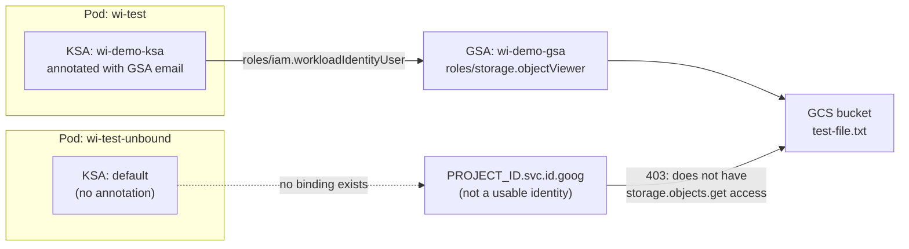
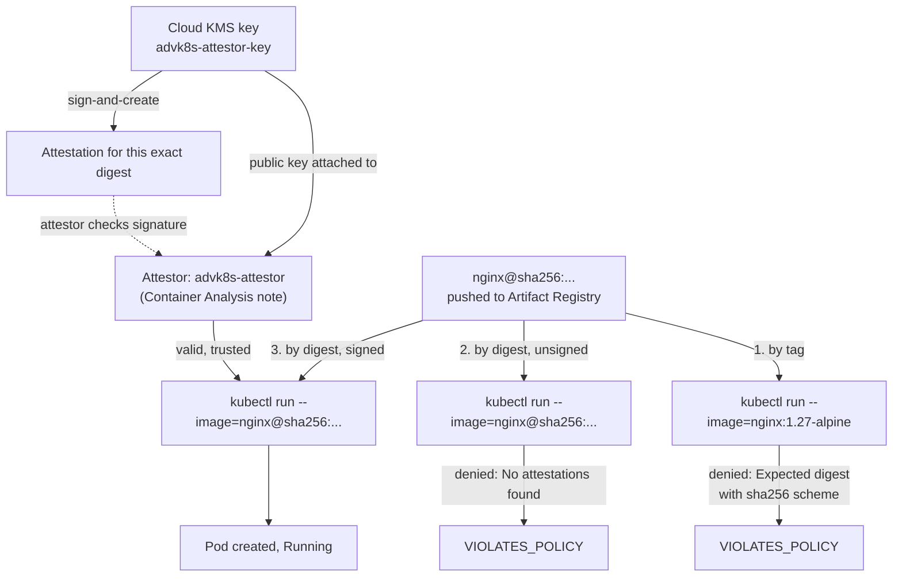

# Lab 8 — Configuring GKE Workload Identity Federation and Binary Authorization 

**Day 2 · Security & Scaling/Optimization**

> Every command below was actually run end to end against a real GKE cluster, and every screenshot is a real `screencapture` of that run.

## What you'll learn

- How Workload Identity Federation lets a specific Pod act as a specific GCP service account — and, just as importantly, what identity every *other* Pod gets instead (not the node's powerful default identity, the way it used to work).
- Setting up Binary Authorization end to end: an attestor backed by a real Cloud KMS signing key, a cluster-enforced policy, and the full deny → sign → allow cycle against a real image.
- Two real-world gotchas that have nothing to do with either feature conceptually, but that you will hit in practice: Binary Authorization's digest-only requirement, and cross-architecture image pushes.

## Time & cost

- **Time:** ~75 minutes.
- **Cost:** real, but small — one small GKE cluster (2× `e2-medium`), a Cloud KMS key (a few cents), Container Analysis/Artifact Registry API usage (free tier covers this lab easily). Comparable to Day 1's cloud labs — a few dollars for the lifetime of the lab if you tear down promptly.

## Prerequisites

Complete the [Setup Environment Guide](00-setup-environment-guide.md), with `gcloud` authenticated against a real GCP project with billing enabled. This lab additionally needs Docker running locally (to push a test image) and the `beta` gcloud component:

```bash
gcloud components install beta
```

---

## 8.1 Create the cluster

```bash
export PROJECT_ID=YOUR_GCP_PROJECT_ID

gcloud services enable \
  binaryauthorization.googleapis.com containeranalysis.googleapis.com cloudkms.googleapis.com \
  --project=$PROJECT_ID

gcloud container clusters create advk8s-security \
  --project=$PROJECT_ID \
  --zone=us-central1-a \
  --num-nodes=2 \
  --machine-type=e2-medium \
  --disk-size=30 \
  --workload-pool=${PROJECT_ID}.svc.id.goog \
  --release-channel=regular
```

`--workload-pool` is what turns on Workload Identity Federation for this cluster. It cannot be enabled after the fact on the *pool identity* setting itself — Workload Identity federation requires the cluster to have a workload pool configured; if you forget this flag at creation, you'd need to update it in, which GKE does support (`gcloud container clusters update --workload-pool=...`), but doing it at creation avoids a second wait.

```bash
gcloud container clusters get-credentials advk8s-security --zone us-central1-a --project=$PROJECT_ID
kubectl config rename-context gke_${PROJECT_ID}_us-central1-a_advk8s-security advk8s-security
kubectl --context advk8s-security get nodes
```


---

## Part A — Workload Identity Federation

### A.1 Concepts, briefly

Before Workload Identity, every Pod on a GKE node inherited that **node's** default compute service account — meaning any workload on the node could reach anything that node's identity could reach, whether or not it needed to. Workload Identity Federation replaces this with a mapping: a specific **Kubernetes ServiceAccount (KSA)** is bound to a specific **Google service account (GSA)**, and only Pods using that exact KSA get that GSA's permissions. Every other Pod gets no usable cloud identity at all.



### A.2 Create and bind the identities

```bash
kubectl create serviceaccount wi-demo-ksa

gcloud iam service-accounts create wi-demo-gsa \
  --project=$PROJECT_ID --display-name="Workload Identity demo GSA"

gcloud iam service-accounts add-iam-policy-binding \
  wi-demo-gsa@${PROJECT_ID}.iam.gserviceaccount.com \
  --role roles/iam.workloadIdentityUser \
  --member "serviceAccount:${PROJECT_ID}.svc.id.goog[default/wi-demo-ksa]" \
  --project=$PROJECT_ID

kubectl annotate serviceaccount wi-demo-ksa \
  iam.gke.io/gcp-service-account=wi-demo-gsa@${PROJECT_ID}.iam.gserviceaccount.com
```

### A.3 Give the GSA something real to access

```bash
BUCKET="gs://${PROJECT_ID}-wi-demo-$(date +%s)"
gcloud storage buckets create $BUCKET --project=$PROJECT_ID --location=us-central1
echo "hello from workload identity federation" | gcloud storage cp - ${BUCKET}/test-file.txt

gcloud storage buckets add-iam-policy-binding $BUCKET \
  --member="serviceAccount:wi-demo-gsa@${PROJECT_ID}.iam.gserviceaccount.com" \
  --role="roles/storage.objectViewer"
```

### A.4 Prove it — from both sides

A Pod using the bound KSA:

```bash
kubectl apply -f - <<EOF
apiVersion: v1
kind: Pod
metadata:
  name: wi-test
spec:
  serviceAccountName: wi-demo-ksa
  containers:
  - name: gcloud
    image: google/cloud-sdk:slim
    command: ["sleep", "3600"]
EOF
kubectl wait --for=condition=Ready pod/wi-test --timeout=90s

kubectl exec wi-test -- curl -sS -H "Metadata-Flavor: Google" \
  "http://metadata.google.internal/computeMetadata/v1/instance/service-accounts/default/email"
kubectl exec wi-test -- gcloud storage cat "${BUCKET}/test-file.txt"
```


**Verified result:**

```
wi-demo-gsa@YOUR_PROJECT_ID.iam.gserviceaccount.com

hello from workload identity federation
```

> **Tested gotcha:** right after creating this pod on a cluster where Workload Identity was *just* enabled (i.e., a freshly-created cluster, not one that's been running a while), the first `gcloud storage cat` call inside the pod can fail with `ERROR: gcloud crashed (MetadataServerException): The request is rejected. Please check if the metadata server is concealed.` The identity resolution itself (the `curl` to the metadata server) still succeeds and returns the correct bound GSA — only the `gcloud storage` call fails. This is a propagation delay in GKE's metadata server proxy sidecar settling in on a brand-new node, not a real configuration problem: retrying the exact same command moments later succeeds cleanly. If you hit this, wait a few seconds and retry before assuming your IAM bindings are wrong.

Now the other side — a Pod using the **default, unbound** KSA:

```bash
kubectl apply -f - <<EOF
apiVersion: v1
kind: Pod
metadata:
  name: wi-test-unbound
spec:
  containers:
  - name: gcloud
    image: google/cloud-sdk:slim
    command: ["sleep", "3600"]
EOF
kubectl wait --for=condition=Ready pod/wi-test-unbound --timeout=90s

kubectl exec wi-test-unbound -- curl -sS -H "Metadata-Flavor: Google" \
  "http://metadata.google.internal/computeMetadata/v1/instance/service-accounts/default/email"
kubectl exec wi-test-unbound -- gcloud storage cat "${BUCKET}/test-file.txt"
```


**Verified result:**

```
YOUR_PROJECT_ID.svc.id.goog

ERROR: (gcloud.storage.cat) HTTPError 403: Caller does not have storage.objects.get access ...
This command is authenticated as YOUR_PROJECT_ID.svc.id.goog
```

The unbound Pod doesn't fall back to the node's identity, and it doesn't get *some* identity that happens to lack permission — it resolves to `PROJECT_ID.svc.id.goog`, a placeholder that isn't a usable identity for anything. This is the actual security property Workload Identity buys you: the blast radius of "a Pod gets compromised" shrinks from "the whole node's identity" to "nothing, unless that specific Pod was explicitly bound to something." Full evidence: [`evidence/lab08-workload-identity-federation.txt`](evidence/lab08-workload-identity-federation.txt).

Clean up before moving on:

```bash
kubectl delete pod wi-test wi-test-unbound
```

---

## Part B — Binary Authorization

### B.1 Concepts, briefly

Binary Authorization enforces that only images meeting a policy — typically "signed by a specific trusted party" — can be deployed to a cluster. The unit of trust is an **attestor**: a Container Analysis note plus a public key. Something (a CI pipeline, a human, a scanner that only signs off on clean images) signs an image's digest with the corresponding private key; Binary Authorization checks for a valid signature from a trusted attestor before allowing the Pod to be admitted.



### B.2 Enable enforcement on the cluster

```bash
gcloud container clusters update advk8s-security \
  --zone us-central1-a \
  --binauthz-evaluation-mode=PROJECT_SINGLETON_POLICY_ENFORCE \
  --project=$PROJECT_ID
```

This takes several minutes — it's a real cluster control-plane update, not a quick API flag flip.

### B.3 Create an attestor backed by Cloud KMS

```bash
export NOTE_ID=advk8s-attestor-note
export ATTESTOR_NAME=advk8s-attestor

cat > /tmp/note_payload.json <<EOF
{
  "name": "projects/${PROJECT_ID}/notes/${NOTE_ID}",
  "attestation": {"hint": {"human_readable_name": "Advanced Kubernetes lab attestor"}}
}
EOF

curl -sS -X POST \
    -H "Content-Type: application/json" \
    -H "Authorization: Bearer $(gcloud auth print-access-token)" \
    -H "x-goog-user-project: ${PROJECT_ID}" \
    --data-binary @/tmp/note_payload.json \
    "https://containeranalysis.googleapis.com/v1/projects/${PROJECT_ID}/notes/?noteId=${NOTE_ID}"

gcloud --project="${PROJECT_ID}" container binauthz attestors create "${ATTESTOR_NAME}" \
    --attestation-authority-note="${NOTE_ID}" \
    --attestation-authority-note-project="${PROJECT_ID}"
```

Create the signing key and attach its public half to the attestor:

```bash
gcloud kms keyrings create advk8s-binauthz-keyring --location us-central1 --project=$PROJECT_ID

gcloud kms keys create advk8s-attestor-key \
    --location us-central1 \
    --keyring advk8s-binauthz-keyring \
    --purpose asymmetric-signing \
    --default-algorithm ec-sign-p256-sha256 \
    --protection-level software \
    --project=$PROJECT_ID

gcloud --project="${PROJECT_ID}" container binauthz attestors public-keys add \
    --attestor="${ATTESTOR_NAME}" \
    --keyversion-project="${PROJECT_ID}" \
    --keyversion-location=us-central1 \
    --keyversion-keyring=advk8s-binauthz-keyring \
    --keyversion-key=advk8s-attestor-key \
    --keyversion=1
```

### B.4 Set the policy to require this attestor

```bash
cat > /tmp/binauthz-policy.yaml <<EOF
defaultAdmissionRule:
  enforcementMode: ENFORCED_BLOCK_AND_AUDIT_LOG
  evaluationMode: REQUIRE_ATTESTATION
  requireAttestationsBy:
  - projects/${PROJECT_ID}/attestors/${ATTESTOR_NAME}
globalPolicyEvaluationMode: ENABLE
name: projects/${PROJECT_ID}/policy
admissionWhitelistPatterns:
- namePattern: gcr.io/gke-release/*
- namePattern: registry.k8s.io/*
- namePattern: gke.gcr.io/*
EOF

gcloud container binauthz policy import /tmp/binauthz-policy.yaml --project=$PROJECT_ID
```

The whitelist patterns matter — without them, GKE's own system images would also need attestation, which breaks the cluster's own internals. Whitelist your Kubernetes distribution's system image registries, not application registries.

### B.5 Push a real test image

```bash
gcloud artifacts repositories create advk8s-images --repository-format=docker --location=us-central1 --project=$PROJECT_ID
gcloud auth configure-docker us-central1-docker.pkg.dev --quiet

docker tag nginx:1.27-alpine us-central1-docker.pkg.dev/${PROJECT_ID}/advk8s-images/nginx:1.27-alpine
docker push us-central1-docker.pkg.dev/${PROJECT_ID}/advk8s-images/nginx:1.27-alpine
```

> **Tested gotcha, Apple Silicon specifically:** if you're pushing from an M-series Mac, `docker push` sends an **arm64** image by default. GKE's standard node pools (`e2-medium` etc.) are **amd64**. The Pod will be admitted (Binary Authorization only cares about the digest, not the architecture) but crash instantly with `exec /docker-entrypoint.sh: exec format error`. We hit exactly this. Fix — resolve the amd64-specific digest from the source image's multi-arch manifest and copy that digest directly, rather than relying on a local `docker pull`:
> ```bash
> docker buildx imagetools inspect nginx:1.27-alpine | grep -A3 "linux/amd64"
> # Name: docker.io/library/nginx:1.27-alpine@sha256:<amd64-specific-digest>
>
> docker buildx imagetools create \
>   --tag us-central1-docker.pkg.dev/${PROJECT_ID}/advk8s-images/nginx:1.27-alpine-amd64 \
>   docker.io/library/nginx:1.27-alpine@sha256:<amd64-specific-digest>
> ```
> Note that `docker pull --platform linux/amd64 <image>` does **not** reliably fix this once the arm64 layer is already cached locally under the same tag — `docker` reports "Image is up to date" and silently keeps serving the cached arm64 content. Removing the local tag first (`docker rmi`) didn't help either in our testing. Resolving and copying the digest directly, as above, is the reliable fix.

### B.6 The deny → sign → allow cycle

```bash
IMAGE="us-central1-docker.pkg.dev/${PROJECT_ID}/advk8s-images/nginx:1.27-alpine-amd64"
DIGEST=$(gcloud artifacts docker images describe $IMAGE --format='value(image_summary.digest)')
IMAGE_BY_DIGEST="us-central1-docker.pkg.dev/${PROJECT_ID}/advk8s-images/nginx@${DIGEST}"
```

**Attempt 1 — by mutable tag:**

```bash
kubectl run unattested-test --image="$IMAGE" --restart=Never
```


```
Error from server (VIOLATES_POLICY): ... denied by attestor ...:
Expected digest with sha256 scheme, but got tag or malformed digest
```

Binary Authorization refuses tag references outright — an attestation binds to one immutable digest, never to a tag that could point at different content tomorrow.

**Attempt 2 — by digest, unattested:**

```bash
kubectl run binauthz-test --image="$IMAGE_BY_DIGEST" --restart=Never
```


```
Error from server (VIOLATES_POLICY): ... denied by attestor projects/.../attestors/advk8s-attestor:
No attestations found that were valid and signed by a key trusted by the attestor
```

**Sign it:**

```bash
gcloud beta container binauthz attestations sign-and-create \
  --project=$PROJECT_ID \
  --artifact-url="$IMAGE_BY_DIGEST" \
  --attestor=advk8s-attestor \
  --attestor-project=$PROJECT_ID \
  --keyversion-project=$PROJECT_ID \
  --keyversion-location=us-central1 \
  --keyversion-keyring=advk8s-binauthz-keyring \
  --keyversion-key=advk8s-attestor-key \
  --keyversion=1
```

**Attempt 3 — same digest, now attested:**

```bash
kubectl run binauthz-test --image="$IMAGE_BY_DIGEST" --restart=Never
kubectl get pod binauthz-test
```


**Verified result:**

```
pod/binauthz-test created
NAME            READY   STATUS    RESTARTS   AGE
binauthz-test   1/1     Running   0          9s
```

Full evidence, including all three attempts verbatim: [`evidence/lab08-binary-authorization.txt`](evidence/lab08-binary-authorization.txt).

---

## Lab summary

| | Verified |
|---|---|
| Bound-KSA Pod resolves to the GSA identity and can access granted resources | ✅ |
| Unbound Pod gets no usable identity, access denied (403) | ✅ |
| Unattested image, deny by digest requirement | ✅ |
| Unattested image, deny by missing attestation | ✅ |
| Signed image, admitted and running | ✅ |

## Clean up

```bash
kubectl delete pod wi-test wi-test-unbound binauthz-test 2>/dev/null
gcloud storage rm -r $BUCKET
gcloud iam service-accounts delete wi-demo-gsa@${PROJECT_ID}.iam.gserviceaccount.com --quiet
gcloud container binauthz attestors delete advk8s-attestor --project=$PROJECT_ID --quiet
gcloud kms keys versions destroy 1 --key=advk8s-attestor-key --keyring=advk8s-binauthz-keyring --location=us-central1 --project=$PROJECT_ID --quiet
gcloud artifacts repositories delete advk8s-images --location=us-central1 --project=$PROJECT_ID --quiet
gcloud container clusters delete advk8s-security --zone us-central1-a --project=$PROJECT_ID --quiet
```

KMS key *versions* can be scheduled for destruction (a 24-hour minimum pending-deletion window) but the keyring itself cannot be deleted — this is a deliberate, permanent GCP behavior, not a bug. An empty keyring costs nothing to leave behind.

## Evidence

- Screenshots: [`screenshots/lab08/`](screenshots/lab08/) (6 images)
- Logs: [`evidence/lab08-workload-identity-federation.txt`](evidence/lab08-workload-identity-federation.txt), [`evidence/lab08-binary-authorization.txt`](evidence/lab08-binary-authorization.txt)

**Next:** [Lab 9 — Implementing supply chain and runtime security controls (Falco)](lab-09-falco-runtime-security.md), or continue to [Lab 11](lab-11-cluster-autoscaler-gpu-nodepools.md) if you're doing the cloud-dependent labs back to back.
