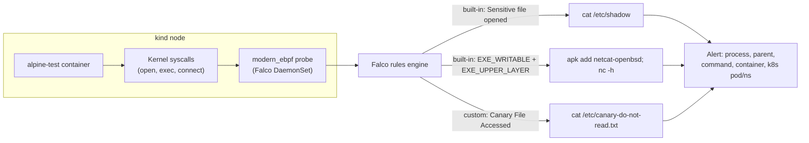

# Lab 9 — Implementing Supply Chain and Runtime Security Controls (Falco) 

**Day 2 · Security & Scaling/Optimization**

> Every command below was actually run end to end on a local `kind` cluster, and every screenshot is a real `screencapture` of a genuine kernel-level Falco alert — not a simulated log line.

## What you'll learn

- What Falco actually watches (kernel syscalls, via eBPF) and why that makes it fundamentally different from the admission-time controls in Lab 7 — Falco catches things *happening inside a running container*, not just bad configuration at deploy time.
- Reading a real Falco alert and understanding what each field tells you.
- Writing and deploying a custom detection rule.

## Time & cost

- **Time:** ~40 minutes.
- **Cost:** $0. Runs entirely on a local `kind` cluster.

## Prerequisites

Complete the [Setup Environment Guide](00-setup-environment-guide.md). You need `docker`, `kind`, `kubectl`, and `helm` verified working.

**A note on feasibility before you start:** Falco needs to hook kernel syscalls, which sounds like exactly the kind of thing that wouldn't work inside a container on Docker Desktop's virtualized Linux. It does — this lab was fully verified on Docker Desktop for Mac (Apple Silicon) using Falco's `modern_ebpf` driver, including real, correct detections of real events. If you're on Linux natively, it'll work at least as well.

---

## 9.1 Why this is a different layer than Lab 7

Lab 7 (Kyverno) is an **admission controller** — it inspects a Pod spec before the Pod is allowed to exist, and it can only reason about what's declared in that spec. It has no idea what a container actually *does* once it's running.

Falco is a **runtime security** tool. It taps directly into the kernel via eBPF and watches actual syscalls as they happen — file opens, process launches, network connections — regardless of whether anything about them looks wrong in a YAML file. This is what catches things like:

- A container reading `/etc/shadow` when nothing about its declared spec suggested it would.
- A process being installed and executed *after* the container already started (Lab 7's image scan happened before the container ever ran — it can't see this).
- A shell being spawned inside a container that's supposed to be a stateless web server with no interactive use case at all.

The two layers are complementary, not competing: admission control stops bad configurations from ever running; runtime security catches bad *behavior* in configurations that looked completely fine at admission time.



Contrast this with Lab 7: Kyverno's admission webhook only ever sees the Pod *spec* you submit, once, before creation. Falco sees everything the container's processes actually *do*, continuously, for the life of the container — including things (like a binary installed live, after startup) that no spec could ever have declared one way or the other.

---

## 9.2 Install Falco

```bash
kind create cluster --name falco-lab

helm repo add falcosecurity https://falcosecurity.github.io/charts
helm repo update

helm install falco falcosecurity/falco \
  --namespace falco --create-namespace \
  --set driver.kind=modern_ebpf \
  --set tty=true

kubectl wait --for=condition=Ready pod -l app.kubernetes.io/name=falco -n falco --timeout=120s
```

`driver.kind=modern_ebpf` is the setting that matters here — it's the CO-RE (Compile Once, Run Everywhere) eBPF probe, which doesn't need matching kernel headers on the host the way the older kernel-module driver does. This is what makes Falco viable inside a `kind` node running on a virtualized/hypervisor kernel rather than bare metal.

You'll see some warnings on startup like this — they're expected and non-fatal:

```
[libs]: libbpf: failed to determine tracepoint 'syscalls/sys_enter_creat' perf event ID: No such file or directory
[libs]: libpman: failure while attaching TOCTOU mitigation program for 'creat' system call.
Detection will continue to work, but TOCTOU mitigation may not properly work
```

Falco says exactly what's degraded (a specific race-condition mitigation for a couple of syscalls) and confirms detection itself is unaffected. Confirm the pod is actually healthy:

```bash
kubectl get pods -n falco
```

---

## 9.3 Trigger a real, built-in detection

Deploy a plain container to poke at:

```bash
kubectl run alpine-test --image=alpine:3.20 --restart=Never -- sleep 3600
kubectl wait --for=condition=Ready pod/alpine-test --timeout=60s
```

Do something that looks exactly like early-stage reconnaissance after a compromise — read the shadow password file:

```bash
kubectl exec alpine-test -- cat /etc/shadow
```


Check Falco's logs:

```bash
kubectl logs -n falco -l app.kubernetes.io/name=falco -c falco --tail=20
```


**Verified result:**

```
Warning Sensitive file opened for reading by non-trusted program | file=/etc/shadow
  gparent=containerd-shim process=cat proc_exepath=/bin/busybox parent=sh
  command=cat /etc/shadow container_name=alpine-test
  container_image_repository=docker.io/library/alpine k8s_pod_name=alpine-test k8s_ns_name=default
```

Notice how much context is in a single alert: which file, which process, its parent process, the exact command line, the container and image, and the Kubernetes pod/namespace — enough to act on immediately without cross-referencing three other systems.

---

## 9.4 Trigger a second built-in detection: runtime tampering

This one is worth doing deliberately because the *reason* it fires is the actual lesson:

```bash
kubectl exec alpine-test -- sh -c "apk add --no-cache netcat-openbsd; nc -h"
```


```bash
kubectl logs -n falco -l app.kubernetes.io/name=falco -c falco --tail=30 | grep -i "not part of base"
```


**Verified result:**

```
Critical Executing binary not part of base image | proc_exe=nc
  exe_flags=EXE_WRITABLE|EXE_UPPER_LAYER command=nc -h
  container_name=alpine-test container_image_repository=docker.io/library/alpine
```

`alpine:3.20` doesn't ship `netcat-openbsd` — we installed it live, after the container was already running. Falco's `EXE_WRITABLE|EXE_UPPER_LAYER` flags tell you exactly why it's suspicious: the binary that just executed lives in the container's **writable overlay layer**, not the read-only image layer it was built from. A legitimate process in a well-built image never needs to do this. An attacker who's gained code execution and wants a foothold (a reverse shell tool, a port scanner, a crypto miner) very often does exactly this. This is a detection Lab 7's image scan structurally cannot produce — the scan runs against the image, and this behavior only exists once the container is a running, mutated instance of it.

---

## 9.5 Write your own rule

Falco's built-in rule set is large but general-purpose. Real deployments almost always add rules specific to what a given workload should never do. Here's a simple, high-signal one — a canary (decoy) file that no legitimate process has any reason to ever touch:

```bash
cat > /tmp/falco-custom-rules.yaml <<'EOF'
customRules:
  rules-custom.yaml: |-
    - rule: Canary File Accessed
      desc: Detect any read of our planted decoy file -- nothing legitimate should ever touch it
      condition: >
        open_read and container and fd.name = "/etc/canary-do-not-read.txt"
      output: >
        Canary file was read (user=%user.name command=%proc.cmdline
        container=%container.name image=%container.image.repository)
      priority: CRITICAL
      tags: [container, canary, mitre_discovery]
EOF

helm upgrade falco falcosecurity/falco \
  --namespace falco \
  --set driver.kind=modern_ebpf \
  --set tty=true \
  -f /tmp/falco-custom-rules.yaml

kubectl rollout status daemonset/falco -n falco --timeout=90s
```

Trigger it:

```bash
kubectl exec alpine-test -- sh -c "echo secret > /etc/canary-do-not-read.txt"
kubectl exec alpine-test -- cat /etc/canary-do-not-read.txt
```


```bash
kubectl logs -n falco -l app.kubernetes.io/name=falco -c falco --tail=10
```


**Verified result:**

```
Critical Canary file was read (user=root command=cat /etc/canary-do-not-read.txt
  container_name=alpine-test image=docker.io/library/alpine)
```

> **Tested gotcha:** an earlier version of this rule targeted `nc`/`ncat`/`netcat` process execution (`spawned_process and container and proc.name = "nc"` etc.). It loaded with no schema errors — Falco's startup log confirmed `schema validation: ok` — but never actually fired, even though the exact same `nc` execution was independently confirmed by the built-in "not part of base image" rule in §9.4. We were not able to conclusively root-cause why that specific condition shape didn't trigger. Rephrasing the rule around a different event class (`open_read`/`fd.name`, as above) instead of `spawned_process`/`proc.name` worked immediately and reliably. **If your own custom rule loads cleanly but silently never fires, don't assume your YAML is broken — try restructuring the condition around a different event type before you spend a long time debugging syntax that was never the problem.**

Full evidence for this lab, including the failed rule attempt in full: [`evidence/lab09-falco-runtime-security.txt`](evidence/lab09-falco-runtime-security.txt).

---

## Lab summary

| Detection | Trigger | Verified |
|---|---|---|
| Built-in: sensitive file read | `cat /etc/shadow` | ✅ |
| Built-in: binary not part of base image | live `apk add` + execute | ✅ |
| Custom rule: canary file access | planted decoy file read | ✅ |

## Clean up

```bash
kind delete cluster --name falco-lab
```


## Evidence

- Screenshots: [`screenshots/lab09/`](screenshots/lab09/) (7 images)
- Logs: [`evidence/lab09-falco-runtime-security.txt`](evidence/lab09-falco-runtime-security.txt)

**Next:** [Lab 10 — Configuring advanced HPA/VPA autoscaling patterns](lab-10-hpa-vpa-autoscaling.md).
