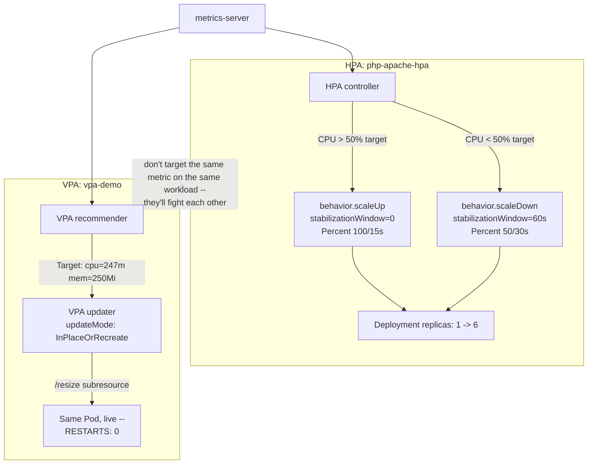

# Lab 10 — Configuring Advanced HPA/VPA Autoscaling Patterns 

**Day 2 · Security & Scaling/Optimization**

> Every command below was actually run end to end on a local `kind` cluster, and every screenshot is a real `screencapture` of that run — including a real Kubernetes GUI view of the VPA object.

## What you'll learn

- Tuning `HorizontalPodAutoscaler` behavior beyond the default target-utilization — asymmetric scale-up/scale-down policies with stabilization windows.
- Setting up the Vertical Pod Autoscaler to *recommend*, and then *actually apply*, resource requests based on real measured usage instead of guesswork.
- Why VPA's `Auto` mode is deprecated, what replaced it, and the genuinely new capability (in-place resize with zero pod restarts) that makes the replacement better, not just a rename.
- Why you generally don't point HPA and VPA at the same metric on the same workload.



## Time & cost

- **Time:** ~40 minutes.
- **Cost:** $0. Runs entirely on a local `kind` cluster.

## Prerequisites

Complete the [Setup Environment Guide](00-setup-environment-guide.md). You need `docker`, `kind`, `kubectl`, and `helm` verified working.

---

## 10.1 Create the cluster and install metrics-server

Neither HPA nor VPA can do anything without a metrics source. `kind` doesn't ship one by default:

```bash
kind create cluster --name autoscale-lab

kubectl apply -f https://github.com/kubernetes-sigs/metrics-server/releases/latest/download/components.yaml
kubectl patch deployment metrics-server -n kube-system --type='json' \
  -p='[{"op":"add","path":"/spec/template/spec/containers/0/args/-","value":"--kubelet-insecure-tls"}]'
kubectl wait --for=condition=Available --timeout=120s -n kube-system deployment/metrics-server
```

`--kubelet-insecure-tls` is required because `kind` nodes' kubelet certs aren't signed for something metrics-server's default TLS verification accepts — this is a standard, well-known `kind` accommodation, not a real security compromise (you're still on localhost, inside Docker).

Confirm it's actually reporting numbers, not just running:

```bash
kubectl top nodes
```

> **Tested gotcha, worth knowing about if you're doing several labs back to back:** if you're also working with a real GKE/EKS/AKS cluster in the same terminal session (e.g. doing Lab 8 in parallel), remember that `gcloud container clusters create` (and equivalents) **silently switches your `kubectl` current-context** to the new cluster the moment it finishes provisioning — even if that happens in the background while you're mid-command on a different cluster. We hit this directly: a GKE cluster finished creating in the background while working in this `kind` cluster, silently redirected `kubectl`, and several commands ran against the wrong cluster before we noticed (`kubectl config current-context` gave it away immediately). Check your context before any command whose blast radius matters, especially if you have cloud provisioning running in another terminal or background job.

---

## 10.2 Advanced HPA: asymmetric scale-up/scale-down behavior

The default HPA behavior is symmetric and can flap under bursty load. Deploy a CPU-bound app:

```bash
kubectl apply -f - <<'EOF'
apiVersion: apps/v1
kind: Deployment
metadata:
  name: php-apache
spec:
  replicas: 1
  selector:
    matchLabels: {run: php-apache}
  template:
    metadata:
      labels: {run: php-apache}
    spec:
      containers:
      - name: php-apache
        image: registry.k8s.io/hpa-example
        ports: [{containerPort: 80}]
        resources:
          requests: {cpu: 200m, memory: 64Mi}
          limits: {cpu: 500m, memory: 128Mi}
---
apiVersion: v1
kind: Service
metadata:
  name: php-apache
spec:
  ports: [{port: 80}]
  selector: {run: php-apache}
EOF
kubectl wait --for=condition=Available --timeout=90s deployment/php-apache
```

Apply an HPA with **fast, generous scale-up** (absorb a spike quickly) and **slow, cautious scale-down** (don't thrash):

```bash
kubectl apply -f - <<'EOF'
apiVersion: autoscaling/v2
kind: HorizontalPodAutoscaler
metadata:
  name: php-apache-hpa
spec:
  scaleTargetRef: {apiVersion: apps/v1, kind: Deployment, name: php-apache}
  minReplicas: 1
  maxReplicas: 6
  metrics:
  - type: Resource
    resource: {name: cpu, target: {type: Utilization, averageUtilization: 50}}
  behavior:
    scaleUp:
      stabilizationWindowSeconds: 0
      policies:
      - {type: Percent, value: 100, periodSeconds: 15}
      - {type: Pods, value: 2, periodSeconds: 15}
      selectPolicy: Max
    scaleDown:
      stabilizationWindowSeconds: 60
      policies:
      - {type: Percent, value: 50, periodSeconds: 30}
      selectPolicy: Min
EOF
```

Confirm the baseline before generating any load:

```bash
kubectl get hpa php-apache-hpa
```


Generate load and watch:

```bash
kubectl run load-generator --image=busybox --restart=Never -- \
  /bin/sh -c "while true; do wget -q -O- http://php-apache; done"

watch kubectl get hpa php-apache-hpa
```


**Verified scale-up (live-tested):**

| Time | CPU | Replicas |
|---|---|---|
| t+20s | 121%/50% | 1 |
| t+40s | 153%/50% | 3 |
| t+60s | 85%/50% | 6 |

Scaled from 1 to the max of 6 within about 90 seconds of load starting — the `Percent 100/15s` + `Pods 2/15s` policies (whichever gives the bigger jump, `selectPolicy: Max`) let it climb aggressively.

Now remove the load and watch the other half of the behavior:

```bash
kubectl delete pod load-generator
watch kubectl get hpa php-apache-hpa
```


**Verified scale-down (live-tested):**

| Time since load removed | CPU | Replicas |
|---|---|---|
| t+0s | 61%/50% | 6 |
| t+20s | 0%/50% | 6 (inside the 60s stabilization window — no action despite 0% CPU) |
| t+60s | 0%/50% | 6 (window just expiring) |
| t+80s | 0%/50% | 3 (window expired; 50%-per-30s policy: 6→3, not straight to 1) |
| t+100s | 0%/50% | 1 (second 50% step: 3→1) |

CPU dropped to 0% almost immediately, but replica count didn't move for a full 60 seconds (the stabilization window), then stepped down in controlled 50% increments rather than collapsing straight to `minReplicas`. This is the actual mechanism that prevents an HPA from flapping a workload up and down every time load has a brief dip. Full data: [`evidence/lab10-advanced-hpa-behavior.txt`](evidence/lab10-advanced-hpa-behavior.txt).

---

## 10.3 VPA: recommendations from real usage, not guesses

**Don't point VPA and HPA at the same metric on the same workload** — they can fight each other (VPA raises a CPU request, which changes what "50% utilization" means for the HPA, which changes replica count, which changes per-pod load, which changes VPA's recommendation...). Use a separate deployment:

```bash
kubectl apply -f - <<'EOF'
apiVersion: apps/v1
kind: Deployment
metadata:
  name: vpa-demo
spec:
  replicas: 2
  selector: {matchLabels: {app: vpa-demo}}
  template:
    metadata: {labels: {app: vpa-demo}}
    spec:
      containers:
      - name: stress
        image: polinux/stress
        resources:
          requests: {cpu: 100m, memory: 50Mi}
          limits: {cpu: 200m, memory: 100Mi}
        command: ["stress"]
        args: ["--cpu", "1", "--timeout", "999999s"]
EOF
kubectl wait --for=condition=Available --timeout=90s deployment/vpa-demo
```

This container asks for 100m CPU / 50Mi memory but actually burns a full core continuously — deliberately under-provisioned, the way a real workload someone eyeballed once and never revisited often ends up.

### Install VPA

VPA isn't part of core Kubernetes. Use the **official chart from the `kubernetes/autoscaler` repo itself** (not a third-party community chart — several exist on Artifact Hub, but the canonical one ships in-tree):

```bash
git clone --depth 1 https://github.com/kubernetes/autoscaler.git /tmp/autoscaler-repo
helm install vpa /tmp/autoscaler-repo/vertical-pod-autoscaler/charts/vertical-pod-autoscaler -n kube-system
kubectl wait --for=condition=Ready pod -n kube-system -l app.kubernetes.io/instance=vpa --timeout=120s
```

> **Tested gotcha:** the *other* official install method — `kubernetes/autoscaler`'s `hack/vpa-up.sh` script — fails out of the box on a shallow clone (`git clone --depth 1`) with `fatal: invalid reference: vertical-pod-autoscaler-1.7.1`, because it resolves an image tag from a git tag that a depth-limited clone doesn't have. The in-repo Helm chart used above doesn't have this problem and is the simpler path.

### Recommendation mode first

```bash
kubectl apply -f - <<'EOF'
apiVersion: autoscaling.k8s.io/v1
kind: VerticalPodAutoscaler
metadata:
  name: vpa-demo
spec:
  targetRef: {apiVersion: apps/v1, kind: Deployment, name: vpa-demo}
  updatePolicy:
    updateMode: "Off"
EOF
```

Give it several minutes to build a usage history, then check:

```bash
kubectl describe vpa vpa-demo
```


**Verified result** (after ~8 minutes):

```
Recommendation:
  Container Name:  stress
  Lower Bound:   cpu=170m  memory=250Mi
  Target:        cpu=247m  memory=250Mi
  Upper Bound:   cpu=50460m  memory=2349382352
```

VPA correctly identified the container needs roughly **2.5x the CPU and 5x the memory** we originally requested, based purely on observed behavior — no manual profiling required.

### Actually applying it: `InPlaceOrRecreate`

Older docs and tutorials will tell you to set `updateMode: Auto`. **Don't** — as of the VPA version this lab was tested against, applying it prints:

```
Warning: UpdateMode "Auto" is deprecated and will be removed in a future API version.
Use explicit update modes like "Recreate", "Initial", or "InPlaceOrRecreate" instead.
```

Use `InPlaceOrRecreate` instead — it's not just a rename. It uses Kubernetes' newer **in-place pod resize** capability (the `/resize` subresource) when the resize can be done live, and only falls back to the old evict-and-recreate behavior when it can't:

```bash
kubectl patch vpa vpa-demo --type=merge -p '{"spec":{"updatePolicy":{"updateMode":"InPlaceOrRecreate"}}}'
```

**Before** — check the pods' current resource requests, so you have something to compare against:

```bash
kubectl get pods -l app=vpa-demo -o jsonpath='{range .items[*]}{.metadata.name}{"  "}{.spec.containers[0].resources.requests}{"\n"}{end}'
```


Wait about a minute (the updater runs on its own reconciliation loop), then check again:

```bash
kubectl get pods -l app=vpa-demo
kubectl get pods -l app=vpa-demo -o jsonpath='{range .items[*]}{.metadata.name}{"  "}{.spec.containers[0].resources.requests}{"\n"}{end}'
```


**Verified result:**

```
NAME                        READY   STATUS    RESTARTS   AGE
vpa-demo-54ddbf7868-9rqhm   1/1     Running   0          5m14s
vpa-demo-54ddbf7868-jl265   1/1     Running   0          5m14s

vpa-demo-54ddbf7868-9rqhm   {"cpu":"587m","memory":"250Mi"}
vpa-demo-54ddbf7868-jl265   {"cpu":"587m","memory":"250Mi"}
```

**RESTARTS: 0.** Same pod names, continuously running the entire time — from `cpu=100m/memory=50Mi` to `cpu=587m/memory=250Mi` — the resource requests changed underneath a live, running container with zero disruption. (The applied CPU value here is higher than the 247m the recommendation showed earlier: the `stress` load generator was still running the whole time, so the recommender's own target had kept climbing between the two checks — that's expected, not a discrepancy. What matters is the mechanism: a real resize of live containers via the `/resize` subresource, not a pod replacement.) The updater's own log confirms the mechanism:

```
"In-place update approved" pod="default/vpa-demo-..."
"Calculated patches": requests.cpu=587m requests.memory=250Mi
"In-place patched pod /resize subresource"
Event: InPlaceResizedByVPA -- "Pod was resized in place by VPA Updater."
```

Full data: [`evidence/lab10-vpa-recommendation.txt`](evidence/lab10-vpa-recommendation.txt) and [`evidence/lab10-vpa-inplace-resize.txt`](evidence/lab10-vpa-inplace-resize.txt).

### Optional: see the VPA object in a GUI

Same [Headlamp](https://headlamp.dev/) substitution used in Lab 7 (the official Kubernetes Dashboard Helm repo is dead — see Lab 7 for the finding). Configuration → VPAs shows the same object, live:


By the time this was captured the recommender had moved further still (1168m) — the load generator was still active. The `Provided: True` column is Headlamp's rendering of the same `RecommendationProvided` condition seen in the `kubectl describe` output earlier.

---

## Lab summary

| | Verified |
|---|---|
| HPA custom scale-up behavior (fast, aggressive) | ✅ 1→6 replicas in ~90s |
| HPA custom scale-down behavior (stabilization + stepped) | ✅ 60s hold, then 6→3→1 |
| VPA recommendation from real usage | ✅ cpu 100m→247m, mem 50Mi→250Mi |
| VPA `InPlaceOrRecreate`: live resize, zero restarts | ✅ RESTARTS: 0 |
| Live VPA state visible in a GUI (Headlamp) | ✅ |

## Clean up

```bash
kind delete cluster --name autoscale-lab
```


## Evidence

- Screenshots: [`screenshots/lab10/`](screenshots/lab10/) (8 images)
- Logs: [`evidence/lab10-advanced-hpa-behavior.txt`](evidence/lab10-advanced-hpa-behavior.txt), [`evidence/lab10-vpa-recommendation.txt`](evidence/lab10-vpa-recommendation.txt), [`evidence/lab10-vpa-inplace-resize.txt`](evidence/lab10-vpa-inplace-resize.txt)

**Next:** [Lab 11 — Setting up Cluster Autoscaler / Node Auto-Provisioning with GPU node pools](lab-11-cluster-autoscaler-gpu-nodepools.md).
