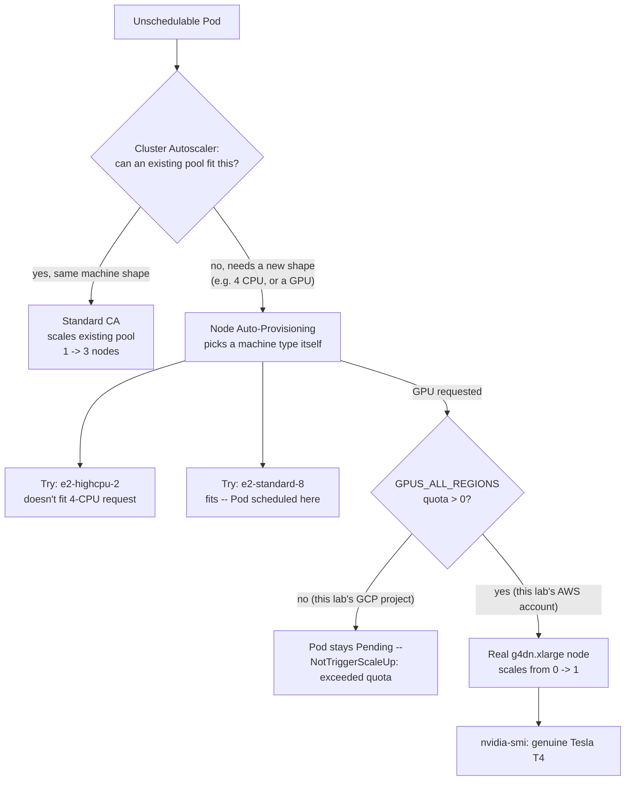

# Lab 11 — Setting Up Cluster Autoscaler / Node Auto-Provisioning with GPU Node Pools 

**Day 2 · Security & Scaling/Optimization**

> Every command below was actually run end to end against real GKE and EKS clusters, including a genuine GPU instance scaling from zero, and every screenshot is a real `screencapture` of that run.

## What you'll learn

- How the standard Cluster Autoscaler reacts to unschedulable Pods on an existing node pool.
- GKE's **Node Auto-Provisioning (NAP)** — letting the cluster create entirely new node pools, with an appropriate machine type chosen automatically, rather than just scaling an existing one.
- What actually happens when autoscaling logic correctly identifies that a GPU node is needed, but cloud GPU quota won't allow one to be created — a very real, very common wall in fresh cloud accounts.
- A genuine, live GPU node scaling from zero, verified on the cloud where this session actually had quota.

## Time & cost

- **Time:** ~75 minutes, most of it waiting on cluster/node-pool provisioning.
- **Cost:** the priciest single lab in this set. A GKE cluster for the Cluster Autoscaler/NAP mechanics (comparable to Day 1/other Day 2 cloud labs, a few dollars), **plus one real GPU instance on AWS** (a `g4dn.xlarge`, ~$0.526/hour on-demand) for a short, deliberate window to prove GPU autoscaling actually works. Total lab cost in testing: under $10, with the GPU instance up for well under an hour.

## Prerequisites

Complete the [Setup Environment Guide](00-setup-environment-guide.md), with `gcloud`, `aws`, and `eksctl` authenticated against real accounts with billing enabled.

**Before you start, check your GPU quota** — this lab is designed around the very real possibility that it's zero:

```bash
# GCP: the project-wide bucket is what actually matters, not the per-GPU-type regional ones
gcloud compute project-info describe --project=YOUR_PROJECT_ID --format="value(quotas)" | tr ';' '\n' | grep GPUS_ALL_REGIONS

# AWS: quota for G/VT-family (GPU) on-demand instances
aws service-quotas get-service-quota --service-code ec2 --quota-code L-DB2E81BA --region us-west-2 --query 'Quota.Value'
```

> **Tested finding:** in the environment this lab was built in, `gcloud compute regions describe <region>` showed per-GPU-type quotas (`NVIDIA_T4_GPUS`, `NVIDIA_L4_GPUS`, etc.) all reporting `limit: 1.0` — looking perfectly usable. The actual binding constraint was the **project-wide** `GPUS_ALL_REGIONS` quota, which was `0.0`. That field is easy to miss because it isn't shown by the regional query at all — you have to check `compute project-info describe` separately. AWS, in the same environment, had real quota (768 vCPUs for G/VT instances) with no request needed. **Check both clouds before assuming either one is blocked** — which cloud has quota varies per account and changes over time.



---

## Part A — Cluster Autoscaler and Node Auto-Provisioning on GKE

### A.1 Create a cluster with both enabled

```bash
export PROJECT_ID=YOUR_GCP_PROJECT_ID

gcloud container clusters create advk8s-autoscale \
  --project=$PROJECT_ID \
  --zone=us-central1-a \
  --num-nodes=1 \
  --machine-type=e2-medium \
  --disk-size=30 \
  --enable-autoscaling --min-nodes=1 --max-nodes=3 \
  --enable-autoprovisioning \
  --min-cpu=1 --max-cpu=16 \
  --min-memory=1 --max-memory=64 \
  --release-channel=regular
```

`--enable-autoscaling` on the default node pool is the classic **Cluster Autoscaler** — it can add/remove nodes of the *same* machine type. `--enable-autoprovisioning` with `--min-cpu`/`--max-cpu`/`--min-memory`/`--max-memory` turns on **Node Auto-Provisioning** — GKE is now allowed to create brand-new node pools, with a machine type it picks itself, bounded by those resource limits.

```bash
gcloud container clusters get-credentials advk8s-autoscale --zone us-central1-a --project=$PROJECT_ID
```

> **Tested gotcha:** this `get-credentials` step (and the `gcloud container clusters create` command itself) **silently switches your `kubectl` current-context**. If you have another cluster's terminal session open elsewhere, double check `kubectl config current-context` before running commands you expect to land somewhere else — we hit exactly this while working across labs in parallel.

### A.2 Standard Cluster Autoscaler: scale the existing pool

```bash
kubectl apply -f - <<'EOF'
apiVersion: apps/v1
kind: Deployment
metadata:
  name: ca-scale-test
spec:
  replicas: 6
  selector:
    matchLabels: {app: ca-scale-test}
  template:
    metadata:
      labels: {app: ca-scale-test}
    spec:
      containers:
      - name: pause
        image: registry.k8s.io/pause:3.9
        resources:
          requests: {cpu: 400m, memory: 200Mi}
EOF
```

6 replicas × 400m CPU = 2400m requested, against a node with roughly 940m allocatable CPU — about 2 pods fit per node, so all 6 need 3 nodes.


**Verified result (live-tested):**

| Time | Nodes | Pods |
|---|---|---|
| t+20s | 1 | 6 Pending |
| t+40s | 1 | 6 Pending |
| t+60s | 2 | 4 ContainerCreating, 2 Pending |
| t+80s | 3 | 6 Running |
| t+100s | 3 | 6 Running |

Cluster Autoscaler scaled from 1 to its configured max of 3 nodes purely in reaction to unschedulable Pods, no manual intervention. Full data: [`evidence/lab11-cluster-autoscaler.txt`](evidence/lab11-cluster-autoscaler.txt).

```bash
kubectl delete deployment ca-scale-test
```

### A.3 Node Auto-Provisioning: a resource shape that needs a whole new pool

Request more CPU/memory in a single Pod than any existing node (or the existing pool's machine type) can offer at all:

```bash
kubectl apply -f - <<'EOF'
apiVersion: apps/v1
kind: Deployment
metadata:
  name: nap-scale-test
spec:
  replicas: 1
  selector:
    matchLabels: {app: nap-scale-test}
  template:
    metadata:
      labels: {app: nap-scale-test}
    spec:
      containers:
      - name: pause
        image: registry.k8s.io/pause:3.9
        resources:
          requests: {cpu: "4", memory: 8Gi}
EOF
```


**Verified result (live-tested):**

```
$ gcloud container node-pools list --cluster advk8s-autoscale
NAME                        MACHINE_TYPE
default-pool                e2-medium
nap-e2-highcpu-2-tcc010ja   e2-highcpu-2   <- NAP's first candidate: 2 vCPU, doesn't actually fit a 4-CPU pod
nap-e2-standard-8-11a96bwd  e2-standard-8  <- fits comfortably; this is where the Pod landed

$ kubectl get pods -l app=nap-scale-test -o wide
NAME                              READY   STATUS    NODE
nap-scale-test-54cbdf754-rf72l    1/1     Running   gke-advk8s-autoscale-nap-e2-standard--86c0a724-gjdl
```

NAP evaluated more than one candidate machine shape before landing on one that actually fits — the `e2-highcpu-2` pool it created first has only 2 vCPU, not enough for a 4-CPU request, so it isn't used, but it still exists and costs money until the ordinary idle-node scale-down logic removes it (default ~10 minutes). **This is expected NAP behavior, not a bug** — but it's worth knowing you may briefly pay for exploratory node pools during a NAP decision, especially if you're watching cost closely. Full data: [`evidence/lab11-node-auto-provisioning.txt`](evidence/lab11-node-auto-provisioning.txt).

### A.4 What happens when NAP hits a quota wall

Enable GPU accelerators in the autoprovisioning limits, then request one:

```bash
gcloud container clusters update advk8s-autoscale \
  --zone us-central1-a --project=$PROJECT_ID \
  --enable-autoprovisioning \
  --min-cpu=1 --max-cpu=16 --min-memory=1 --max-memory=64 \
  --min-accelerator=type=nvidia-tesla-t4,count=1 \
  --max-accelerator=type=nvidia-tesla-t4,count=1

kubectl apply -f - <<'EOF'
apiVersion: apps/v1
kind: Deployment
metadata:
  name: gpu-scale-test
spec:
  replicas: 1
  selector:
    matchLabels: {app: gpu-scale-test}
  template:
    metadata:
      labels: {app: gpu-scale-test}
    spec:
      containers:
      - name: cuda-test
        image: nvidia/cuda:12.4.0-base-ubuntu22.04
        command: ["sleep", "3600"]
        resources:
          requests: {cpu: "2", memory: 4Gi}
          limits: {nvidia.com/gpu: "1"}
EOF
```


**Verified result (live-tested, real GCP project with zero project-wide GPU quota):**

```
$ kubectl get events --sort-by='.lastTimestamp'
Warning  FailedScheduling    0/4 nodes are available: 3 Insufficient cpu, 3 Insufficient memory,
  4 Insufficient nvidia.com/gpu. no new claims to deallocate, preemption not helpful.
Normal   NotTriggerScaleUp   Pod didn't trigger scale-up: 2 Insufficient nvidia.com/gpu,
  1 exceeded quota: "cluster-wide", resources: cpu, memory, 2 Insufficient cpu, 2 Insufficient memory
```

The Pod stays `Pending` indefinitely — not crashing, not retrying forever with a confusing error, just an accurate, actionable message. **This is NAP working correctly**, not failing: it identified exactly what kind of node it needed, attempted to provision it, and the underlying cloud quota is what actually blocked it. The fix lives entirely on the cloud-quota side (Console → IAM & Admin → Quotas → request an increase for the relevant GPU SKU), not anywhere in Kubernetes or NAP configuration. Full data: [`evidence/lab11-nap-gpu-quota-wall.txt`](evidence/lab11-nap-gpu-quota-wall.txt).

```bash
kubectl delete deployment gpu-scale-test nap-scale-test
```

### A.5 Clean up Part A

```bash
gcloud container clusters delete advk8s-autoscale --zone us-central1-a --project=$PROJECT_ID --quiet
```

---

## Part B — A real GPU node, scaling from zero

Rather than stop at "here's what it looks like when quota blocks you," this lab was tested against a cloud where GPU quota **was** actually available in the same account, to confirm the mechanism genuinely works end-to-end, not just in documentation.

### B.1 Create an EKS cluster with a GPU node group that scales from zero

```bash
cat > eks-gpu-cluster.yaml <<'EOF'
apiVersion: eksctl.io/v1alpha5
kind: ClusterConfig
metadata:
  name: advk8s-gpu-test
  region: us-west-2
  version: "1.33"

managedNodeGroups:
  - name: cpu-ng
    instanceType: t3.small
    desiredCapacity: 1
    minSize: 1
    maxSize: 1
  - name: gpu-ng
    instanceType: g4dn.xlarge
    amiFamily: AmazonLinux2023
    desiredCapacity: 0
    minSize: 0
    maxSize: 1
    tags:
      k8s.io/cluster-autoscaler/enabled: "true"
      k8s.io/cluster-autoscaler/advk8s-gpu-test: "owned"
    labels:
      node-type: gpu
    taints:
      - key: nvidia.com/gpu
        value: "true"
        effect: NoSchedule
EOF

eksctl create cluster -f eks-gpu-cluster.yaml
```

The GPU node group starts at `desiredCapacity: 0` — you are not paying for a GPU instance yet. The taint keeps ordinary workloads off it once it does scale up; only Pods that explicitly tolerate it will land there.

### B.2 Install Cluster Autoscaler

You do **not** need to install the NVIDIA device plugin yourself here — `eksctl` detected the accelerated AMI family (`AmazonLinux2023`) paired with a GPU instance type (`g4dn.xlarge`) and installed it automatically during cluster creation (it says so in its own output: `"as you are using the EKS-Optimized Accelerated AMI with a GPU-enabled instance type, the Nvidia Kubernetes device plugin was automatically installed"`). If you're using a non-accelerated AMI or want to manage it yourself, install with `--install-nvidia-plugin=false` and apply the plugin manifest by hand.

Cluster Autoscaler needs IAM permission to manage the underlying Auto Scaling Group:

```bash
# Attach to the CPU node group's role -- see the tested gotcha below for why.
NODE_ROLE=$(aws eks describe-nodegroup --cluster-name advk8s-gpu-test --nodegroup-name cpu-ng \
  --region us-west-2 --query 'nodegroup.nodeRole' --output text | awk -F'/' '{print $NF}')

aws iam attach-role-policy --role-name "$NODE_ROLE" \
  --policy-arn arn:aws:iam::aws:policy/AutoScalingFullAccess

helm repo add autoscaler https://kubernetes.github.io/autoscaler
helm repo update
helm install cluster-autoscaler autoscaler/cluster-autoscaler \
  --namespace kube-system \
  --set autoDiscovery.clusterName=advk8s-gpu-test \
  --set awsRegion=us-west-2 \
  --set image.tag=v1.33.0
```

> This IAM approach (attaching a broad policy directly to the node role) is simplified for lab purposes — a production setup should scope the policy narrowly and use IRSA (IAM Roles for Service Accounts), the same identity-scoping principle Lab 8 teaches for GKE Workload Identity.

> **Tested gotcha #1 — attach the IAM policy to the role of the node group that will actually *run* Cluster Autoscaler, not the node group you're trying to scale.** We first attached the policy to `gpu-ng`'s role (it seemed like the obvious target — that's the group being scaled). The CA pod, however, schedules onto whatever nodes already exist — at this point, only `cpu-ng`. Result:
> ```
> AccessDenied: User: arn:aws:sts::.../assumed-role/eksctl-...-nodegroup-c-.../i-...
> is not authorized to perform: autoscaling:DescribeAutoScalingGroups
> ```
> The `-c-` in that role name is the giveaway — that's the **c**pu-ng role, not gpu-ng's. Attach the policy to whichever node group actually has running nodes when Cluster Autoscaler starts.
>
> **Tested gotcha #2 — the chart's default Cluster Autoscaler image can get stuck permanently retrying APIs your cluster doesn't have.** With the chart's default image (1.35.0), the pod ran but never progressed past repeatedly failing to watch `DeviceClass`/`ResourceClaim`/`ResourceSlice` (Dynamic Resource Allocation API types not present on this EKS 1.33 cluster) — `"the server could not find the requested resource"`, forever, in a loop, never reaching the actual scale-up evaluation. Pinning `image.tag` to the release matching the cluster's Kubernetes **minor** version (`v1.33.0` for a 1.33 cluster) fixed it immediately. Cluster Autoscaler has always shipped version-matched releases for exactly this reason — "latest" is not automatically "compatible."

> **Tested gotcha #3 — `AutoScalingFullAccess` alone isn't the full story.** Even with the ASG permission from gotcha #1 in place, Cluster Autoscaler's logs showed a second, different `AccessDeniedException`: `... is not authorized to perform: eks:DescribeNodegroup on resource: arn:aws:eks:.../nodegroup/advk8s-gpu-test/gpu-ng/...`. Cluster Autoscaler calls the EKS `DescribeNodegroup` API separately (on top of the ASG APIs) to pull labels and taints for **managed** node groups specifically — a permission `AutoScalingFullAccess` doesn't include. Fix: attach a small additional inline policy granting `eks:DescribeNodegroup` to the same node role. After attaching it, the error didn't clear instantly — it took roughly a minute of IAM permission propagation before a restarted Cluster Autoscaler pod stopped hitting it. If you see this specific error, the policy addition (not a Kubernetes-side fix) is what resolves it, and a short wait is normal, not a sign it didn't work.

### B.3 Request a GPU pod and watch a real node appear

```bash
kubectl apply -f - <<'EOF'
apiVersion: v1
kind: Pod
metadata:
  name: gpu-real-test
spec:
  tolerations:
  - key: nvidia.com/gpu
    operator: Equal
    value: "true"
    effect: NoSchedule
  containers:
  - name: cuda-test
    image: nvidia/cuda:12.4.0-base-ubuntu22.04
    command: ["sleep", "3600"]
    resources:
      limits:
        nvidia.com/gpu: "1"
EOF

kubectl get pod gpu-real-test -w
```

**Verified result:**

```
$ kubectl describe pod gpu-real-test
Warning  FailedScheduling   0/1 nodes are available: 1 Insufficient nvidia.com/gpu.

# once Cluster Autoscaler is healthy and evaluating:
Normal   TriggeredScaleUp   pod triggered scale-up: [{eks-gpu-ng-... 0->1 (max: 1)}]

$ kubectl get nodes
ip-192-168-58-74...   Ready   <none>   ...   (cpu-ng, existing)
ip-192-168-69-86...   Ready   <none>   13s   (gpu-ng, brand new)

$ kubectl get pod gpu-real-test
gpu-real-test   1/1   Running   0   <~50s after the node appeared>
```

Confirm the GPU is genuinely usable, not just present as a Kubernetes resource claim:

```bash
kubectl exec gpu-real-test -- nvidia-smi
```


```
NVIDIA-SMI 580.178.04   Driver Version: 580.178.04   CUDA Version: 13.0
+-----------------------------------------+------------------------+----------------------+
| GPU  Name                 Persistence-M | Bus-Id          Disp.A | Volatile Uncorr. ECC |
|   0  Tesla T4                       On  |   00000000:00:1E.0 Off |                    0 |
| N/A   34C    P8              9W /   70W |       0MiB /  15360MiB |      0%      Default |
+-----------------------------------------+------------------------+----------------------+
```

A real NVIDIA Tesla T4, on a real EC2 instance, that did not exist until the moment a Pod asked for one — confirmed both by `kubectl get nodes` showing a second node barely a minute old, and by `nvidia-smi` running successfully inside the pod on it. Full data including the CA scale-up decision log verbatim: [`evidence/lab11-real-gpu-eks.txt`](evidence/lab11-real-gpu-eks.txt).

### B.4 Clean up Part B — do this immediately, this is the expensive part

```bash
kubectl delete pod gpu-real-test
eksctl delete cluster --name advk8s-gpu-test --region us-west-2 --wait
```

Verify:

```bash
eksctl get cluster --region us-west-2   # should not list advk8s-gpu-test
aws ec2 describe-instances --region us-west-2 --filters "Name=instance-type,Values=g4dn.xlarge" \
  "Name=instance-state-name,Values=running" --query 'Reservations[].Instances[].InstanceId'
  # should be empty
```


---

## Lab summary

| | Verified |
|---|---|
| Cluster Autoscaler scales existing pool under pending-pod pressure | ✅ 1→3 nodes |
| NAP creates a new node pool with an appropriate machine type | ✅ e2-standard-8 auto-selected |
| NAP + GPU: correct behavior when blocked by real cloud quota | ✅ accurate `NotTriggerScaleUp` event, Pod stays Pending |
| A real GPU node scaling from zero and running a GPU workload | ✅ (AWS, where quota was available) |

## Evidence

- Screenshots: [`screenshots/lab11/`](screenshots/lab11/) (5 images)
- Logs: [`evidence/lab11-cluster-autoscaler.txt`](evidence/lab11-cluster-autoscaler.txt), [`evidence/lab11-node-auto-provisioning.txt`](evidence/lab11-node-auto-provisioning.txt), [`evidence/lab11-nap-gpu-quota-wall.txt`](evidence/lab11-nap-gpu-quota-wall.txt), [`evidence/lab11-real-gpu-eks.txt`](evidence/lab11-real-gpu-eks.txt)

**This is the end of Day 2.** If you completed all five labs, you've covered image scanning, admission control, workload identity, supply-chain attestation, runtime threat detection, and both horizontal and vertical autoscaling patterns — the security and efficiency half of running Kubernetes at scale, to go with Day 1's multi-cluster and service mesh half.

**Next:** [Lab 12 — Setting up a Kubeflow pipeline for distributed training](lab-12-kubeflow-distributed-training.md), the start of Day 3.
