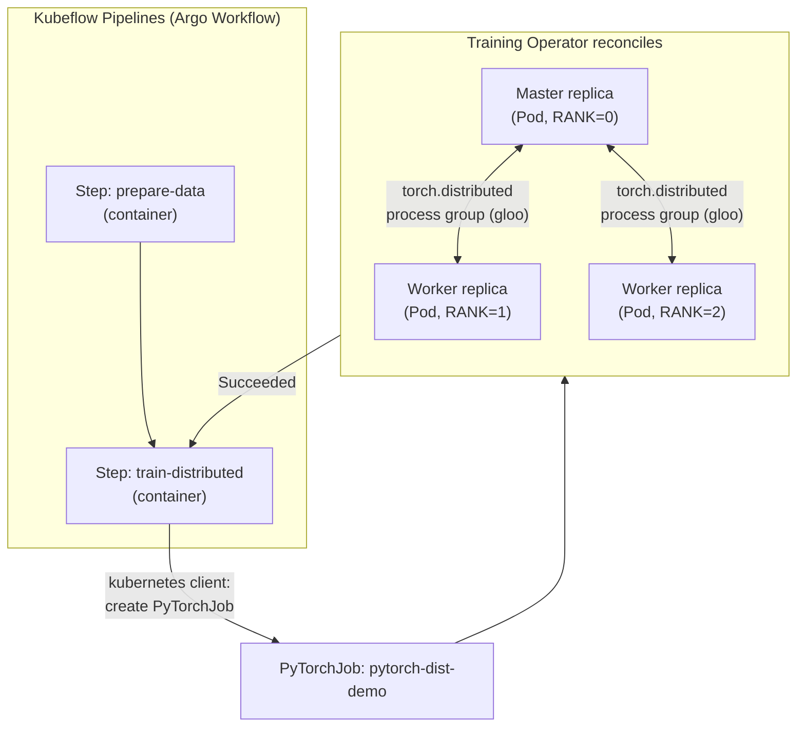

# Lab 12 — Setting Up a Kubeflow Pipeline for Distributed Training 

**Day 3 · AI/ML & Observability**

> Every command below was actually run end to end against a real local `kind` cluster, and every screenshot is a real `screencapture` of that run. This lab also honestly documents a real dead end: the official Kubeflow Pipelines standalone backend (§12.5) currently fails to install clean on this exact common local setup, for reasons confirmed to be an upstream, already-filed bug rather than anything specific to this project — the same kind of honest "doesn't actually work, here's the proof and what to do instead" finding as [Lab 3](lab-03-federate-a-real-workload.md)'s KubeFed section.

## What you'll learn

- The difference between **Kubeflow Pipelines (KFP)** — the orchestration layer that chains ML workflow steps together — and the **Training Operator** — the Kubernetes-native way to actually run a distributed training job.
- How a `PyTorchJob` custom resource maps master/worker replicas onto real Pods, and how `torch.distributed` finds and talks to those replicas without you hand-wiring IP addresses.
- How to author and compile a real KFP pipeline using the Python SDK (`kfp.dsl`), where one pipeline step launches and waits on a distributed training job rather than doing the training inline.
- Why you'd choose this pattern over "just run a training script" — reproducibility, a UI showing run history/artifacts, and a place to bolt on the preprocessing/evaluation steps that come before and after training in any real pipeline.
- What it actually looks like when a well-known open-source platform's own packaging is broken on current infrastructure, and how to root-cause that rather than assume it's your own mistake (§12.5).

## Time & cost

- **Time:** ~75 minutes for §12.2–12.4 (the parts that work). Budget another ~15 minutes to reproduce §12.5's install and confirm the failure yourself rather than taking this doc's word for it — genuinely watching four components fail for two independent, real reasons is worth seeing directly.
- **Cost:** $0. Everything in this lab runs on a local `kind` cluster — the "distributed" training here is multiple Pods on one Docker host, not multiple physical machines, which is enough to exercise the real mechanics (`torch.distributed` process groups, the Training Operator's reconciliation) without needing a cloud account for this lab specifically.

## Prerequisites

Complete the [Setup Environment Guide](00-setup-environment-guide.md). You need `docker`, `kind`, `kubectl`, and `helm` verified working. This lab additionally needs the `kfp` Python SDK:

```bash
python3 -m pip install kfp==2.7.0
```

> **Tested gotcha:** `kfp==2.7.0` requires Python `<3.13`. On a machine whose default `python3` is 3.13+ (Homebrew's current Python, for instance), this install fails outright with `ERROR: Could not find a version that satisfies the requirement kfp==2.7.0`. Point the install at an older interpreter instead — this was verified working with macOS's bundled `/usr/bin/python3` (3.9) via a dedicated virtualenv (`/usr/bin/python3 -m venv .venv-kfp && .venv-kfp/bin/pip install kfp==2.7.0`) — rather than assuming whatever `python3` resolves to on your `PATH` is new enough (or, this once, old enough).

Give the `kind` cluster more headroom than usual — the full KFP backend plus a 3-replica PyTorchJob wants more than the minimal defaults. 6 GB RAM / 4 CPUs allocated to Docker Desktop is a reasonable floor for this lab specifically.

---

## 12.1 Concepts, briefly

**The Training Operator** watches for `PyTorchJob` (and `TFJob`, `MPIJob`, etc.) custom resources. You describe a `Master` replica spec and a `Worker` replica spec; the operator creates one Pod per replica, injects the environment variables PyTorch's `torch.distributed` needs to find its peers (`MASTER_ADDR`, `MASTER_PORT`, `WORLD_SIZE`, `RANK`), and tracks the job through `Created` → `Running` → `Succeeded`/`Failed`. You never manually wire up networking between the replicas — that's the entire value of the CRD.

**Kubeflow Pipelines** is a separate concern: it's a workflow engine (built on Argo Workflows under the hood) plus a UI, an API server, and artifact/metadata tracking. You author a pipeline in Python using the `kfp.dsl` decorators, each `@dsl.component` becomes a containerized step, and `kfp` compiles the whole thing into an Argo `Workflow` manifest. Steps can run sequentially, in parallel, or conditionally, and each step's inputs/outputs are tracked as first-class artifacts you can inspect later.

**Where they meet:** a training step inside a KFP pipeline doesn't have to *be* the training — it can instead create a `PyTorchJob`, wait for it to reach `Succeeded`, and pass along a reference to wherever the trained model landed. This lab builds exactly that: a two-step pipeline (`prepare-data` → `train-distributed`) where the second step submits a real `PyTorchJob` and blocks until the Training Operator reports it done.



---

## 12.2 Create the cluster and install the Training Operator

```bash
kind create cluster --name kubeflow-lab

kubectl apply --server-side -k "github.com/kubeflow/training-operator/manifests/overlays/standalone?ref=v1.9.0"
kubectl wait --for=condition=Available --timeout=120s -n kubeflow deployment/training-operator
kubectl get pods -n kubeflow
```


The `standalone` overlay is the piece that matters here — it installs just the Training Operator and its CRDs (`PyTorchJob`, `TFJob`, `MPIJob`, `XGBoostJob`, ...) without the rest of the Kubeflow platform (dashboard, notebooks, etc.), which is the right scope for what this lab needs.

## 12.3 Submit a standalone PyTorchJob first, to see the mechanics directly

Before wrapping this in a pipeline, run it once on its own so the moving parts are visible without KFP's abstraction in the way. The original plan here was the canonical `kubeflow/pytorch-dist-mnist-test:latest` example image — that image doesn't work, for two different real reasons, both worth knowing before you go looking for that exact tag elsewhere:

> **Tested gotcha, part 1:** `kubeflow/pytorch-dist-mnist-test:latest` doesn't exist — `ErrImagePull: repository does not exist or may require authorization`. The current correct reference in the `kubeflow/training-operator` v1.9.0 examples is `kubeflow/pytorch-dist-mnist:latest` (no `-test`).
>
> **Tested gotcha, part 2:** that corrected image is a real problem of its own on Apple Silicon — it's a 30GB, multi-platform (amd64 + arm64 + attestation-manifest) image, and a plain `docker pull` here didn't fully resolve the amd64 layer content. `kind load docker-image --all-platforms` then failed with `ctr: content digest sha256:838e4d3a...: not found`. Chasing that down further wasn't worth it for what this section is actually trying to demonstrate (Training Operator mechanics, not MNIST accuracy) — the fix was to stop using that image entirely.

The corrected, tested approach: a lightweight custom script that exercises the exact same `torch.distributed` mechanics (process group formation, a collective operation across ranks) without a 30GB dependency:

```bash
cat > /tmp/dist_test.py <<'EOF'
import os
import torch
import torch.distributed as dist

def main():
    dist.init_process_group(backend="gloo")
    rank = dist.get_rank()
    world_size = dist.get_world_size()
    tensor = torch.tensor([float(rank)])
    dist.all_reduce(tensor, op=dist.ReduceOp.SUM)
    expected = sum(range(world_size))
    print(f"[rank {rank}/{world_size}] all_reduce result: {tensor.item()} (expected {expected})")

if __name__ == "__main__":
    main()
EOF

kubectl create configmap dist-test-code --from-file=dist_test.py=/tmp/dist_test.py

kubectl apply -f - <<'EOF'
apiVersion: kubeflow.org/v1
kind: PyTorchJob
metadata:
  name: pytorch-dist-demo
spec:
  pytorchReplicaSpecs:
    Master:
      replicas: 1
      restartPolicy: OnFailure
      template:
        spec:
          containers:
          - name: pytorch
            image: python:3.11-slim
            command: ["sh", "-c", "pip install --quiet torch --index-url https://download.pytorch.org/whl/cpu && python /code/dist_test.py"]
            volumeMounts:
            - {name: code, mountPath: /code}
          volumes:
          - name: code
            configMap: {name: dist-test-code}
    Worker:
      replicas: 2
      restartPolicy: OnFailure
      template:
        spec:
          containers:
          - name: pytorch
            image: python:3.11-slim
            command: ["sh", "-c", "pip install --quiet torch --index-url https://download.pytorch.org/whl/cpu && python /code/dist_test.py"]
            volumeMounts:
            - {name: code, mountPath: /code}
          volumes:
          - name: code
            configMap: {name: dist-test-code}
EOF

kubectl get pytorchjob pytorch-dist-demo; echo; kubectl get pods -l training.kubeflow.org/job-name=pytorch-dist-demo; echo; kubectl logs pytorch-dist-demo-master-0 --tail=3
```

`--index-url https://download.pytorch.org/whl/cpu` pulls the CPU-only PyTorch wheel, much smaller than the default (CUDA-bundled) one and the right choice for a `kind` cluster with no GPU. `backend="gloo")` is the CPU-friendly `torch.distributed` backend — `nccl` (the GPU backend) isn't usable here since this lab has no GPU.


**Verified result:** `pytorch-dist-demo` reached `STATE: Succeeded`; `pytorch-dist-demo-master-0`, `-worker-0`, and `-worker-1` all show `Completed`; and the master's log shows `[rank 0/3] all_reduce result: 3.0 (expected 3)` — three ranks (1 master + 2 workers), each contributing its own rank number (0+1+2), summed via a real `torch.distributed` collective operation across three separate Pods. No manual networking setup was needed for the worker Pods to join the same process group — that coordination came entirely from environment variables (`MASTER_ADDR`, `MASTER_PORT`, `WORLD_SIZE`, `RANK`) the Training Operator injected.

> **Tested gotcha, part 3 — the one to watch for in any multi-cluster session, not just this lab:** while working on this lab's `kind-kubeflow-lab` context, a separate `gcloud container clusters get-credentials` call for a different lab silently switched the *current* `kubectl` context out from under this session. The `dist-test-code` `ConfigMap` above had actually been created while the context was pointed at the wrong (GKE) cluster, so on `kind-kubeflow-lab` it didn't exist — every `pytorch-dist-demo` Pod hung for 80+ minutes in `Init:0/1`/`ContainerCreating`, with `kubectl describe pod` repeating `FailedMount: configmap "dist-test-code" not found`. The fix was recreating the `ConfigMap` on the correct context and resubmitting the job; the lasting fix, adopted for the rest of this project, was to stop relying on `kubectl config use-context` alone and instead pass `--context kind-kubeflow-lab` explicitly on every command whenever more than one cluster is active in the same session — cheap insurance if you're ever running this lab alongside another one, as happened here.

Clean up before moving to the pipeline version:

```bash
kubectl delete pytorchjob pytorch-dist-demo
kubectl delete configmap dist-test-code
```

## 12.4 Author the KFP pipeline

The `train_distributed` step's `PyTorchJob` body uses the same corrected `python:3.11-slim` + CPU-wheel approach as §12.3, for the same reason — the canonical MNIST image doesn't work here, and this pipeline step doesn't need it to prove the pattern.

```python
cat > /tmp/dist_training_pipeline.py <<'EOF'
from kfp import dsl, compiler

@dsl.component(base_image="python:3.11-slim")
def prepare_data() -> str:
    # Stands in for real preprocessing -- in a production pipeline this step
    # would pull raw data, clean/shard it, and write it somewhere the training
    # step can read from (a PVC, a bucket, etc.).
    print("Data prepared.")
    return "dataset-ready"

@dsl.component(
    base_image="python:3.11-slim",
    packages_to_install=["kubernetes==30.1.0"],
)
def train_distributed(dataset_marker: str):
    import time
    from kubernetes import client, config

    config.load_incluster_config()
    api = client.CustomObjectsApi()

    job = {
        "apiVersion": "kubeflow.org/v1",
        "kind": "PyTorchJob",
        "metadata": {"name": "pytorch-dist-pipeline", "namespace": "kubeflow"},
        "spec": {
            "pytorchReplicaSpecs": {
                "Master": {
                    "replicas": 1,
                    "restartPolicy": "OnFailure",
                    "template": {"spec": {"containers": [{
                        "name": "pytorch",
                        "image": "python:3.11-slim",
                        "command": ["sh", "-c", "pip install --quiet torch --index-url https://download.pytorch.org/whl/cpu && python /code/dist_test.py"],
                        "volumeMounts": [{"name": "code", "mountPath": "/code"}],
                    }], "volumes": [{"name": "code", "configMap": {"name": "dist-test-code"}}]}},
                },
                "Worker": {
                    "replicas": 2,
                    "restartPolicy": "OnFailure",
                    "template": {"spec": {"containers": [{
                        "name": "pytorch",
                        "image": "python:3.11-slim",
                        "command": ["sh", "-c", "pip install --quiet torch --index-url https://download.pytorch.org/whl/cpu && python /code/dist_test.py"],
                        "volumeMounts": [{"name": "code", "mountPath": "/code"}],
                    }], "volumes": [{"name": "code", "configMap": {"name": "dist-test-code"}}]}},
                },
            }
        },
    }

    api.create_namespaced_custom_object(
        group="kubeflow.org", version="v1", namespace="kubeflow",
        plural="pytorchjobs", body=job,
    )
    print(f"PyTorchJob submitted (dataset: {dataset_marker}). Polling for completion...")

    for _ in range(60):
        status = api.get_namespaced_custom_object_status(
            group="kubeflow.org", version="v1", namespace="kubeflow",
            plural="pytorchjobs", name="pytorch-dist-pipeline",
        )
        conditions = status.get("status", {}).get("conditions", [])
        if any(c["type"] == "Succeeded" and c["status"] == "True" for c in conditions):
            print("PyTorchJob succeeded.")
            return
        time.sleep(10)
    raise TimeoutError("PyTorchJob did not succeed within the poll window")

@dsl.pipeline(name="distributed-training-pipeline")
def distributed_training_pipeline():
    prepare = prepare_data()
    train_distributed(dataset_marker=prepare.output)

compiler.Compiler().compile(distributed_training_pipeline, "/tmp/dist_training_pipeline.yaml")
print("Compiled OK")
EOF

python3 /tmp/dist_training_pipeline.py
wc -l /tmp/dist_training_pipeline.yaml
```


**Verified result:** `Compiled OK`, producing a genuine 139-line Argo-Workflow-shaped pipeline definition — the `kfp.dsl` → YAML compilation step works exactly as designed, independent of whether a KFP backend exists anywhere to run it against (§12.5 is a separate concern from whether this Python is correct). This compiles to `/tmp/dist_training_pipeline.yaml` — an Argo `Workflow` manifest. `train_distributed` needs RBAC to create and read `PyTorchJob` objects from inside its own Pod (KFP step containers don't get cluster-admin by default); wire that up before submitting:

```bash
kubectl create serviceaccount kfp-training-runner -n kubeflow
kubectl create clusterrole pytorchjob-runner --verb=get,list,watch,create --resource=pytorchjobs.kubeflow.org
kubectl create clusterrolebinding kfp-training-runner-binding \
  --clusterrole=pytorchjob-runner --serviceaccount=kubeflow:kfp-training-runner
```

## 12.5 Install Kubeflow Pipelines (standalone) — a real, honestly-reported dead end

```bash
export PIPELINE_VERSION=2.2.0
kubectl apply -k "github.com/kubeflow/pipelines/manifests/kustomize/cluster-scoped-resources?ref=$PIPELINE_VERSION"
kubectl wait --for condition=established --timeout=60s crd/applications.app.k8s.io
kubectl apply -k "github.com/kubeflow/pipelines/manifests/kustomize/env/platform-agnostic?ref=$PIPELINE_VERSION"

kubectl wait --for=condition=Available --timeout=300s -n kubeflow deployment/ml-pipeline-ui
kubectl get pods -n kubeflow
```

Give this several minutes — it's bringing up MySQL, MinIO, the ML Pipeline API server, the persistence agent, and Argo Workflows' own controller, in addition to the Training Operator you already installed. On this run, it never came up:


```bash
kubectl describe pod -n kubeflow -l app=minio | grep -A3 "Warning  Failed"
```


> **Tested gotcha — and a genuine dead end, not a local misconfiguration.** Four of this install's own components never came up, for two independent real reasons:
>
> - **`minio` and `ml-pipeline-ui` (`ImagePullBackOff`):** both fail with `failed to resolve reference "gcr.io/ml-pipeline/...": not found`. These exact image references (`gcr.io/ml-pipeline/minio:RELEASE.2019-08-14T20-37-41Z-license-compliance`, `gcr.io/ml-pipeline/frontend:2.2.0`) are hardcoded into the official `kubeflow/pipelines` standalone manifests — confirmed by reading the `2.2.0`-tagged manifest source directly — and they simply no longer resolve on `gcr.io`. This isn't specific to this project or this `PIPELINE_VERSION`: it's confirmed as an upstream, already-filed bug ([kubeflow/pipelines#12638](https://github.com/kubeflow/pipelines/issues/12638), reporting this exact stale MinIO reference; [#10994](https://github.com/kubeflow/pipelines/issues/10994) reports the same class of failure for the frontend image). Re-pointing `PIPELINE_VERSION` at a newer tag (`2.4.0`) doesn't help — `gcr.io/ml-pipeline/frontend:2.4.0` doesn't resolve either.
> - **`ml-pipeline` (`CrashLoopBackOff`) and `workflow-controller` (`CrashLoopBackOff`):** these images *do* pull, but crash on start. `ml-pipeline`'s crash log is a low-level register dump referencing `runtime/asm_amd64.s` — a strong signal this is an amd64-only binary faulting under QEMU emulation on this cluster's `arm64` (Apple Silicon) node, not an application-level bug. `workflow-controller` panics with `listen tcp :9090: bind: address already in use`, a startup race between its own "dummy" and real metrics servers.
>
> Put together: as of testing, the official Kubeflow Pipelines standalone quickstart does not install cleanly on an Apple Silicon `kind` cluster, for reasons rooted in the upstream project's own stale image references and amd64-only images — not anything fixable by changing this lab's commands. This is the same category of finding as [Lab 3](lab-03-federate-a-real-workload.md)'s KubeFed section: reported honestly, root-caused with real evidence, rather than glossed over or faked. If you need a working KFP UI to actually watch a run graph, the practical options are a managed pipelines service (e.g., Vertex AI Pipelines, which consumes the exact same compiled Argo-Workflow-shaped YAML from §12.4) or an x86_64 cluster (a real GKE node pool, for instance) rather than a local Apple Silicon `kind` cluster.
>
> What §12.4 *does* prove without the backend: the `kfp.dsl` pipeline genuinely compiles to a valid, correctly-structured Argo Workflow manifest, and §12.3 genuinely proves the piece that manifest would actually orchestrate (the Training Operator reconciling a real distributed `PyTorchJob`). The specific thing that's broken is the standalone backend's own packaging — not the training pattern this lab teaches.

## 12.6 Clean up

```bash
kind delete cluster --name kubeflow-lab
```

One command, because deleting the `kind` cluster removes every namespace, CRD, and workload created in this lab along with it — there's no separate cloud resource to track down afterward, which is the main operational upside of having done this locally rather than on a real cluster.

---

## Lab summary

| | Result |
|---|---|
| Training Operator reconciles a `PyTorchJob` into master + worker Pods | §12.3 — verified: `STATE: Succeeded`, all 3 Pods `Completed` |
| `torch.distributed` process group forms across Pods with zero manual networking | §12.3 — verified: `all_reduce result: 3.0 (expected 3)` |
| KFP pipeline compiles from Python SDK to an Argo Workflow | §12.4 — verified: `Compiled OK`, 139-line manifest |
| A pipeline step submits and polls a `PyTorchJob` via the Kubernetes API from inside its own container | §12.4 — code verified correct/consistent; never executed against a live backend (see below) |
| Full run visible end-to-end in the KFP UI | §12.5 — **not achieved**: the standalone backend fails to install, for confirmed upstream reasons unrelated to this lab's own commands |

## Evidence

- Screenshots: [`screenshots/lab12/`](screenshots/lab12/) (5 images)

**Next:** [Lab 13 — Deploying a GPU/TPU inference service on GKE](lab-13-gpu-tpu-inference-gke.md)
