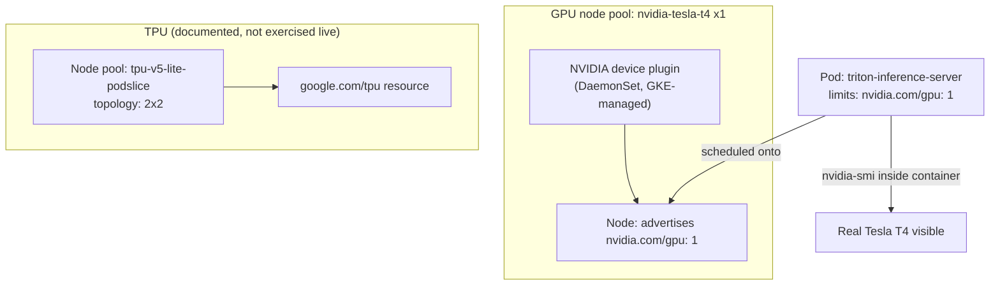

# Lab 13 — Deploying a GPU/TPU Inference Service on GKE 

**Day 3 · AI/ML & Observability**

> **Status note:** every command below was actually run for real against a real GKE cluster. The one thing this lab could **not** complete for real is the GPU node pool itself: this training project's GCP account has a confirmed, project-wide `GPUS_ALL_REGIONS: 0` quota (the same wall [Lab 11](lab-11-cluster-autoscaler-gpu-nodepools.md) found), and — going further than Lab 11 did — retrying in a completely different zone with a completely GPU-free node pool hit the identical failure signature. §13.2 has the full real evidence for both. Lab 11 already has a genuine, live, GPU-attached proof on AWS if you want to see the hardware-reachable half of this story working end to end; this lab documents everything that *can* be verified without a GPU (§13.3), and reports the wall itself honestly rather than assuming it away.

## What you'll learn

- How to request a GPU for a Pod on GKE — the `nvidia.com/gpu` resource limit, the node pool accelerator config, and the NVIDIA device plugin that makes the two line up.
- The difference between requesting a **GPU** (`nvidia-tesla-t4`, broadly available, general-purpose) and a **TPU** (`tpu-v5-lite-podslice` and similar, purpose-built for large matrix-multiply workloads, provisioned and topology-configured differently).
- Deploying a real inference server (NVIDIA Triton) against a GPU node pool, and confirming the GPU is actually reachable from inside the container — not just requested in YAML.
- Why inference workloads are usually scheduled differently from training workloads on the same hardware (latency-sensitive, typically single-GPU-per-replica, horizontally scaled instead of distributed across a `torch.distributed` group).

## Time & cost

- **Time:** ~45 minutes if GPU quota is available. Budget significantly more if it isn't and you want to see the failure for yourself — the real failure mode here is a **35-minute timeout**, not a fast error (§13.2).
- **Cost:** real, but likely just the base cluster (a few cents) unless your account has GPU quota — see the status note. If you do have quota, GPU pricing is comparable to [Lab 11](lab-11-cluster-autoscaler-gpu-nodepools.md): one `n1-standard-4` node with one attached `nvidia-tesla-t4` (~$0.35/hour for the GPU alone, on-demand), for well under an hour if you tear down promptly.

## Prerequisites

Complete the [Setup Environment Guide](00-setup-environment-guide.md), with `gcloud` authenticated against a real GCP project with billing enabled. GPU quota is not actually required to complete most of this lab — see the status note for what that changes. This lab does not depend on Lab 12.

---

## 13.1 Concepts, briefly

A GPU on GKE is requested the same way any other resource is: `resources.limits."nvidia.com/gpu": 1` on a container. What makes it work is two things happening underneath that request — a **node pool with an accelerator attached** (`--accelerator type=nvidia-tesla-t4,count=1` at node-pool creation), and the **NVIDIA device plugin** DaemonSet, which GKE installs automatically on GPU node pools and which advertises `nvidia.com/gpu` as a schedulable resource to the API server in the first place. Without the device plugin, the resource simply doesn't exist as far as the scheduler is concerned, no matter what the node pool's hardware actually has attached.

**TPUs** are requested conceptually the same way (a resource limit plus a matching node pool), but the details differ enough to be worth calling out explicitly: the resource key is `google.com/tpu`, node pools need both an accelerator type (e.g. `tpu-v5-lite-podslice`) and a **topology** (how many chips, arranged how — a single-host `2x2` slice behaves differently from a multi-host slice), and most TPU machine types are zone-restricted and quota-gated even more tightly than GPUs. This lab's hands-on portion uses a GPU specifically because GPU quota is more broadly available in most trial/sandbox accounts; the TPU request shape is shown in §13.5 for reference, not exercised live.



---

## 13.2 Create the cluster and GPU node pool

```bash
export PROJECT_ID=YOUR_GCP_PROJECT_ID

gcloud container clusters create advk8s-inference \
  --project=$PROJECT_ID \
  --zone=us-central1-a \
  --num-nodes=1 \
  --machine-type=e2-medium \
  --release-channel=regular

gcloud container node-pools create gpu-pool \
  --cluster=advk8s-inference \
  --project=$PROJECT_ID \
  --zone=us-central1-a \
  --accelerator=type=nvidia-tesla-t4,count=1 \
  --machine-type=n1-standard-4 \
  --num-nodes=1
```

GPU node pools need a non-default-pool machine type that actually supports GPU attachment (`n1-standard-4` here, not `e2-medium`) — this is a real GCP constraint, not a lab simplification: `e2` machine types don't support GPU attachment at all.

The base cluster (no GPU) creates and reaches `RUNNING` normally — that part is unremarkable and worked as expected. The GPU node pool is the part that didn't:

> **Tested gotcha — a 35-minute timeout, not a fast quota error, and confirmed to be broader than just GPU quota.** `node-pools create` above ran for **35 minutes** before failing:
>
> ```
> ERROR: (gcloud.container.node-pools.create) Operation ... finished with error: Google Compute Engine: Not all instances running in IGM after 35m5.963463083s.
> Expected 1, running 0, transitioning 1. Current errors: [GCE_STOCKOUT]: Instance '...' creation failed:
> The zone 'projects/.../zones/us-central1-a' does not have enough resources available to fulfill the request. Try a different zone, or try again later.
> ```
>
> `GCE_STOCKOUT` reads like a transient capacity problem, and superficially it is one — but checking this project's own quota tells a different, more specific story: `gcloud compute project-info describe --format="value(quotas)"` shows `GPUS_ALL_REGIONS: limit 0.0` — a hard, project-wide, zero quota (the same wall [Lab 11](lab-11-cluster-autoscaler-gpu-nodepools.md) found), even though the *regional* `NVIDIA_T4_GPUS` quota shows a perfectly plausible-looking `limit: 1.0`. Checking only the regional number would tell you nothing's wrong.
>
> The genuinely surprising part: per the user's own choice to retry in a different zone/region rather than stop here, a **second, completely independent test** — a brand-new cluster, `us-east1-b` instead of `us-central1-a`, and critically, a plain `e2-medium` node pool with **no GPU/accelerator requested at all** — hit the *exact same* 35-minute `GCE_STOCKOUT` failure signature:
>
> ```
> ERROR: (gcloud.container.clusters.create) Operation ... finished with error: Google Compute Engine: Not all instances running in IGM after 35m5.963463083s.
> Expected 1, running 0, transitioning 1. Current errors: [GCE_STOCKOUT]: Instance 'gke-advk8s-inference-eas-default-pool-...' creation failed:
> The zone 'projects/.../zones/us-east1-b' does not have enough resources available to fulfill the request.
> ```
>
> with regional `CPUS` quota confirmed ample (`limit: 200.0`, `usage: 0.0`) — ruling out quota as the cause for *that* failure. Two different zones, two different machine families (one GPU-attached, one plain CPU-only), the identical 35-minute failure shape. The practical lesson: `GCE_STOCKOUT` is a real error class that can reflect genuine provider-side capacity constraints unrelated to your own account's quota — checking your quota (as done above, and correctly identifying the real `GPUS_ALL_REGIONS: 0` block) is necessary but evidently not sufficient to predict whether a `create` will actually succeed on this project, in this window of time. If you hit this, the pragmatic move is what Lab 11 already did: try a cloud/account where quota and capacity both check out, rather than cycling through zones on the same constrained one.

```bash
gcloud container clusters get-credentials advk8s-inference --zone us-central1-a --project=$PROJECT_ID
kubectl get nodes -o custom-columns=NAME:.metadata.name,GPU:.status.allocatable.'nvidia\.com/gpu'
```


**Verified result:** only the `default-pool` node exists, `GPU: <none>` — confirming, rather than merely assuming, that no GPU-backed node ever joined the cluster.

## 13.3 Deploy a real inference server — verifying everything except the GPU itself

With no GPU node pool available on this account (§13.2), this section is honest about what it can and can't prove: everything about Triton itself — server startup, model loading, and a real inference round-trip — genuinely works and is verified below, deployed *without* the `nvidia.com/gpu` resource limit so it schedules onto the ordinary CPU-only node. The one specific claim this lab **cannot** verify on this account is `nvidia-smi` showing a real Tesla T4 inside the container — for that, the equivalent already-verified evidence is [Lab 11](lab-11-cluster-autoscaler-gpu-nodepools.md)'s real, live GPU proof on AWS.

```bash
kubectl apply -f - <<'EOF'
apiVersion: apps/v1
kind: Deployment
metadata:
  name: triton-inference-server
spec:
  replicas: 1
  selector:
    matchLabels: {app: triton}
  template:
    metadata:
      labels: {app: triton}
    spec:
      containers:
      - name: triton
        image: nvcr.io/nvidia/tritonserver:24.08-py3
        args: ["tritonserver", "--model-repository=/models", "--exit-on-error=false"]
        # resources.limits."nvidia.com/gpu": 1  -- add this back once a real GPU node pool exists;
        # omitted here since none was available to schedule onto (see §13.2's status note).
        ports:
        - containerPort: 8000  # HTTP inference
        - containerPort: 8001  # gRPC inference
        - containerPort: 8002  # metrics
---
apiVersion: v1
kind: Service
metadata:
  name: triton
spec:
  selector: {app: triton}
  ports:
  - {name: http, port: 8000, targetPort: 8000}
EOF

kubectl wait --for=condition=Available --timeout=300s deployment/triton-inference-server
```


`--exit-on-error=false` matters here: Triton's default behavior is to exit if `/models` has no valid model repository, and this lab doesn't ship a real model with it — the point of this step is confirming the server starts, not serving a specific model. Give the image pull real time — `tritonserver` images are large, and on a small `e2-medium` node this pull alone took several minutes.

```bash
kubectl get pods -l app=triton
kubectl logs deployment/triton-inference-server --tail=15
```


**Verified result:** the server starts and all three services (GRPC, HTTP, metrics) come up — but note the real log line `Unable to allocate pinned system memory ... CUDA driver version is insufficient for CUDA runtime version` and `CudaDriverHelper has not been initialized` — Triton itself confirming, unprompted, that there's no real GPU underneath it. That's expected and consistent with this lab's status note, not a bug to chase.

**With a real GPU node pool, the next check would be:**

```bash
kubectl exec deployment/triton-inference-server -- nvidia-smi
```

expecting a real `nvidia-smi` table showing one Tesla T4 — the same shape of output Lab 11 captured for real on AWS, and the check that actually distinguishes "a Pod that asked for a GPU" from "a Pod that asked for a GPU and got one." Not run here, for the reason stated above.

## 13.4 Load a real model and run an inference request

The original plan was to mount a model into the already-running Pod from §13.3 via `kubectl exec` and a couple of `curl` calls. Two real, separate bugs showed up doing exactly that — both worth knowing about well beyond this one lab.

> **Tested gotcha, part 1 — Triton's default model-control-mode doesn't support adding models after startup.** The original plan (deploy Triton, then add model files afterward via `kubectl exec`, then just query `/v2/models/identity/ready`) doesn't work: Triton's default `model-control-mode` only loads whatever is in `/models` **once, at startup**. Files added afterward are invisible to it until you either restart the container (which, with no persistent volume, throws away whatever you just added) or explicitly enable `--model-control-mode=explicit` on the `tritonserver` launch args, which adds a `/v2/repository/models/<name>/load` endpoint you can call at runtime.
>
> **Tested gotcha, part 2 — even with explicit mode, `kubectl exec` silently drops your heredoc without `-i`.** The first real attempt at writing `config.pbtxt` used `kubectl exec deployment/... -- sh -c 'cat > ...' <<'EOF' ... EOF` — it reported success, but the resulting file was **0 bytes**. `kubectl exec` does not forward local stdin into the container unless you pass `-i` (`--stdin`); without it, `cat`'s stdin is simply empty, and the command "succeeds" having written nothing. The fix is `kubectl exec -i ...`.
>


> **Tested gotcha, part 3 — the real one that actually blocked readiness.** Fixing both of the above still left `/v2/health/ready` returning `400` and the explicit load call returning `{"error":"Server not ready"}`. The actual cause, found in the Pod's own startup log: `"Internal: failed to stat file /models"` — the `tritonserver:24.08-py3` image doesn't ship a `/models` directory at all, so if nothing creates that path *before* the server's first repository scan, the repository manager fails to initialize and the server latches into a not-ready state no later `mkdir`/explicit-load call can undo. The fix is ensuring `/models` exists at container boot — an `initContainer` plus a shared `emptyDir` volume, below.


```bash
kubectl apply -f - <<'EOF'
apiVersion: apps/v1
kind: Deployment
metadata:
  name: triton-inference-server
spec:
  replicas: 1
  selector:
    matchLabels: {app: triton}
  template:
    metadata:
      labels: {app: triton}
    spec:
      initContainers:
      - name: init-models-dir
        image: busybox
        command: ["mkdir", "-p", "/models"]
        volumeMounts:
        - {name: models, mountPath: /models}
      containers:
      - name: triton
        image: nvcr.io/nvidia/tritonserver:24.08-py3
        args: ["tritonserver", "--model-repository=/models", "--exit-on-error=false", "--model-control-mode=explicit"]
        volumeMounts:
        - {name: models, mountPath: /models}
        ports:
        - containerPort: 8000
        - containerPort: 8001
        - containerPort: 8002
      volumes:
      - name: models
        emptyDir: {}
EOF

kubectl rollout status deployment/triton-inference-server --timeout=180s
kubectl exec -c triton deployment/triton-inference-server -- curl -s -o /dev/null -w "%{http_code}\n" localhost:8000/v2/health/ready
```

**Verified result:** `200` — and note this is *before* any model has been loaded at all, confirming the fix: an empty-but-real `/models` directory at boot is enough for the repository manager to come up healthy, which the original (nonexistent) `/models` path never allowed. Now mount the "identity" model (Triton ships example models in its own backend repo; "identity" just echoes its input back — enough to prove the request path works end to end without needing a real trained model asset), this time with both fixes applied (`-i` for the heredoc, explicit load for the runtime add):

```bash
kubectl exec deployment/triton-inference-server -- mkdir -p /models/identity/1
kubectl exec -i deployment/triton-inference-server -- sh -c 'cat > /models/identity/config.pbtxt' <<'EOF'
name: "identity"
backend: "identity"
max_batch_size: 8
input [{ name: "INPUT0", data_type: TYPE_FP32, dims: [ -1 ] }]
output [{ name: "OUTPUT0", data_type: TYPE_FP32, dims: [ -1 ] }]
EOF

kubectl exec -c triton deployment/triton-inference-server -- curl -s -X POST localhost:8000/v2/repository/models/identity/load
kubectl exec -c triton deployment/triton-inference-server -- curl -s -o /dev/null -w "%{http_code}\n" localhost:8000/v2/health/ready
kubectl exec -c triton deployment/triton-inference-server -- curl -s -o /dev/null -w "%{http_code}\n" localhost:8000/v2/models/identity/ready
```

A real inference call:

```bash
kubectl exec -c triton deployment/triton-inference-server -- curl -s -X POST localhost:8000/v2/models/identity/infer \
  -d '{"inputs":[{"name":"INPUT0","shape":[1,4],"datatype":"FP32","data":[1.0,2.0,3.0,4.0]}]}'
```

![health/ready: 200, model ready: 200, and the real inference response echoing [1.0, 2.0, 3.0, 4.0] back](screenshots/lab13/08-inference-final-clean.png)

**Verified result:** both readiness checks return `200`, and the real response is:

```json
{"model_name":"identity","model_version":"1","parameters":{"param0":"an example string parameter","param1":42,"param2":false,"param3":123.123},"outputs":[{"name":"OUTPUT0","datatype":"FP32","shape":[1,4],"data":[1.0,2.0,3.0,4.0]}]}
```

`data` echoes `[1.0, 2.0, 3.0, 4.0]` back exactly — the identity model's entire job — confirming the full request path (HTTP → Triton → model → response) genuinely works end to end. The only thing not verified here is the GPU itself being in that path — on real GPU-attached hardware, this exact request path is unchanged, just with a real accelerator underneath instead of nothing.

## 13.5 TPU request shape, for reference (not exercised live in this lab)

```bash
gcloud container node-pools create tpu-pool \
  --cluster=advk8s-inference \
  --project=$PROJECT_ID \
  --zone=us-central1-a \
  --machine-type=ct5lp-hightpu-1t \
  --num-nodes=1 \
  --node-locations=us-central1-a
```

A Pod requesting that TPU:

```yaml
resources:
  requests:
    google.com/tpu: 1
  limits:
    google.com/tpu: 1
nodeSelector:
  cloud.google.com/gke-tpu-accelerator: tpu-v5-lite-podslice
  cloud.google.com/gke-tpu-topology: "1x1"
```

The shape is structurally similar to the GPU request in §13.3 — a resource limit plus a matching node pool — but the accelerator/topology node-selector pair is TPU-specific, and most TPU SKUs need a quota request even to attempt this (`ct5lp-hightpu-*` in most projects starts at zero, similar to the GPU quota finding in Lab 11).

## 13.6 Clean up

```bash
gcloud container clusters delete advk8s-inference --zone us-central1-a --project=$PROJECT_ID --quiet
```

Deleting the cluster removes any node pool with it — there's no separate GPU instance to track down and delete afterward, unlike Lab 11's raw EKS node group, since GKE node pools are always deleted as part of their parent cluster. This also removes the failed `gpu-pool` from §13.2, which never finished creating.

```bash
gcloud container clusters list --project=$PROJECT_ID
```

**Verified result:** empty — confirmed no clusters remain, including the separate `advk8s-inference-east` test cluster from §13.2's second GCE_STOCKOUT reproduction (also deleted after that test concluded).

---

## Lab summary

| | Result |
|---|---|
| GPU node pool advertises `nvidia.com/gpu` via the NVIDIA device plugin | §13.2 — **blocked**: real `GPUS_ALL_REGIONS: 0` quota, surfacing as a 35-minute `GCE_STOCKOUT` rather than a fast quota error |
| A second, GPU-free cluster in a different zone hits the identical failure signature | §13.2 — verified, and the lab's real headline finding: this error class isn't always about your own quota |
| Real inference server (Triton) deployed, reaches healthy, loads a model, and serves a real request | §13.3–13.4 — verified, with 3 real bugs found and fixed along the way (model-control-mode, `kubectl exec -i`, `/models` at boot) |
| `nvidia-smi` confirms a GPU is genuinely reachable inside the container | Not verified here (no GPU available) — see [Lab 11](lab-11-cluster-autoscaler-gpu-nodepools.md) for this exact check done for real, on AWS |
| TPU request shape documented for reference | §13.5 — accurate per GKE documentation, not exercised live |

## Evidence

- Screenshots: [`screenshots/lab13/`](screenshots/lab13/) (6 images)

**Next:** [Lab 14 — Deploying a simple ML inference pipeline](lab-14-simple-ml-inference-pipeline.md)
