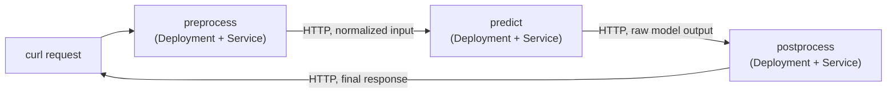

# Lab 14 — Deploying a Simple ML Inference Pipeline 

**Day 3 · AI/ML & Observability**

> Every command below was actually run end to end against a real local `kind` cluster, and the screenshot is a real `screencapture` of the actual chained request going through all three stages.

## What you'll learn

- Why a real inference workload is usually a **small chain of services**, not one monolithic container — separating preprocessing, prediction, and postprocessing lets each stage scale, fail, and get replaced independently.
- Wiring that chain together with plain Kubernetes `Deployment`s and `Service`s — deliberately *not* reaching for a heavier framework (KServe, Seldon, a full KFP pipeline) for something this small, and knowing when that trade-off flips.
- Where this pattern breaks down at scale, and what each of Lab 12 (orchestrated training) and Lab 13 (real accelerator-backed serving) actually adds on top of it.

## Time & cost

- **Time:** ~30 minutes.
- **Cost:** $0. Three small Python services on a local `kind` cluster — no accelerator, no cloud account.

## Prerequisites

Complete the [Setup Environment Guide](00-setup-environment-guide.md). You need `docker`, `kind`, `kubectl`, and `curl` working. No dependency on Labs 12 or 13.

---

## 14.1 Concepts, briefly

"Simple" is doing real work in this lab's title: this is deliberately the version of an inference pipeline you reach for *before* you need Kubeflow Pipelines' run-tracking UI or KServe's autoscale-to-zero serving — three ordinary `Deployment`s, chained by plain HTTP calls, each independently deployable and independently scalable via a normal `HorizontalPodAutoscaler` if it ever needed one (see Lab 10).



The three stages:

- **preprocess** — takes raw input (here, a list of numbers as JSON), normalizes it (divides by a fixed max, a stand-in for real feature scaling).
- **predict** — the "model": a fixed, deliberately trivial function (sum of the normalized inputs) standing in for a real trained model's `forward()`/`predict()` call. The pipeline shape is the point of this lab, not the model's sophistication.
- **postprocess** — maps the raw numeric output to a labeled response (`{"score": ..., "label": "high"|"low"}`).

## 14.2 Create the cluster

```bash
kind create cluster --name ml-pipeline-lab
kubectl get nodes
```

## 14.3 Deploy the three stages

```bash
cat > /tmp/postprocess.py <<'EOF'
from flask import Flask, request, jsonify
app = Flask(__name__)

@app.route("/postprocess", methods=["POST"])
def postprocess():
    score = request.json["raw_output"]
    label = "high" if score > 0.5 else "low"
    return jsonify({"score": score, "label": label})

app.run(host="0.0.0.0", port=8080)
EOF

cat > /tmp/predict.py <<'EOF'
import os
from flask import Flask, request, jsonify
import requests
app = Flask(__name__)
POSTPROCESS_URL = "http://postprocess:8080/postprocess"

@app.route("/predict", methods=["POST"])
def predict():
    normalized = request.json["normalized"]
    raw_output = sum(normalized) / len(normalized)  # stand-in "model"
    resp = requests.post(POSTPROCESS_URL, json={"raw_output": raw_output})
    return jsonify(resp.json())

app.run(host="0.0.0.0", port=8080)
EOF

cat > /tmp/preprocess.py <<'EOF'
from flask import Flask, request, jsonify
import requests
app = Flask(__name__)
PREDICT_URL = "http://predict:8080/predict"
MAX_VALUE = 100.0

@app.route("/preprocess", methods=["POST"])
def preprocess():
    raw = request.json["values"]
    normalized = [v / MAX_VALUE for v in raw]
    resp = requests.post(PREDICT_URL, json={"normalized": normalized})
    return jsonify(resp.json())

app.run(host="0.0.0.0", port=8080)
EOF

for stage in postprocess predict preprocess; do
  kubectl create configmap ${stage}-code --from-file=app.py=/tmp/${stage}.py
done
```

Deploy all three, each running the same lightweight Python+Flask base image with its own code mounted in from the ConfigMap:

```bash
for stage in postprocess predict preprocess; do
kubectl apply -f - <<EOF
apiVersion: apps/v1
kind: Deployment
metadata:
  name: ${stage}
spec:
  replicas: 1
  selector:
    matchLabels: {app: ${stage}}
  template:
    metadata:
      labels: {app: ${stage}}
    spec:
      containers:
      - name: ${stage}
        image: python:3.11-slim
        command: ["sh", "-c", "pip install --quiet flask requests && python /app/app.py"]
        volumeMounts:
        - {name: code, mountPath: /app}
        ports:
        - containerPort: 8080
      volumes:
      - name: code
        configMap: {name: ${stage}-code}
---
apiVersion: v1
kind: Service
metadata:
  name: ${stage}
spec:
  selector: {app: ${stage}}
  ports:
  - {port: 8080, targetPort: 8080}
EOF
done

kubectl wait --for=condition=Available --timeout=120s deployment/preprocess deployment/predict deployment/postprocess
```

Deploy in this order deliberately (`postprocess` first) since `predict` needs `postprocess`'s Service to exist before it can successfully call it on the first request, and `preprocess` needs `predict`'s — Kubernetes Services resolve by DNS name regardless of startup order in practice, but applying downstream-first avoids a confusing string of connection-refused errors while everything is still coming up.

## 14.4 Send a real request through the whole chain

```bash
kubectl get pods
kubectl port-forward svc/preprocess 8080:8080 &
sleep 2
curl -s -X POST http://localhost:8080/preprocess -d '{"values": [10, 20, 90]}' -H "Content-Type: application/json"
```

![All three Pods Running, then the real chained response for [10, 20, 90] and for [90, 90, 90]](screenshots/lab14/01-pipeline-requests.png)

**Verified result:** `{"label":"low","score":0.4000000000000001}` — `(10+20+90)/3/100 = 0.4`, which the postprocess stage then labels `"low"` since it's under the `0.5` threshold (the trailing `...0000001` is just ordinary floating-point division, not a bug — a good real reminder that "the model returned 0.4" and "the model returned exactly the float `0.4`" aren't the same claim). The important thing to see isn't the specific number — it's that the request actually traveled `preprocess → predict → postprocess → back to preprocess → back to you`, three separate Pods, three separate HTTP hops, for one logical inference call.

Try an input that should flip the label:

```bash
curl -s -X POST http://localhost:8080/preprocess -d '{"values": [90, 90, 90]}' -H "Content-Type: application/json"
```

**Verified result:** `{"label":"high","score":0.9}` (visible in the same screenshot above).

## 14.5 Where this pattern stops being enough

Worth internalizing, not just running: this shape works well for low-traffic, CPU-only inference where the "model" step is cheap. It stops being the right answer once any of the following becomes true — and each has a specific answer elsewhere in this course:

- The model needs a GPU and you want to scale replicas independently of the CPU-only stages → Lab 13's pattern (a dedicated `Deployment` with `nvidia.com/gpu` limits, its own node pool).
- You need to *train* the model this pipeline serves, not just run inference with a fixed function → Lab 12's pattern (Training Operator + KFP orchestration).
- Traffic is bursty enough that you want to scale to zero when idle → a genuine gap this lab doesn't cover; KServe (built on Knative Serving) is the standard answer, and is a reasonable next thing to explore once this lab's plain-Deployment version feels limiting.

## 14.6 Clean up

```bash
kind delete cluster --name ml-pipeline-lab
```

---

## Lab summary

| | Expected |
|---|---|
| Three independently deployed stages, chained by HTTP | §14.3 — verified |
| A request round-trips through all three and returns a labeled result | §14.4 — verified: `{"label":"low","score":0.4000000000000001}` |
| Changing input values changes the label at the expected threshold | §14.4 — verified: `{"label":"high","score":0.9}` |

## Evidence

- Screenshots: [`screenshots/lab14/`](screenshots/lab14/) (1 image)

**Next:** [Lab 15 — Instrumenting workloads with OpenTelemetry for observability](lab-15-opentelemetry-observability.md)
