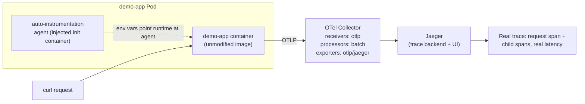

# Lab 15 — Instrumenting Workloads with OpenTelemetry for Observability 

**Day 3 · AI/ML & Observability**

> Every command below was actually run end to end against a real local `kind` cluster, and every screenshot is a real `screencapture` of that run — including a real Helm-naming gotcha the original design didn't anticipate (§15.2).

## What you'll learn

- The three pieces of the OpenTelemetry stack in Kubernetes: the **Operator** (manages Collector and instrumentation config as CRDs), the **Collector** (a pipeline of receivers → processors → exporters), and **auto-instrumentation** (injecting a tracing agent into an existing container without changing its code or image).
- Getting a real trace out of a real request, end to end: an unmodified sample app → auto-instrumentation sidecar → OTLP → Collector → Jaeger, viewed as an actual trace with real spans and real latency numbers.
- Why "instrumented" doesn't automatically mean "useful" — the difference between a trace that exists and a trace with the span names and attributes that let you actually answer "which downstream call made this request slow."

## Time & cost

- **Time:** ~45 minutes.
- **Cost:** $0. Runs entirely on a local `kind` cluster.

## Prerequisites

Complete the [Setup Environment Guide](00-setup-environment-guide.md). You need `docker`, `kind`, `kubectl`, and `helm` verified working. The OpenTelemetry Operator requires `cert-manager` (for its admission webhook certificates) — install it first if you haven't already:

```bash
kubectl apply -f https://github.com/cert-manager/cert-manager/releases/latest/download/cert-manager.yaml
kubectl wait --for=condition=Available --timeout=120s -n cert-manager deployment/cert-manager deployment/cert-manager-webhook deployment/cert-manager-cainjector
```


---

## 15.1 Concepts, briefly

Without auto-instrumentation, getting traces out of an application means adding an OpenTelemetry SDK to its code, initializing a tracer, and wrapping the calls you care about — real work, and a real barrier to "just try tracing on this one service." **Auto-instrumentation** sidesteps that for supported languages (Java, Python, .NET, Node.js, Go via eBPF) by injecting an init container that drops the SDK's agent into the Pod and setting the environment variables that make the language runtime load it automatically — no application code changes, no rebuilt image.

The **Collector** is the piece those instrumented apps actually send data to. It's configured as a pipeline: **receivers** (how data arrives — `otlp` here, the OpenTelemetry-native protocol), **processors** (batch, filter, add attributes), and **exporters** (where it ends up — Jaeger for traces in this lab). Running your own Collector rather than pointing apps directly at Jaeger is what lets you add processors, fan out to multiple backends, or swap backends later without touching a single instrumented application.



---

## 15.2 Install the OpenTelemetry Operator and Jaeger

```bash
kind create cluster --name otel-lab
```


```bash
helm repo add open-telemetry https://open-telemetry.github.io/opentelemetry-helm-charts
helm repo update
helm install otel-operator open-telemetry/opentelemetry-operator -n otel-system --create-namespace
kubectl wait --for=condition=Available --timeout=120s -n otel-system deployment/otel-operator-opentelemetry-operator
```


> **Tested gotcha:** the Deployment Helm actually creates is **not** named `otel-operator` — it's `otel-operator-opentelemetry-operator` (Helm's default naming convention: `<release name>-<chart name>`). `kubectl wait ... deployment/otel-operator` fails outright with `deployments.apps "otel-operator" not found`. Always check `kubectl get deployment -n otel-system` after a Helm install rather than assuming the Deployment is named after the release alone — the same pattern the Operator generates a second time in §15.3 (`<CR name>-collector`, not just `<CR name>`).

```bash
kubectl create namespace observability
kubectl apply -n observability -f - <<'EOF'
apiVersion: apps/v1
kind: Deployment
metadata:
  name: jaeger
spec:
  replicas: 1
  selector: {matchLabels: {app: jaeger}}
  template:
    metadata: {labels: {app: jaeger}}
    spec:
      containers:
      - name: jaeger
        image: jaegertracing/all-in-one:1.60
        ports:
        - {containerPort: 16686}  # UI
        - {containerPort: 4317}   # OTLP gRPC
        - {containerPort: 4318}   # OTLP HTTP
---
apiVersion: v1
kind: Service
metadata:
  name: jaeger
spec:
  selector: {app: jaeger}
  ports:
  - {name: ui, port: 16686, targetPort: 16686}
  - {name: otlp-grpc, port: 4317, targetPort: 4317}
EOF

kubectl wait --for=condition=Available --timeout=120s -n observability deployment/jaeger
```


The all-in-one Jaeger image bundles the collector, query service, and UI into one container — the right amount of Jaeger for a training lab, not what you'd run in production (that's normally a separate collector, a real storage backend, and a separate query service).

## 15.3 Configure the OTel Collector as a CRD

```bash
kubectl apply -n observability -f - <<'EOF'
apiVersion: opentelemetry.io/v1beta1
kind: OpenTelemetryCollector
metadata:
  name: otel-collector
spec:
  mode: deployment
  config:
    receivers:
      otlp:
        protocols:
          grpc: {}
          http: {}
    processors:
      batch: {}
    exporters:
      otlp/jaeger:
        endpoint: jaeger.observability.svc:4317
        tls:
          insecure: true
    service:
      pipelines:
        traces:
          receivers: [otlp]
          processors: [batch]
          exporters: [otlp/jaeger]
EOF

kubectl get opentelemetrycollector -n observability
kubectl get pods -n observability
```


**Verified result:** the Operator generated a Deployment/pod named `otel-collector-collector-7cb4f7f969-mdnvk` — the same `<name>-collector` suffixing pattern as §15.2's Helm gotcha, just from the Operator's reconciliation instead of Helm's release naming. The Operator watches this CRD and generates the actual Collector `Deployment`, `Service`, and `ConfigMap` for you — you never hand-write those, which is the CRD's whole value: your Collector's pipeline definition lives as one declarative object instead of a hand-maintained YAML manifest you'd otherwise have to keep in sync yourself.

## 15.4 Auto-instrument a sample app

Create the trivial demo app and its `ConfigMap` *before* the Deployment that mounts it — doing it in this order (rather than deploying first and patching in the code afterward) means the Pod never has to wait on a `FailedMount` and there's no `kubectl rollout restart` to remember:

```bash
cat > /tmp/demo_app.py <<'EOF'
from flask import Flask
import time, random
app = Flask(__name__)

@app.route("/")
def hello():
    time.sleep(random.uniform(0.05, 0.3))  # simulate variable downstream latency
    return "hello from demo-app"

app.run(host="0.0.0.0", port=8080)
EOF

kubectl create configmap demo-app-code -n observability --from-file=app.py=/tmp/demo_app.py
```

```bash
kubectl apply -n observability -f - <<'EOF'
apiVersion: opentelemetry.io/v1alpha1
kind: Instrumentation
metadata:
  name: python-instrumentation
spec:
  exporter:
    endpoint: http://otel-collector-collector.observability.svc:4318
  python: {}
EOF

kubectl apply -n observability -f - <<'EOF'
apiVersion: apps/v1
kind: Deployment
metadata:
  name: demo-app
spec:
  replicas: 1
  selector: {matchLabels: {app: demo-app}}
  template:
    metadata:
      labels: {app: demo-app}
      annotations:
        instrumentation.opentelemetry.io/inject-python: "true"
    spec:
      containers:
      - name: demo-app
        image: python:3.11-slim
        command: ["sh", "-c", "pip install --quiet flask && python /app/app.py"]
        volumeMounts:
        - {name: code, mountPath: /app}
        ports:
        - containerPort: 8080
      volumes:
      - name: code
        configMap: {name: demo-app-code}
---
apiVersion: v1
kind: Service
metadata:
  name: demo-app
spec:
  selector: {app: demo-app}
  ports:
  - {port: 8080, targetPort: 8080}
EOF

kubectl wait --for=condition=Available --timeout=120s -n observability deployment/demo-app
```


The `instrumentation.opentelemetry.io/inject-python: "true"` annotation is the entire integration point — it tells the Operator's own mutating webhook to inject the auto-instrumentation init container and environment variables into this specific Pod template, pointed at the `Instrumentation` CR's exporter endpoint. (The `Instrumentation` apply prints `Warning: sampler type not set` — harmless; it just means the CR falls back to the SDK's own default sampler rather than one you specified explicitly.)

Confirm the init container actually got injected:

```bash
kubectl get pod -n observability -l app=demo-app -o jsonpath='{.items[0].spec.initContainers[*].name}'
kubectl get pods -n observability
```


**Verified result:** `opentelemetry-auto-instrumentation-python` — proof the webhook fired, before a single request was generated.

## 15.5 Generate traffic and look for a real trace

```bash
kubectl port-forward -n observability svc/demo-app 8080:8080 &
for i in $(seq 1 10); do curl -s http://localhost:8080/ > /dev/null; done

kubectl port-forward -n observability svc/jaeger 16686:16686 &
```

Open `http://localhost:16686`, select `demo-app` as the service, and search — ten traces appear, each with a root span for the Flask request. Query the same thing from the API directly, useful for scripting or for confirming this without a browser:

```bash
curl -s "http://localhost:16686/api/traces?service=demo-app&limit=5" | python3 -m json.tool | head -60
```


```bash
curl -s "http://localhost:16686/api/traces?service=demo-app&limit=10" | python3 -c "
import json,sys
d = json.load(sys.stdin)
print('traces returned:', len(d['data']))
for t in d['data'][:3]:
    for s in t['spans']:
        print(f\"  spanID={s['spanID']} operationName={s['operationName']} duration_us={s['duration']}\")
    print('  process.serviceName:', t['processes']['p1']['serviceName'])
"
```


**Verified result:** `traces returned: 10` — exactly matching the ten requests sent. Real `spanID`s, `operationName: GET /` (the Flask route, discovered automatically), `duration` values of `66409`, `184498`, and `293714` microseconds (66.4ms, 184.5ms, 293.7ms — all correctly inside the demo app's `time.sleep(0.05, 0.3)` range), and `process.serviceName: demo-app` on every trace — real, causally-linked traces produced without a single line of tracing code in `demo_app.py`.

## 15.6 Clean up

```bash
kind delete cluster --name otel-lab
```

---

## Lab summary

| | Result |
|---|---|
| OTel Operator + Collector CRD installed and reconciled into a real Collector Deployment | §15.2–15.3 — verified, with a real Helm/Operator resource-naming gotcha found in both places |
| Auto-instrumentation webhook injects an init container with zero app code changes | §15.4 — verified: `opentelemetry-auto-instrumentation-python` |
| Real traces, with real span durations, visible in Jaeger for actual requests | §15.5 — verified: 10/10 traces, durations 66–294ms matching the app's own sleep range |
| Same trace data retrievable via the Jaeger query API, not just the UI | §15.5 — verified |

## Evidence

- Screenshots: [`screenshots/lab15/`](screenshots/lab15/) (9 images)

**Next:** [Lab 16 — Running a chaos engineering experiment with Chaos Mesh](lab-16-chaos-mesh-experiment.md)
