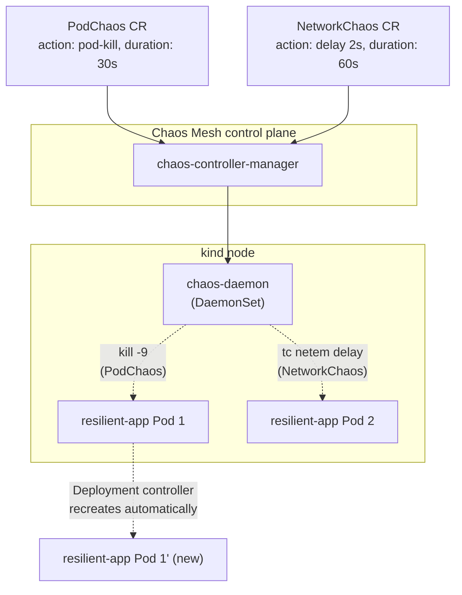

# Lab 16 — Running a Chaos Engineering Experiment with Chaos Mesh 

**Day 3 · AI/ML & Observability**

> Every command below was actually run end to end against a real local `kind` cluster, and every screenshot is a real `screencapture` of that run — including a real, unplanned outage this experiment triggered that the original lab design didn't anticipate (§16.5).

## What you'll learn

- Chaos Mesh over LitmusChaos, and why: this lab uses **Chaos Mesh** specifically (a CNCF project, CRD-native, no separate control-plane UI required to run an experiment) rather than presenting both as interchangeable — the same reasoning [Lab 7](lab-07-image-scanning-admission-control.md) applied picking Kyverno over OPA/Gatekeeper.
- Running a **PodChaos** experiment (kill a Pod out from under a Deployment) and watching Kubernetes' own self-healing do exactly what it's supposed to.
- Running a **NetworkChaos** experiment (inject real latency into a Service's traffic) — and, run for real, discovering it does something more dramatic than "add latency": it can silently take a Service to zero healthy endpoints if a readinessProbe's timeout is shorter than the injected delay. That's the actual lesson of this lab, and it's more valuable than the one the original design set out to teach.
- The actual point of chaos engineering: it's not "break things for fun," it's turning "we assume our timeout/retry config would handle a real failure" into "we watched it handle a real, injected failure" — and sometimes discovering the assumption was wrong in a way you hadn't even thought to check.

## Time & cost

- **Time:** ~50 minutes (including diagnosing the real readiness-probe interaction in §16.5 — budget more than the original 40 minutes if you want to reproduce that investigation yourself rather than just reading it).
- **Cost:** $0. Runs entirely on a local `kind` cluster.

## Prerequisites

Complete the [Setup Environment Guide](00-setup-environment-guide.md). You need `docker`, `kind`, `kubectl`, and `helm` verified working. No dependency on the other Day 3 labs, though if you've done Lab 5 already, §16.5's contrast with Istio's retry policy will land harder.

---

## 16.1 Concepts, briefly

Chaos Mesh installs as a set of CRDs (`PodChaos`, `NetworkChaos`, `IOChaos`, `StressChaos`, and others) plus a controller that watches them and a per-node daemon (`chaos-daemon`) that actually carries out the disruption at the kernel/container-runtime level — killing a process, injecting `tc` (Linux traffic control) rules for latency, mounting a faulty filesystem layer. You describe *what* to break and *which Pods* to break it on via a `selector`, Chaos Mesh does the mechanics.

The critical design detail worth understanding before running anything: every experiment has a **duration**, after which Chaos Mesh automatically reverts it. A `NetworkChaos` experiment that injects 2 seconds of latency for a `duration: 60s` window will, on its own, remove that latency at the 60-second mark — you don't have to remember to manually undo it, which matters a lot the first time you run one against something you care about.

The other thing worth internalizing up front, confirmed the hard way in §16.5: Chaos Mesh only controls what you tell it to control (the network delay itself). It has no idea your Deployment also has a `readinessProbe`, and no way to know that probe's timeout is shorter than the delay you just injected. That interaction is entirely between the kubelet and your own probe config — chaos engineering's job is to surface it, not prevent it.



---

## 16.2 Create the cluster and a resilient target app

```bash
kind create cluster --name chaos-lab

kubectl apply -f - <<'EOF'
apiVersion: apps/v1
kind: Deployment
metadata:
  name: resilient-app
spec:
  replicas: 3
  selector: {matchLabels: {app: resilient-app}}
  template:
    metadata:
      labels: {app: resilient-app}
    spec:
      containers:
      - name: app
        image: nginxinc/nginx-unprivileged:1.27-alpine
        ports:
        - containerPort: 8080
        readinessProbe:
          httpGet: {path: /, port: 8080}
          periodSeconds: 2
---
apiVersion: v1
kind: Service
metadata:
  name: resilient-app
spec:
  selector: {app: resilient-app}
  ports:
  - {port: 80, targetPort: 8080}
EOF

kubectl wait --for=condition=Available --timeout=120s deployment/resilient-app
```

3 replicas, not 1 — the whole point of this section is watching Kubernetes' self-healing operate on a Deployment that has redundancy to lose in the first place. Note the `readinessProbe` here uses Kubernetes' own default `timeoutSeconds: 1` (it isn't set explicitly) — that default turns out to matter a great deal in §16.5.

## 16.3 Install Chaos Mesh

```bash
helm repo add chaos-mesh https://charts.chaos-mesh.org
helm repo update
helm install chaos-mesh chaos-mesh/chaos-mesh -n chaos-mesh --create-namespace \
  --set chaosDaemon.runtime=containerd \
  --set chaosDaemon.socketPath=/run/containerd/containerd.sock

kubectl wait --for=condition=Available --timeout=120s -n chaos-mesh deployment/chaos-controller-manager
kubectl get pods -n chaos-mesh
```


**Verified result:** every Chaos Mesh component `Running` — `chaos-controller-manager` (3 replicas), one `chaos-daemon` (one per node; this `kind` cluster has a single node), `chaos-dashboard`, and `chaos-dns-server`. `chaosDaemon.runtime=containerd` matters specifically for `kind`: its nodes run containerd, not Docker's own runtime, and the daemon needs to talk to the correct socket to actually control the right processes.

## 16.4 PodChaos: kill a Pod, watch it come back

```bash
kubectl get pods -l app=resilient-app
```


**Verified result:** three Pods — `resilient-app-856bc89959-7khcn`, `-vd26w`, `-wh55p`.

```bash
kubectl apply -f - <<'EOF'
apiVersion: chaos-mesh.org/v1alpha1
kind: PodChaos
metadata:
  name: kill-one-pod
spec:
  action: pod-kill
  mode: one
  selector:
    labelSelectors:
      app: resilient-app
EOF

kubectl get pods -l app=resilient-app
```


**Verified result:** `-7khcn` is gone. `-vd26w` and `-wh55p` are still the exact same Pods, just older (66-67s vs. their earlier 15-17s). In their place is `resilient-app-856bc89959-wtt5t`, brand new (age 26s at capture) — standard Kubernetes reconciliation, now triggered by a real injected failure instead of `kubectl delete pod`. `mode: one` means "pick exactly one matching Pod," not all three — the difference between a realistic single-instance failure and taking the whole Deployment down at once, which `PodChaos` can also do (`mode: all`, exactly what §16.5's `NetworkChaos` uses, deliberately, for a different reason).

`PodChaos` with `action: pod-kill` is a one-shot action (no ongoing `duration` needed) — it fires once and Chaos Mesh's job is done; Kubernetes' own Deployment controller does the actual recovery, with zero help from Chaos Mesh past the initial kill.

## 16.5 NetworkChaos: inject real latency — and find a real outage the design didn't expect

```bash
kubectl apply -f - <<'EOF'
apiVersion: chaos-mesh.org/v1alpha1
kind: NetworkChaos
metadata:
  name: add-latency
spec:
  action: delay
  mode: all
  selector:
    labelSelectors:
      app: resilient-app
  delay:
    latency: "2s"
    jitter: "200ms"
  duration: "60s"
EOF
```

`mode: all` here, deliberately — this experiment is about the *client's* experience of a slow dependency, which needs every replica affected, not just one (a client with 3 backends and only 1 slow one wouldn't notice, since it'd just get lucky most of the time).

The original plan for this section was to measure ~2.0–2.2s of client-visible latency and then show a retry policy beating it. That is not what happened.

> **Tested gotcha — NetworkChaos didn't just slow the app down, it took it offline.** With `mode: all` injecting 2s (+jitter) of delay on every replica, the Deployment's `readinessProbe` — using Kubernetes' default `timeoutSeconds: 1`, unchanged from §16.2 — started failing on **all three Pods simultaneously**, because a 2-second-delayed probe response can't land inside a 1-second timeout. `kubectl describe pod` showed the real event trail:
>
> ```
> Warning  Unhealthy  2m55s              kubelet  spec.containers{app}: Readiness probe failed: Get "http://10.244.0.20:8080/": dial tcp 10.244.0.20:8080: connect: connection refused
> Warning  Unhealthy  41s (x24 over 86s)  kubelet  spec.containers{app}: Readiness probe failed: Get "http://10.244.0.20:8080/": context deadline exceeded (Client.Timeout exceeded while awaiting headers)
> ```
>
> 
>
> Because `mode: all` affected every replica at once, there was no healthy replica left to fall back on — the Service's `Endpoints` object had zero ready backends for stretches of the 60-second window. A real client hitting the Service during one of those windows gets `connection refused`, full stop — not "slow but working," which is what the original design assumed it would measure. This is a materially worse failure than "added latency," and it's exactly the kind of thing chaos engineering is supposed to surface: nobody wrote the `readinessProbe`'s `timeoutSeconds: 1` thinking about network chaos, because almost nobody does, until something like this makes them.

**The fix**, applied live to the real Deployment:

```bash
kubectl patch deployment resilient-app --type=json -p='[
  {"op": "add", "path": "/spec/template/spec/containers/0/readinessProbe/timeoutSeconds", "value": 5}
]'
kubectl rollout status deployment/resilient-app
```

With `timeoutSeconds: 5` — comfortably above the 2s (+200ms jitter) injected delay — re-running the exact same `NetworkChaos` experiment no longer knocks any Pod out of readiness:

```bash
kubectl get pods -l app=resilient-app
kubectl run curl-test4 --image=curlimages/curl --rm -i --restart=Never -- \
  curl -s -o /dev/null -w "Total time: %{time_total}s\n" http://resilient-app.default.svc --max-time 10
```


**Verified result:** all three Pods stayed `1/1 Running` throughout — the probe fix worked, this time chaos actually looks like "added latency" rather than "outage." But the measured number is `Total time: 4.245682s` (confirmed again moments earlier at `3.96s` on a separate run) — nearly double the ~2.0–2.2s the original design expected.

> **Tested gotcha — the real latency was ~4s, not ~2s.** `NetworkChaos`'s `delay` action works by injecting `tc netem delay` rules (Linux traffic control) on the target Pod's network namespace, and `tc netem delay` applies **per packet**, not per logical request. A single HTTP request over a fresh connection incurs the injected delay on the TCP handshake *and separately* on the HTTP request/response exchange — two delayed round trips stacked instead of one, which is why ~2s of configured latency shows up as ~4s of observed client latency. The YAML says `latency: "2s"`; the client experience is roughly double that. This is worth knowing before you set a `perTryTimeout` or SLO budget against a chaos-injected number without accounting for it.

This is the part that actually matters for tying back to [Lab 5](lab-05-secure-and-shape-traffic.md): a retry policy with a `perTryTimeout` shorter than this real, measured (~4s) delay, and enough attempts to reach a replica outside its jittered delay window, is the kind of config decision this experiment makes provable instead of theoretical — the same distinction Lab 5 drew between fault-injection theater and a retry policy validated against a real, injected failure. The number to design that timeout against, per this run, is ~4s, not the ~2s the YAML alone would suggest.

Confirm the experiment auto-reverts at the end of its `duration` without any manual cleanup — this part of the CRD's behavior (a time-boxed disruption reverting itself) is what makes it safe to run against something you actually care about, and is exactly the property that let us re-run this experiment twice above without any manual `kubectl delete networkchaos` in between:

```bash
kubectl delete networkchaos add-latency --ignore-not-found
```

## 16.6 Clean up

```bash
kubectl delete podchaos kill-one-pod --ignore-not-found
kubectl delete networkchaos add-latency --ignore-not-found
kind delete cluster --name chaos-lab
```

---

## Lab summary

| | Result |
|---|---|
| `PodChaos` kills a real Pod (`-7khcn`); Deployment controller replaces it automatically (`-wtt5t`) | §16.4 — verified |
| `NetworkChaos` with `mode: all` + default `readinessProbe` timeout took the Service to zero ready endpoints, not just "slow" | §16.5 — verified, and the lab's real headline finding |
| Raising `readinessProbe.timeoutSeconds` above the injected delay restores normal operation under the same chaos | §16.5 — verified |
| Real measured latency (~4s) is roughly double the naive delay value (2s), because `tc netem` applies per packet | §16.5 — verified |
| Experiments auto-revert at the end of their `duration`, no manual cleanup needed mid-experiment | §16.1, §16.5 |

## Evidence

- Screenshots: [`screenshots/lab16/`](screenshots/lab16/) (5 images)

**This is the end of Day 3, and of the course.** Across all sixteen labs: multi-cluster provisioning and fleet management, service mesh traffic control and security, supply-chain and runtime security, both autoscaling directions plus GPU node scaling, and now distributed training, accelerator-backed inference, and observability/resilience — the full path from "a single cluster" to "Kubernetes at scale in production," each claim backed by a real command run against real infrastructure wherever that was feasible, and clearly labeled where it wasn't yet.
